# 没有肮脏和黑暗的 30 个精致肮脏的网站

> 原文：<https://www.sitepoint.com/30-delicately-grungy-websites-without-the-dirty-and-dark/>

有时候，微妙的肮脏和过于肮脏之间的灰色地带很难找到。在你的设计变成类似于僵尸嚼碎后吐出来的东西的一些混乱的概念之前，保持垃圾的层次是很容易的。

我想要一个网站集，我觉得它接近垃圾线，但又不会太远。一些设计师做了很好的工作，创造了一个黑暗的设计，其他人有一些传统的垃圾特征被小心翼翼地弱化了。最终，只要符合客户的需求，就没关系。但是“太多”和“刚刚够”之间的界限被下面这些网站的设计者们小心翼翼地踩在脚下，我认为他们抓住了这一点。你怎么想呢?

* * *

### 理论

* * *

### 阁楼简历

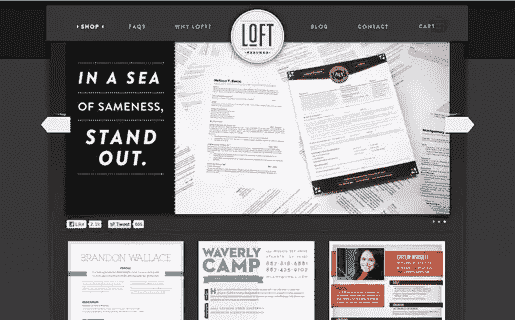

[来源](http://loftresumes.com/)

* * *

### 拖车停车场卡车

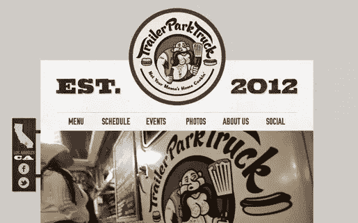

[来源](http://www.trailerparktruck.com/)

* * *

### 友好的绅士

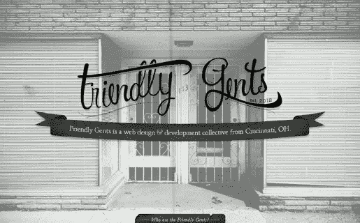

[来源](http://www.friendlygents.com/)

* * *

### 昆斯小酒馆

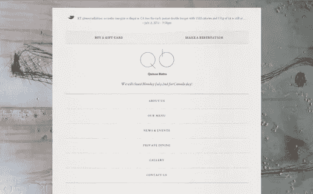

[来源](http://www.quincetoronto.com/)

* * *

### 马里兰手工啤酒节

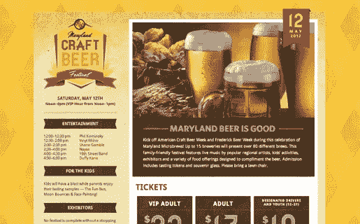

[来源](http://mdcraftbeerfestival.com/)

* * *

### 汤贩

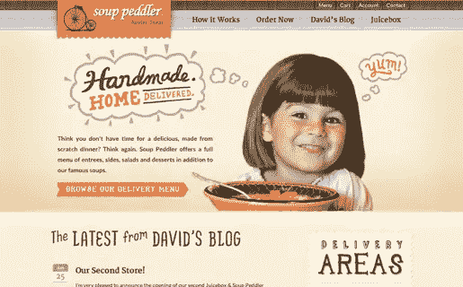

[来源](http://souppeddler.com/)

* * *

### 超越仙境 2012

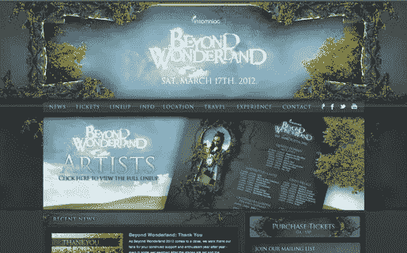

[来源](http://beyondwonderland.com/BW_2012/)

* * *

### 天堂节

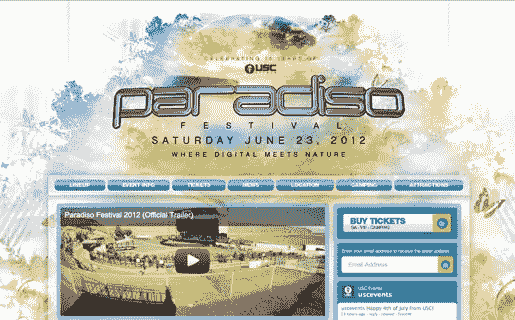

* * *

### 对点

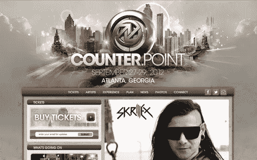

[来源](http://www.counterpointfestival.com/)

* * *

### 电动森林 2012

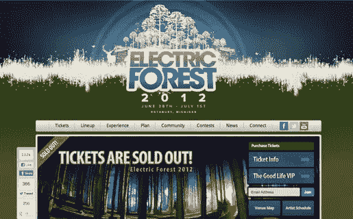

[来源](http://electricforestfestival.com/)

* * *

### 道德工作室

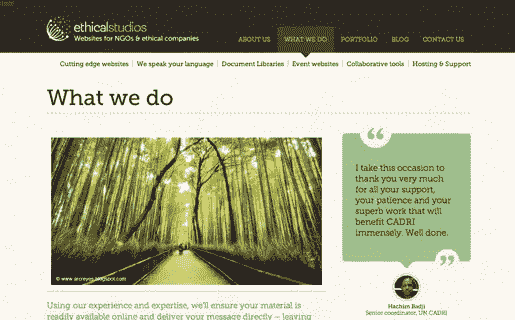

* * *

### Rune Molnes

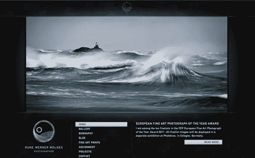

[来源](http://www.runemolnes.com/)

* * *

### 托马斯·奥利弗乐队

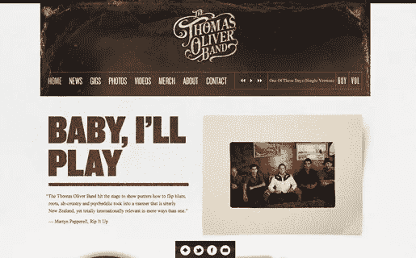

[来源](http://thethomasoliverband.com/home)

* * *

### 1 爱

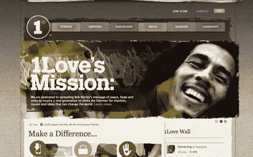

* * *

### 1MD

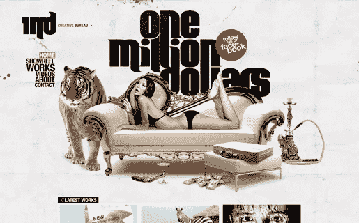

[来源](http://1md.be/)

* * *

### 穆通克

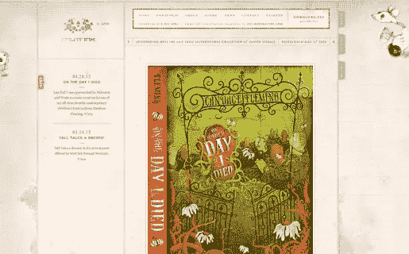

* * *

### 达尔文的 DNA

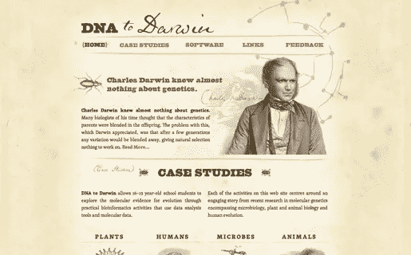

[来源](http://www.dnadarwin.org/)

* * *

### 卢修斯

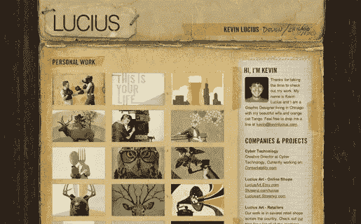

[来源](http://www.kevinlucius.com/)

* * *

### 散步

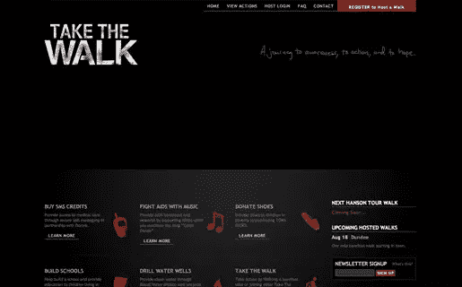

[来源](http://www.takethewalk.net/site/takethewalk/section/name/home)

* * *

### 编辑工作室

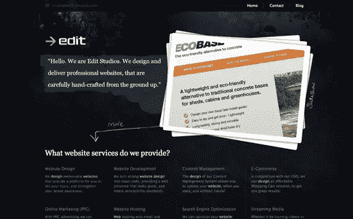

* * *

### 火箭俱乐部

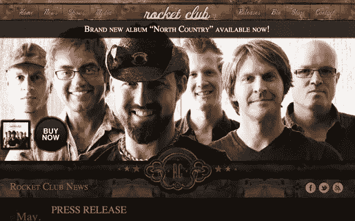

[来源](http://www.rocketclub.info/)

* * *

### Twirk 伦理

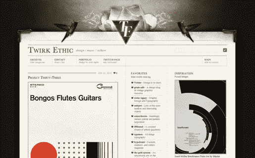

[来源](http://www.twirkethic.com/)

* * *

### 乌鸦星座

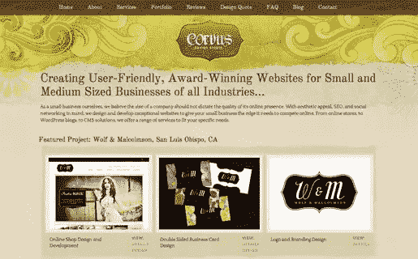

* * *

### 电动纸浆

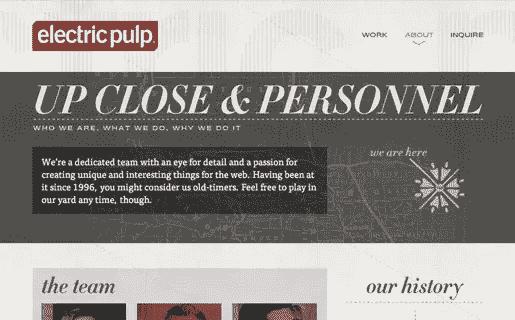

[来源](http://www.electricpulp.com/about)

* * *

### THS

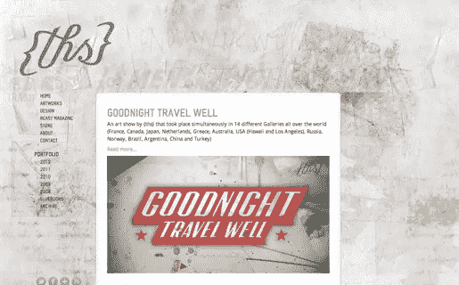

[来源](http://www.ths.nu/)

* * *

### 糟糕是啊

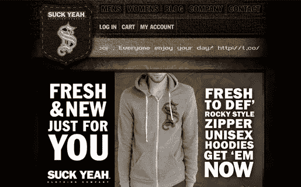

[来源](http://suckyeah.com/store/)

* * *

### 马龙·梅瑟姆

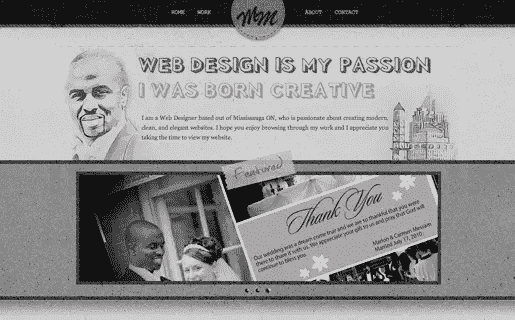

[来源](http://www.marlonmessam.com/)

* * *

### 霍利斯特

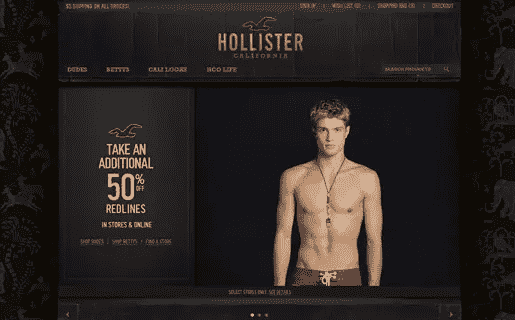

[来源](http://www.hollisterco.com/webapp/wcs/stores/servlet/HomePage?storeId=10251&langId=-1&catalogId=10201)

* * *

### 超越仙境 2010

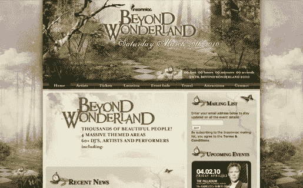

[来源](http://beyondwonderland.com/BW_2010/)

* * *

有喜欢的吗？你有什么设计精美的垃圾网站想分享吗？在你看来，“干净”和“肮脏”是截然相反的两个概念吗？

## 分享这篇文章