# 30 个有用而神奇的 jQuery 插件

> 原文：<https://www.sitepoint.com/30-fantastic-jquery-plug-ins/>

在网页设计领域，这项技术随着许多更新和支持插件而变得流行。JQuery 是站点中最流行、使用最广泛的技术之一。现在的网站都是用 jquery 的功能创建的。因此，我们在这里向您展示了 30 个有用而神奇的 Jquery 插件，供您参考，并享受试用它们的乐趣。！！！

## 1.[使用 jQuery 的网格导航效果](http://tympanus.net/codrops/2011/06/09/grid-navigation-effects/)

今天我们想分享一些使用 jQuery 的整洁的网格导航效果。

[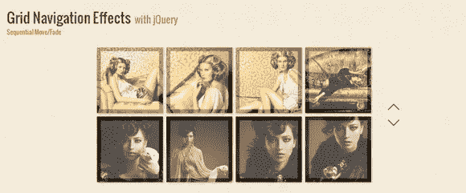](http://tympanus.net/codrops/2011/06/09/grid-navigation-effects/)

[演示](http://tympanus.net/Development/GridNavigationEffects/example5.html) [下载](http://tympanus.net/codrops/2011/06/09/grid-navigation-effects/)

## 2.[用 jQuery 制作窗帘打开的动画](http://buildinternet.com/2009/07/animate-curtains-opening-with-jquery/)

如果没有图形，本教程就没有什么特别的了，所以让我们确保你已经掌握了这些。

[试玩](http://buildinternet.com/live/curtains/) [下载](http://buildinternet.com/2009/07/animate-curtains-opening-with-jquery/)

## 3.[用 jQuery 旋转图像滑块](http://tympanus.net/codrops/2011/04/28/rotating-image-slider/)

在下面的教程中，我们将创建一个稍微扭曲的不对称图像滑块:当滑动图片时，我们将稍微旋转它们并延迟每个元素的滑动。滑块不寻常的形状是由一些元素的位置和使用粗边框造成的。我们还将添加一个自动播放选项和鼠标滚轮功能。

[试玩](http://tympanus.net/Tutorials/RotatingImageSlider/) [下载](http://tympanus.net/codrops/2011/04/28/rotating-image-slider/)

## 4. [JQuery 视差教程](https://www.sitepoint.com/jquery-parallax-tutorial/)

我想我们都同意，当有人访问你的网站时，视差效应可以给你带来惊喜。所以，我想给你看一个真实的 jQuery 视差例子。在本教程中，我将详细解释如何使用 jQuery 创建你自己的视差背景效果，来管理你可以用于标题背景的横幅的动画效果。

[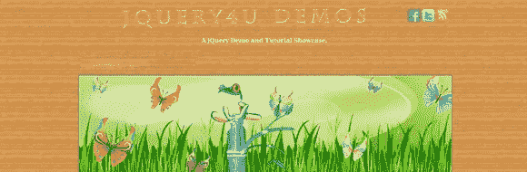](https://www.sitepoint.com/jquery-parallax-tutorial/)

演示[下载](https://www.sitepoint.com/jquery-parallax-tutorial/)

## 5. [JQuery Tour 灵活的旅游插件](http://codecanyon.net/item/jquery-tour-the-flexible-tour-plugin/1052564?ref=sdeering)

一个基于 jQuery 的旅游插件，具有定制的风格和强大的 API。

[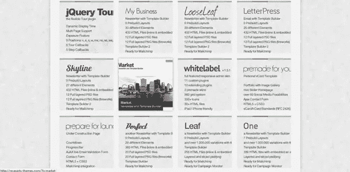](http://codecanyon.net/item/jquery-tour-the-flexible-tour-plugin/1052564?ref=sdeering)

[试玩](http://revaxarts-themes.com/) [下载](http://codecanyon.net/item/jquery-tour-the-flexible-tour-plugin/1052564?ref=sdeering)

## 6.[马赛克 Jquery 插件](http://buildinternet.com/project/mosaic/)

[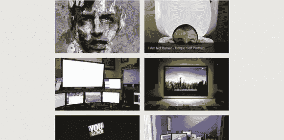](http://buildinternet.com/project/mosaic/)

[试玩](http://buildinternet.com/project/mosaic/1.0/) [下载](http://buildinternet.com/project/mosaic/)

## 7.[同位素](http://isotope.metafizzy.co/index.html)

一个精致的 jQuery 插件，用于神奇的布局。启用过滤、排序和动态布局。

[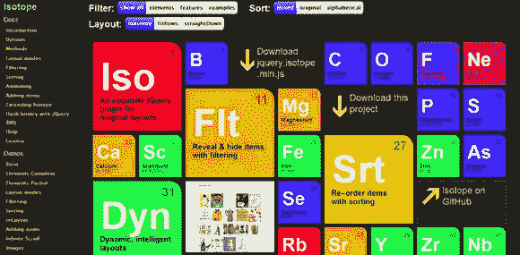](http://isotope.metafizzy.co/index.html)

[试玩](http://isotope.metafizzy.co/index.html) [下载](http://isotope.metafizzy.co/index.html)

## 8.Image Lens 用于镜头效果图像缩放的 jQuery 插件

使用这个 jQuery 插件为图像添加镜头风格的缩放效果。

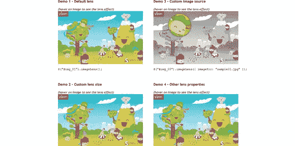

## 9.[用 jQuery 实现苹果般的视网膜效果](http://tutorialzine.com/2010/06/apple-like-retina-effect-jquery-css/)

苹果公司长期以来一直在营销中运用制胜策略，创造设计精良的产品，拥有忠实的粉丝群，并在每款产品发布前大肆宣传。

[试玩](http://demo.tutorialzine.com/2010/06/apple-like-retina-effect-jquery-css/demo.html) [下载](http://tutorialzine.com/2010/06/apple-like-retina-effect-jquery-css/)

## 10.[动态标签表单](http://codecanyon.net/item/dynamic-tag-form/482498?ref=sdeering)

[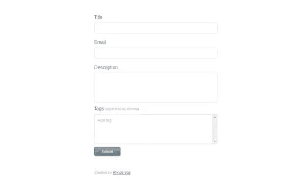](http://codecanyon.net/item/dynamic-tag-form/482498?ref=sdeering)

[试玩](http://rikdevos.com/demos/dynamic_tag_form/) [下载](http://codecanyon.net/item/dynamic-tag-form/482498?ref=sdeering)

## 11.简易滑块 jQuery 插件多个滑块

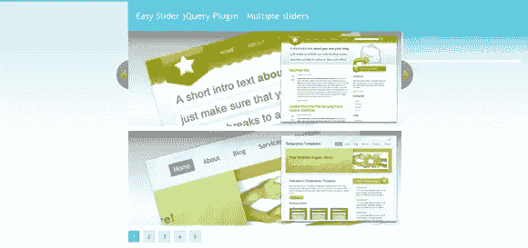

[演示](http://cssglobe.com/lab/easyslider1.7/03.html)

## 12.Neteye 活动指示器

一个 jQuery 插件，使用 SVG 或 VML 呈现半透明的活动指示器(旋转器)。

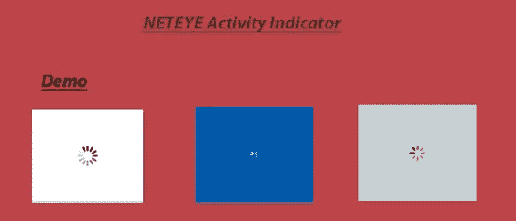

## 13.一个非常简单的用于 jQuery 的 HTML5 音频播放器插件

Simple Player 是一个 jQuery 插件，允许 web 开发人员控制他们网页上的音频文件。通过 CSS 支持风格。所有支持 HTML5 音频标签的浏览器都支持该插件支持的 mp3 或 ogg 格式。

[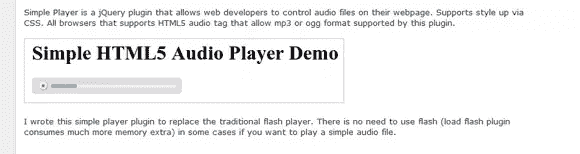](http://jay-notes.blogspot.in/2010/06/simple-player-very-simple-html5-audio.html)

[试玩](http://jay-notes.blogspot.in/2010/06/simple-player-very-simple-html5-audio.html) [下载](http://jay-notes.blogspot.in/2010/06/simple-player-very-simple-html5-audio.html)

## 14.[用 jQuery 构建的干净的滑动登录面板](http://web-kreation.com/tutorials/nice-clean-sliding-login-panel-built-with-jquery/)

[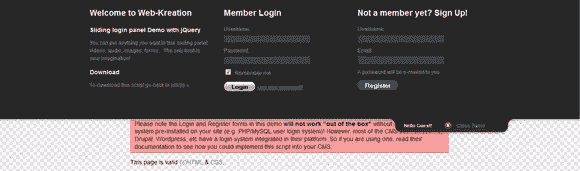](http://web-kreation.com/tutorials/nice-clean-sliding-login-panel-built-with-jquery/)

[试玩](http://web-kreation.com/demos/Sliding_login_panel_jquery/) [下载](http://web-kreation.com/tutorials/nice-clean-sliding-login-panel-built-with-jquery/)

## 15.摔了一跤

创建自定义下拉菜单通常是一个乏味的过程，需要大量额外的设置时间。通常缺乏本地下拉菜单所具有的便利性，例如键盘导航。

## 16.[狡猾的滑步](http://projects.craftedpixelz.co.uk/craftyslide/)

Crafty slide 是一个基于 jQuery 的小幻灯片(只有 2kb)。Crafty slide 的目标是与众不同，通过提供一个简单的，没有装饰的方法来显示图像；打包成一个小巧、干净、高效的插件。

[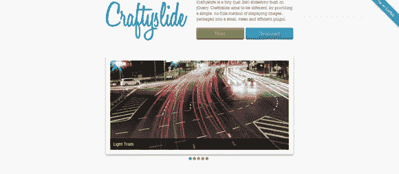](http://projects.craftedpixelz.co.uk/craftyslide/)

[试玩](http://projects.craftedpixelz.co.uk/craftyslide/) [下载](http://projects.craftedpixelz.co.uk/craftyslide/)

## 17.[使用 Jquery 进行动态表单克隆](http://www.mdelrosso.com/sheepit/index.php)

[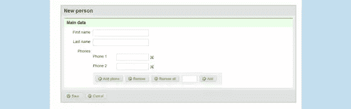](http://www.mdelrosso.com/sheepit/index.php)

[试玩](http://www.mdelrosso.com/sheepit/index.php) [下载](http://www.mdelrosso.com/sheepit/index.php)

## 18.[一个 jQuery 热图](http://tympanus.net/codrops/2010/02/08/a-jquery-heat-map/)

这里有一个用 jQuery 创建热图的非常简单的方法。这个想法是跟踪用户的点击，然后在覆盖层上用半透明的点显示点击模式。

[试玩](http://www.tympanus.net/Tutorials/jQueryHeatMap/) [下载](http://tympanus.net/codrops/2010/02/08/a-jquery-heat-map/)

## 19. [Acorn 媒体播放器](http://ghinda.net/acornmediaplayer/)

Acorn Media Player 是一个 jQuery 插件，实现了一个定制的 HTML5 <video>播放器，特别关注可访问性和定制。</video>

[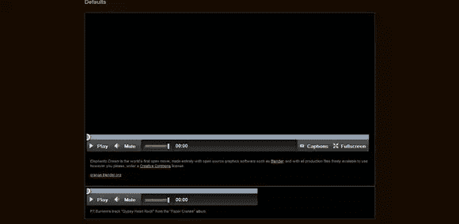](http://ghinda.net/acornmediaplayer/)

[试玩](http://ghinda.net/acornmediaplayer/) [下载](http://ghinda.net/acornmediaplayer/)

## 20.[伸缩滑块](http://www.woothemes.com/flexslider/)

一个令人敬畏的，完全响应的 jQuery slider 插件。

[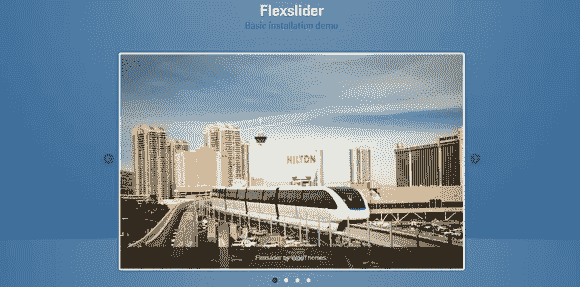](http://www.woothemes.com/flexslider/)

[试玩](http://www.woothemes.com/flexslider/flexslider-demo/) [下载](http://www.woothemes.com/flexslider/)

## 21. [JQuery 表单向导插件](http://thecodemine.org/)

表单向导插件是一个 jQuery 插件，可以用来为表单创建类似向导的页面流，而不必在向导步骤之间重新加载页面。

[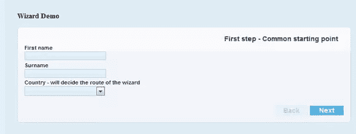](http://thecodemine.org/)

[试玩](http://thecodemine.org/) [下载](http://thecodemine.org/)

## 22\. [Slidejs](http://slidesjs.com/)

SlidesJS 是一个简单的 jQuery 幻灯片插件。打包了一组有用的功能，帮助新手和高级开发人员创建优雅和用户友好的幻灯片。

[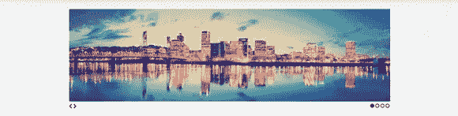](http://slidesjs.com/)

[试玩](http://slidesjs.com/) [下载](http://slidesjs.com/)

## 23.nivo slider

世界上最棒的 jQuery & Word Press 图像滑块。

[试玩](http://nivo.dev7studios.com/) [下载](http://nivo.dev7studios.com/)

## 24.用于分页的 JQuery 插件

今天，我将展示我制作的一个简单的 jQuery 插件。这个插件允许你通过分页控件轻松浏览项目列表。

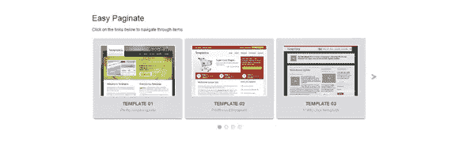

[演示](http://cssglobe.com/lab/easypaginate/03.html)

## 25. [Supersized 是使用 jQuery 库构建的全屏背景幻灯片](http://buildinternet.com/project/supersized/)

[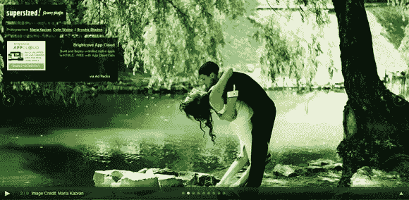](http://buildinternet.com/project/supersized/)

[试玩](http://buildinternet.com/project/supersized/slideshow/3.2/demo.html) [下载](http://buildinternet.com/project/supersized/)

## 26.[精神上](http://www.spritely.net/)

jQuery spritely 是一个由 Art logic 创建的 jQuery 插件，用于创建纯 HTML 和 JavaScript 的动态角色和背景动画。这是一个简单的轻量级插件，用一些简单的方法创建动画精灵，比如你在本页看到的小鸟，以及动态滚动背景。

[试玩](http://www.spritely.net/) [下载](http://www.spritely.net/)

## 27.Lite Accordion 是 jQuery 的一个水平 Accordion 插件

[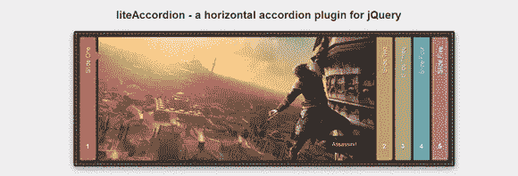](http://nicolahibbert.com/demo/liteAccordion/)

[试玩](http://nicolahibbert.com/demo/liteAccordion/) [下载](http://nicolahibbert.com/demo/liteAccordion/)

## 28.EzMark jQuery 插件

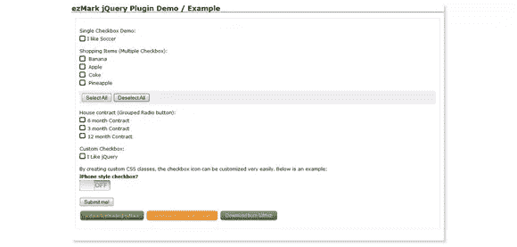

## 29.简易图像缩放 jQuery 插件

我一直在为我的一个客户写一个小脚本，需要放大产品图像。任务是创建一个脚本，允许用户在中等大小的图像上移动光标时看到产品的大细节。

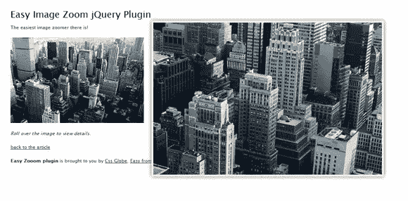

[演示](http://cssglobe.com/lab/easyzoom/easyzoom.html)

## 30.[一个垂直滚动条 jQuery 插件](http://buildinternet.com/2011/02/totem-a-vertical-ticker-jquery-plugin/)

自从广受欢迎的 Supersized 以来，我们非常兴奋地推出我们的下一个 jQuery 插件。Totem 使得实现带导航的动画垂直滚动条变得容易。这是最近几个客户项目的结果，这些项目需要精细控制的滚动条和导航。

[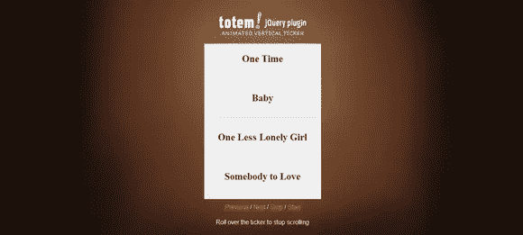](http://buildinternet.com/2011/02/totem-a-vertical-ticker-jquery-plugin/)

[试玩](http://buildinternet.s3.amazonaws.com/projects/totem/index.html) [下载](http://buildinternet.com/2011/02/totem-a-vertical-ticker-jquery-plugin/)

希望这个 JQuery 插件对你有所帮助，请留下你的宝贵意见。

***作者简介-***丹尼尔是一名自由设计师和作家，他与 DesignArticleWriters.com 的一群作家一起工作，从事像**[【SponsoredGiveaways.com】](http://www.sponsoredgiveaways.com)**这样的项目——这些项目帮助博主赚钱，也帮助广告商通过赠品制造声势。

## 分享这篇文章