# 30 免费木材和金属 Photoshop 图案和纹理

> 原文：<https://www.sitepoint.com/30-free-wood-and-metal-photoshop-patterns-and-textures/>

这些天来，我发现自己一直在寻找木头和金属的 Photoshop 图案。无论我是想给网站的按钮元素添加一点纹理，还是整理一张照片，我似乎总是有这种需要。所以，我收集了一些免费赠品，在我需要的时候随时可以得到，并决定与设计节的粉丝们分享。

这里的列表分为两部分。前半部分包括木材纹理，后半部分包括金属纹理。像往常一样，在商业设计中使用 Photoshop 图案或纹理之前，一定要仔细检查设计师的使用条款。

* * *

### 黑木

[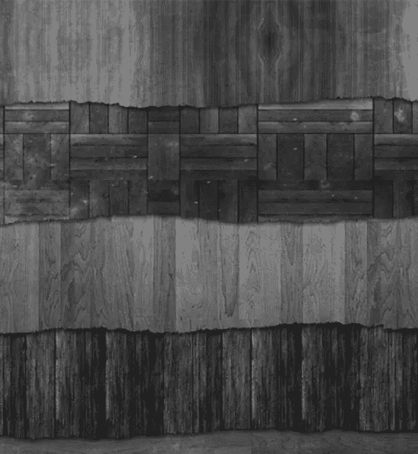](http://cloaks.deviantart.com/art/Dark-Wood-Texture-Pack-100478218)

* * *

### 现实的

[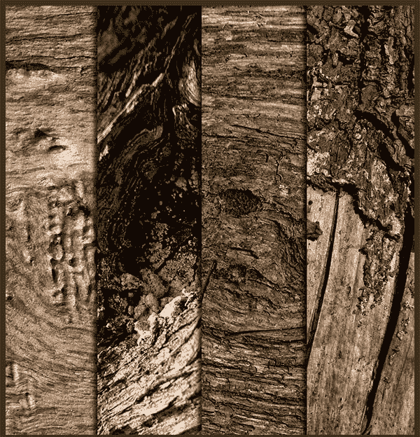](http://qbit71.deviantart.com/art/WOOD-TEXTURES-89031785)

* * *

### 基本木地板

* * *

### 满是指甲的污垢

[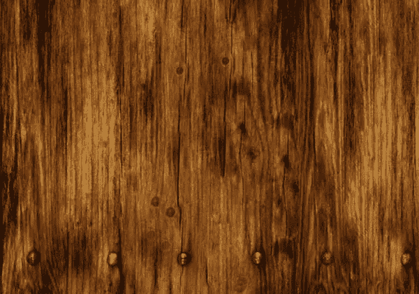](http://shadowh3.deviantart.com/art/Wood-texture-49965978)

* * *

### 水平带宽

* * *

### 清洁木地板

[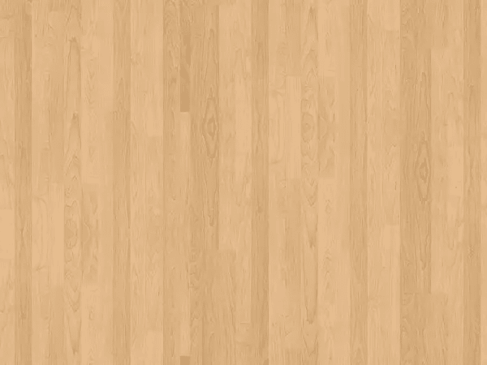](http://gnrbishop.deviantart.com/art/Wood-floor-86913934)

* * *

### 可怕的划痕

[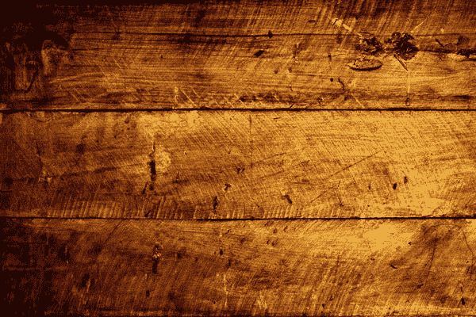](http://beyond-oddities.deviantart.com/art/Local-Texture-Three-by-One-77137822)

* * *

### 未处理的分类

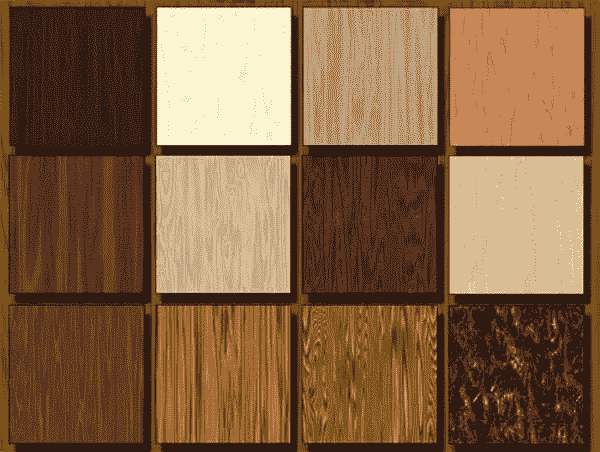

* * *

### 木制套装

[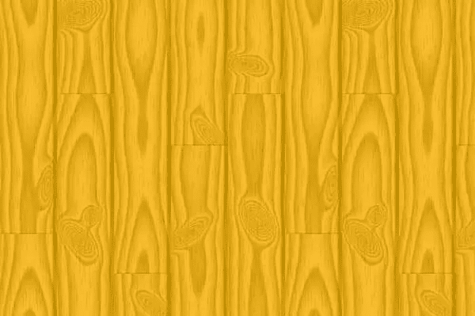](http://www.smashingmagazine.com/2009/02/12/the-ultimate-collection-of-free-photoshop-patterns/)

* * *

* * *

### 树木纹理

[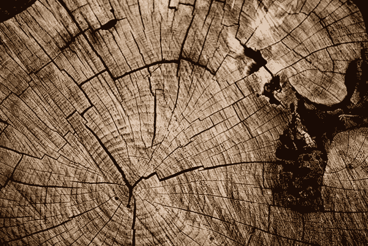](http://www.psd-dude.com/tutorials/resources/over-100-amazing-wood-textures.aspx)

* * *

### 成长标记

[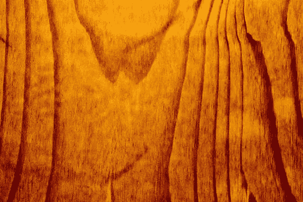](http://www.psd-dude.com/tutorials/resources/over-100-amazing-wood-textures.aspx)

* * *

### 树皮

[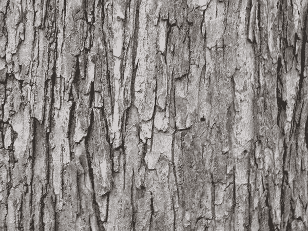](http://www.psd-dude.com/tutorials/resources/over-100-amazing-wood-textures.aspx)

* * *

### 烧焦的木头

[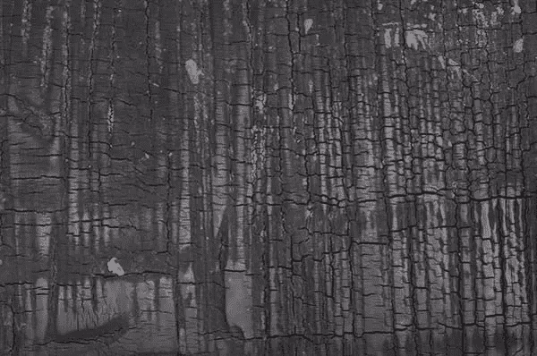](http://www.psd-dude.com/tutorials/resources/over-100-amazing-wood-textures.aspx)

* * *

* * *

### 浮木

* * *

### 木门

[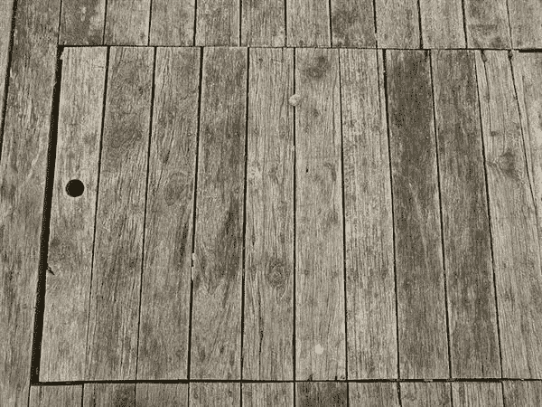](http://www.psd-dude.com/tutorials/resources/over-100-amazing-wood-textures.aspx)

* * *

* * *

### 桑凯特蜘蛛侠图案

[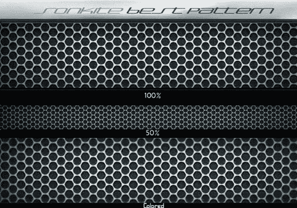](http://www.hongkiat.com/blog/30-high-quality-metallic-texture-pattern-brushes-and-photoshop-tutorials/)

* * *

### 棚屋壁板

[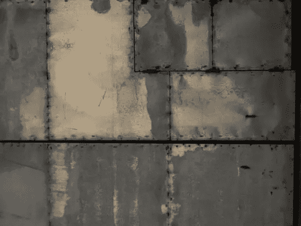](http://www.hongkiat.com/blog/30-high-quality-metallic-texture-pattern-brushes-and-photoshop-tutorials/)

* * *

### 黑色金属

[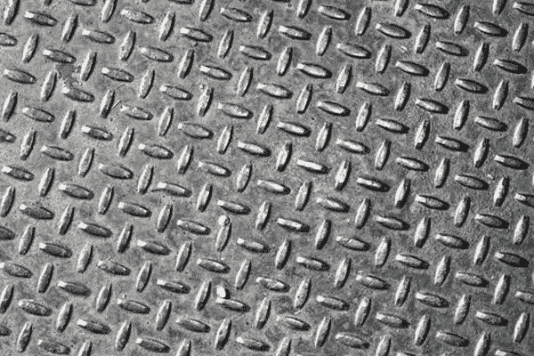](http://www.hongkiat.com/blog/30-high-quality-metallic-texture-pattern-brushes-and-photoshop-tutorials/)

* * *

### 铁丝网

[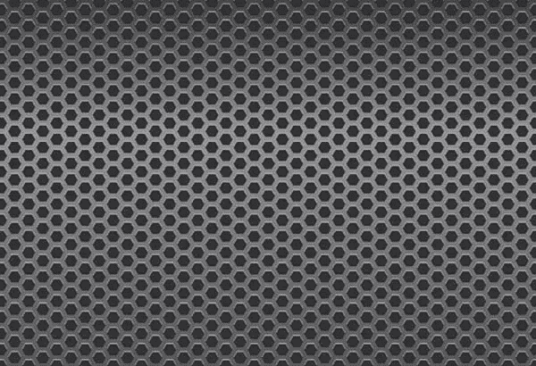](http://www.hongkiat.com/blog/30-high-quality-metallic-texture-pattern-brushes-and-photoshop-tutorials/)

* * *

### 箔纸

[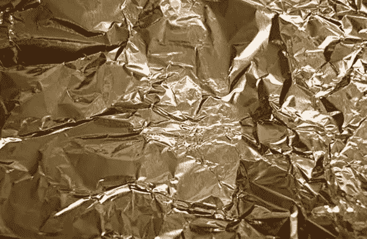](http://www.hongkiat.com/blog/30-high-quality-metallic-texture-pattern-brushes-and-photoshop-tutorials/)

* * *

### 金属栅格

* * *

### 划痕纹理

[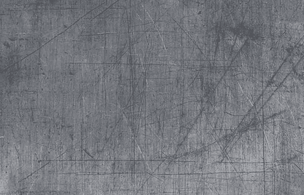](http://www.hongkiat.com/blog/30-high-quality-metallic-texture-pattern-brushes-and-photoshop-tutorials/)

* * *

### 生锈的金属

[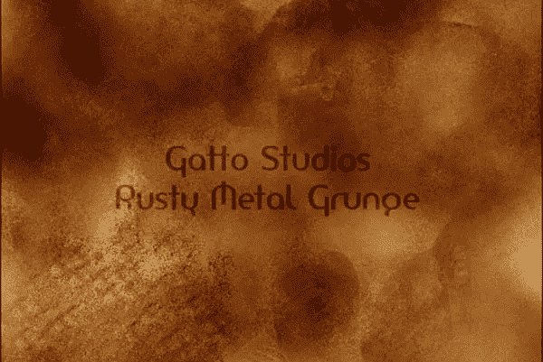](http://www.hongkiat.com/blog/30-high-quality-metallic-texture-pattern-brushes-and-photoshop-tutorials/)

* * *

### 深色金属栅格包

[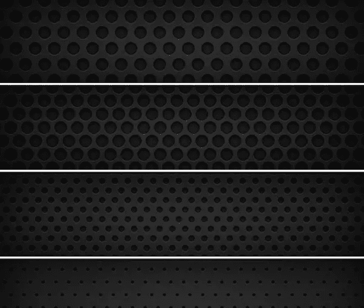](http://ormanclark.deviantart.com/art/8-Dark-Metal-Grid-Patterns-185458980?q=in%3Aresources%2Fapplications%2Fpatterns+sort%3Atime&qo=76)

* * *

### 金属板条

[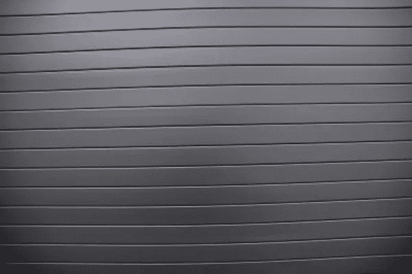](http://designm.ag/resources/free-metal-textures/)

* * *

### 带螺栓和螺钉的金属

[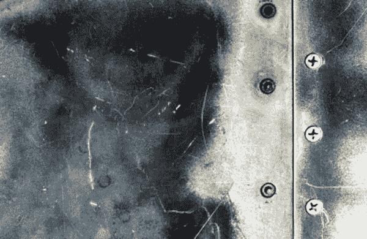](http://designm.ag/resources/free-metal-textures/)

* * *

### 金属编织

[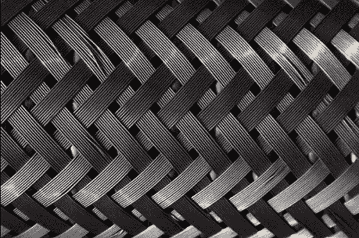](http://designm.ag/resources/free-metal-textures/)

* * *

### 可平铺的正方形

[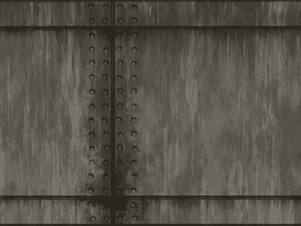](http://designm.ag/resources/free-metal-textures/)

* * *

### 金属栅栏

* * *

### 老化的金属

[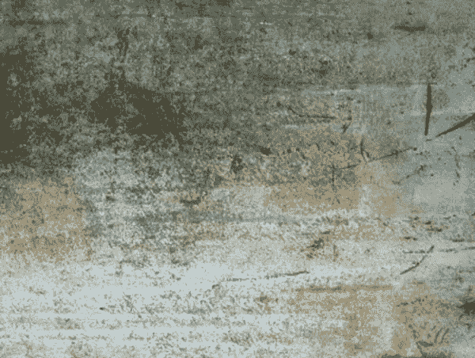](http://designm.ag/resources/free-metal-textures/)

* * *

你有什么最喜欢的东西应该被列入这个列表吗？一定要分享！

## 分享这篇文章