# 30 张 HDR 车辆照片

> 原文：<https://www.sitepoint.com/30-hdr-photographs-of-vehicles/>

我们喜欢我们的热棒，为什么不在 HDR 展示一下呢？！由于汽车和卡车车身的四四方方的，但光滑的形式，更不用说反射油漆工作，车辆创造了不同于其他任何有趣的图像。一些汽车爱好者利用 HDR 成像技术，通过过度饱和颜色来放大汽车上的创造性油漆，以获得充满活力、有趣的护栏。

为什么是 HDR？人类的眼睛被设计用来捕捉可见光谱中的大量值，并且可以适应变化的光线条件。尽管 HDR 的图像可以被打印出来，照相机却不能。如果没有一系列称为高动态范围照片的曝光，其中多次曝光用于捕捉大范围的值，这对相机传感器来说是非常困难的。在摄影领域，有必要手工处理每一张 HDR 的照片。就像许多艺术形式一样，这创造了一个独特风格的伟大集合。

检查 HDR 的汽车收藏，让我们知道你的最爱！

[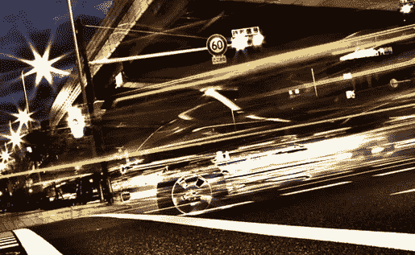](http://500px.com/photo/3653227)

[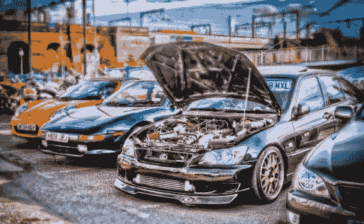](http://hdrphoto.co.uk/2011/12/09/modified-lexus-at-ace-cafe/)

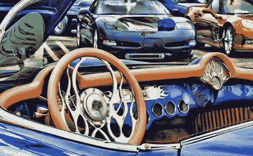

[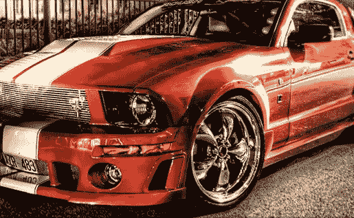](http://www.flickr.com/photos/mescon/3723883949/lightbox/)

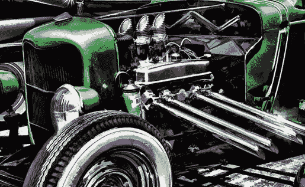

[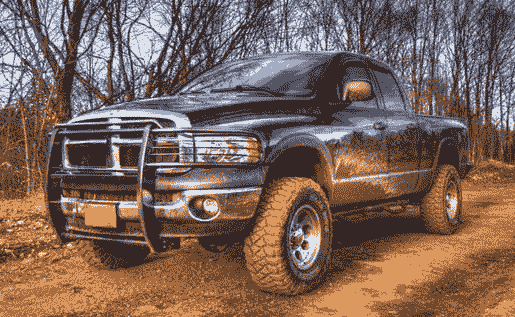](http://nebey.deviantart.com/gallery/?offset=96)

[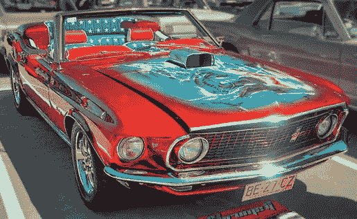](http://starkillerb89.deviantart.com/gallery/24060825#/d2r6nfw)

[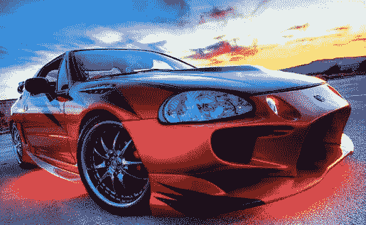](http://www.flickr.com/photos/cattardbezzina/3539367851/lightbox/)

[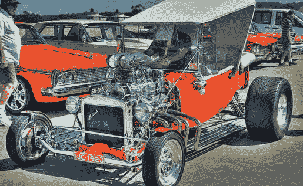](http://starkillerb89.deviantart.com/art/T-Bucket-HDR-164999530?q=gallery%3Astarkillerb89%2F24060825&qo=40)

[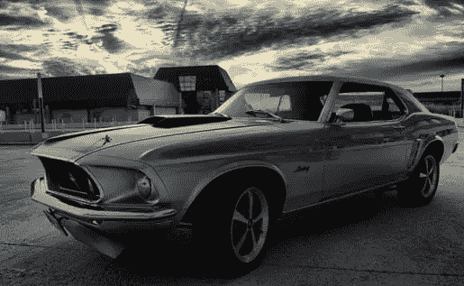](http://www.flickr.com/photos/exxodus/2735377476/)

[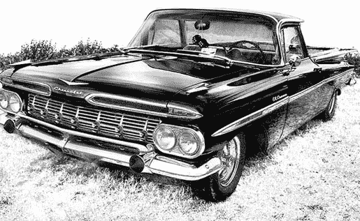](http://www.flickr.com/photos/cyanopolis/3312429482/)

[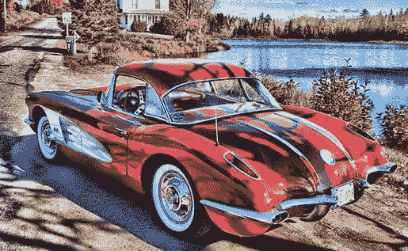](http://www.flickr.com/photos/redvette/1008010904/)

[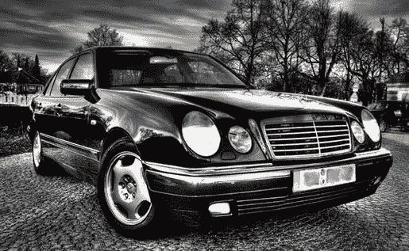](http://www.flickr.com/photos/36028812@N07/4303686057/)

[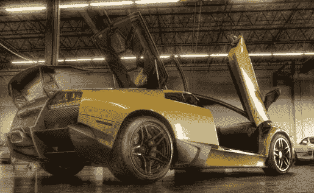](http://www.flickr.com/photos/inno68/3740687791/)

[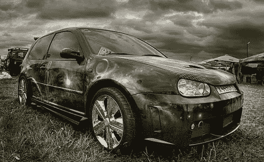](http://www.englishrussia.com/2007/07/12/russian-car-exhibition-with-hdr/)

[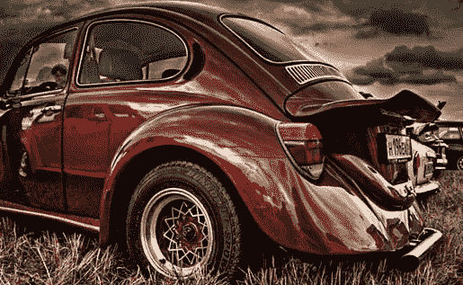](http://www.englishrussia.com/2007/07/12/russian-car-exhibition-with-hdr/)

[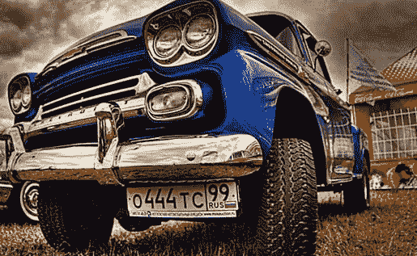](http://www.englishrussia.com/2007/07/12/russian-car-exhibition-with-hdr/)

[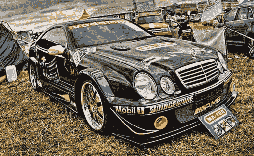](http://www.englishrussia.com/2007/07/12/russian-car-exhibition-with-hdr/)

[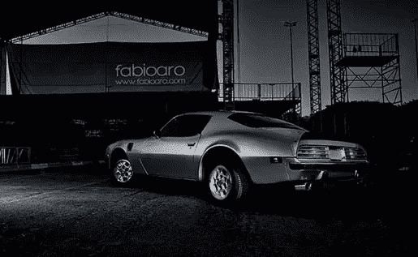](http://www.flickr.com/photos/fabioaro/2537494515/lightbox/)

[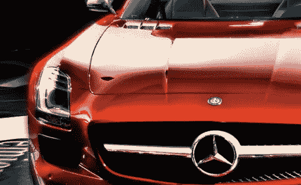](http://www.flickr.com/photos/kraetzsche/3934153239/lightbox/)

[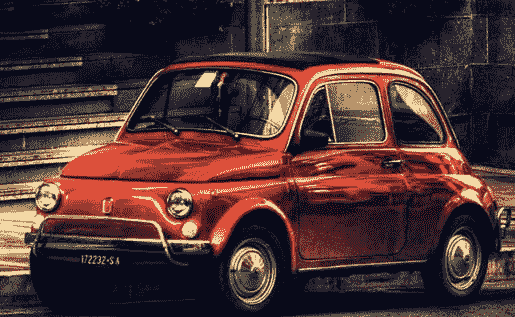](http://www.flickr.com/photos/mar1lyn84/2579564133/)

[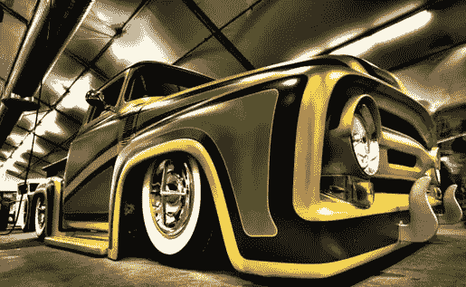](http://500px.com/photo/698113)

[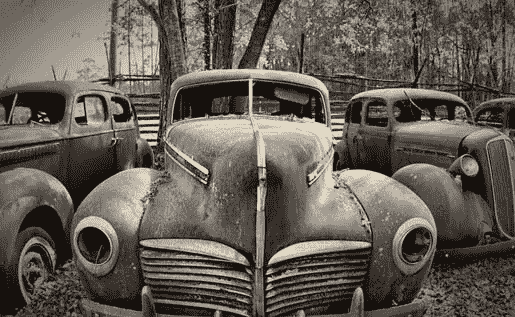](http://www.flickr.com/photos/craigoneal/2306477118/lightbox/)

[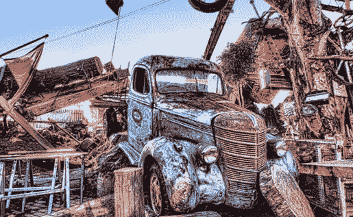](http://www.flickr.com/photos/lj-photographyandco/5962174417/)

[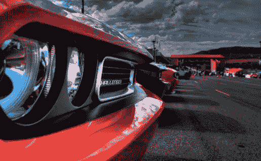](http://www.flickr.com/photos/zachd1_618/4913672284/lightbox/)

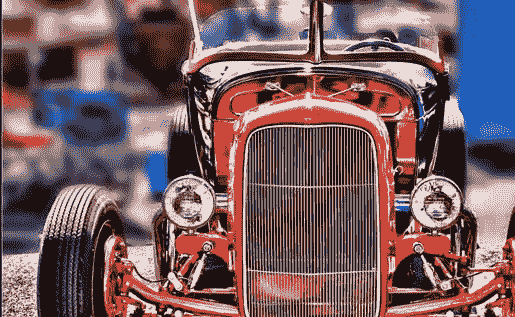

[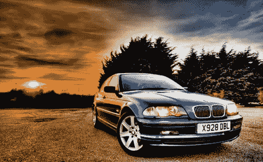](http://500px.com/photo/2182555)

## 分享这篇文章