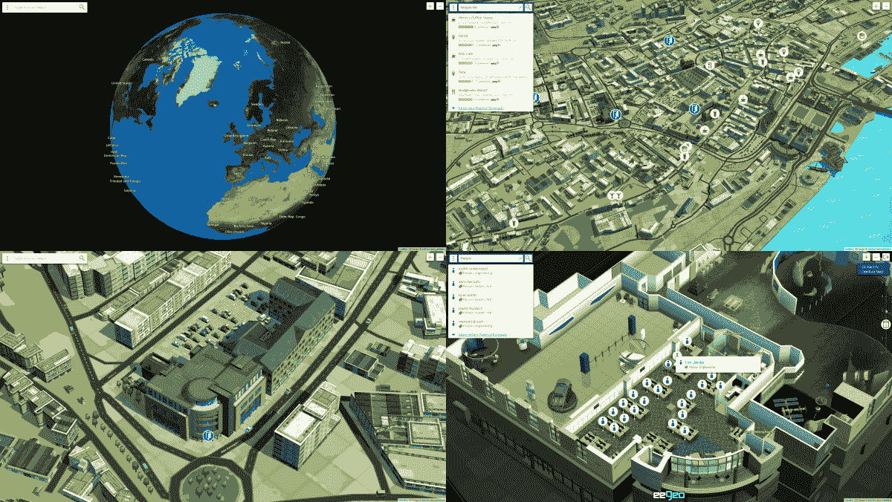
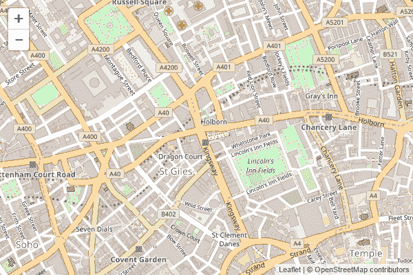
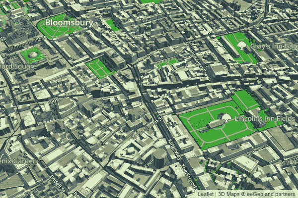
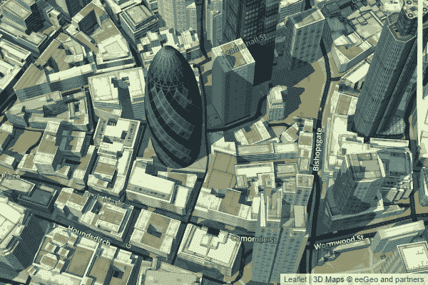

# 使用 eegeo.js 和传单构建精美的 3D 地图

> 原文：<https://www.sitepoint.com/3d-maps-with-eegeo-and-leaflet/>

[eegeo.js](https://docs.eegeo.com/eegeo.js/) 是一个[开源](https://github.com/eegeo/eegeo.js) 3D maps API，建立在流行的地图库[传单](http://leafletjs.com/)之上。

有许多地图库允许您嵌入或构建简单的 2D 地图。特别是[谷歌地图](https://developers.google.com/maps/)、[必应地图](https://www.microsoft.com/maps/choose-your-bing-maps-API.aspx)、[这里](https://developer.here.com/)、 [Mapbox](https://www.mapbox.com/developers/) 和 [OpenStreetMap](http://wiki.openstreetmap.org/wiki/Developer_FAQ) 。流行的映射抽象库如 [OpenLayers](https://openlayers.org/) 和[传单](http://leafletjs.com)也允许你改变地图‘基础层’而不必改变你的应用程序逻辑。

随着 [Google Earth API 的使用下降到 NPAPI 安全弃用](https://maps-apis.googleblog.com/2014/12/announcing-deprecation-of-google-earth.html)，3D 地图 API 的选择受到限制。替代品确实存在，比如广受欢迎的[铯](https://cesiumjs.org/)库。 [eegeo.js](https://docs.eegeo.com/eegeo.js/) 是另一个，提供一个动态的、真正无缝的 3D 世界地图，从空间到室内地图中的桌子。在浏览器中使用 WebGL。



## 入门指南

在本文中，我将向您展示使用 [Transport for London API](https://api.tfl.gov.uk/) 嵌入精美的伦敦 3D 地图并添加一些基本功能是多么简单。

剧透:3D 地图就像使用 2D 地图一样简单。

> **免责声明:**我是 eeGeo 的 SVP 软件开发，我监督 eegeo.js 的开发

有很多关于如何使用传单的教程。eeGeo.js 是有意识地建立在 fleet 之上的，这样已经熟悉 fleet 的开发人员可以立即开始运行。我强烈推荐传单[示例](http://leafletjs.com/examples.html)和[文档](http://leafletjs.com/reference-1.0.3.html)。

本文将涵盖基本的 HTML、CSS、JavaScript 和简单的映射概念。

## 你需要什么

本文将涵盖几个关键组件:

*   传单([文档](http://leafletjs.com/reference-1.0.3.html)，[示例](http://leafletjs.com/examples.html))
*   eeGeo.js ( [文档](https://docs.eegeo.com/eegeo.js/v0.1.780/docs/api/)，[示例](https://docs.eegeo.com/eegeo.js/v0.1.780/docs/examples/))
*   [伦敦交通局(TfL) API](https://api.tfl.gov.uk/)
*   Python，或者上传你的 HTML，CSS 和 JavaScript 的地方

## 展示伦敦的 2D 地图

首先，让我们使用 Leafet 和 Open Street Map 创建一个伦敦的 2D 地图。传单超级简单。您只需要一点点 HTML 来设置页面，一个`<div>`来包含您的地图，以及几行 JavaScript 来创建和设置初始位置。

### 创建 HTML

让我们用以下标记创建一个 HTML 文件:

```
<!DOCTYPE html>
<html lang="en">
  <head>
    <meta charset="utf-8">
    <title>Building Gorgeous 3D maps with eegeo.js and Leaflet</title>
  </head>
  <body>
    <div id="map" style="width: 600px; height: 400px;"></div>
  </body>
</html> 
```

### 包括传单

要包含传单，只需添加传单 JavaScript 库和 CSS 即可。将这些包含在`<head>`标签中:

```
<link rel="stylesheet" href="https://unpkg.com/leaflet@1.0.3/dist/leaflet.css" />
<script src="https://unpkg.com/leaflet@1.0.3/dist/leaflet.js"></script> 
```

### 添加传单 JavaScript

下面几行 JavaScript 初始化传单，使用 OpenStreetMap 作为平铺层。您可以将其作为外部 JavaScript 文件添加，或者为了简单起见，将其添加到`<div id="map"/>`下面的`<script></script>`块中:

```
var map = L.map('map', {
  center: [51.517327, -0.120005],
  zoom: 15
});
L.tileLayer('http://{s}.tile.osm.org/{z}/{x}/{y}.png', {
  attribution: '&copy; <a href="http://osm.org/copyright">OpenStreetMap</a> contributors'
}).addTo(map); 
```

该代码初始化以 WGS84 的霍尔本地铁站为中心的地图，纬度十进制度，经度`51.517327, -0.120005`。你可以通过在数字地图上点击右键并选择“这里有什么”来获得这些坐标，比如[maps.eegeo.com](https://maps.eegeo.com)或[谷歌地图](https://maps.google.co.uk)。稍后您将会看到，大多数地理空间 API 都以标准 WGS84 十进制经纬度返回位置，包括 TfL API。

### 打开 2D 地图

上传你的 HTML 到某个地方，或者在本地查看。我建议不要直接从文件系统加载，而是使用本地回送 web 服务器。将你的 HTML 另存为`index.html`，在同一个文件夹中，运行:`python -m SimpleHTTPServer 8000`然后你就可以在浏览器中访问`http://localhost:8000/`。

你会看到下面这张地图，以伦敦霍尔本地铁站为中心:



## 显示伦敦的 3D 地图

由于 eeGeo.js 是建立在传单之上的，因此只需做很少的更改就可以将伦敦的 2D 地图变成一幅精美的 3D 地图。

将我们在上面添加的 JavaScript 代码`var map = L.map ...`更改为以下内容。需要一个[免费的 eeGeo API 密钥](http://www.eegeo.com/register/)。您还应该删除调用`L.tileLayer`的 JavaScript，因为不再需要它了。

JavaScript 现在应该如下所示:

```
var map = L.eeGeo.map('map', '<your_api_key>', {
  center: [51.517327, -0.120005],
  zoom: 15
}); 
```

将我们添加到`<head>`中的`<script>`内容更改为包含`eegeo.js`而不是传单。`eegeo.js`文件已经包含传单，所以不要同时包含:

```
<script src="https://cdn-webgl.eegeo.com/eegeojs/api/v0.1.780/eegeo.js"></script> 
```

就是这样！只需改变几行，你现在就能看到霍尔本地铁站完全相同的视图，但却是华丽的 3D 视图:



### 更改缩放、倾斜和方向

由于 eeGeo.js 是完全 3D 的，因此可以旋转和倾斜地图。支持传单 [`setView`](http://leafletjs.com/reference.html#map-setview) 功能，可选倾斜和航向参数支持地图的 3D 行为。

添加以下 JavaScript 代码，10 秒钟后，地图将无缝地以 3D 动画显示从霍尔本地铁站到伦敦的小黄瓜:

```
setTimeout(function() {
  map.setView([51.514613, -0.081019], 17, {headingDegrees: 204.374, tiltDegrees:15.0});
}, 10000); 
```



截图并没有公正地处理交互，但是这个代码笔显示了动画的效果:

在 [CodePen](http://codepen.io) 上用 SitePoint ( [@SitePoint](http://codepen.io/SitePoint) )的 eeGeo.js 和传单看笔[华丽的 3D 地图转场。](http://codepen.io/SitePoint/pen/YZpLPw/)