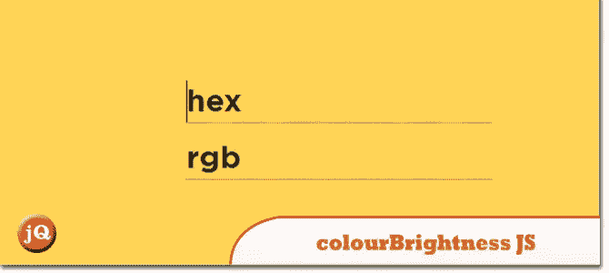
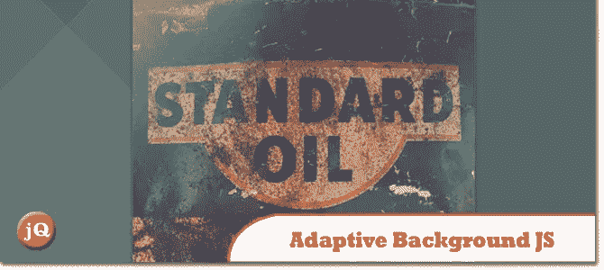
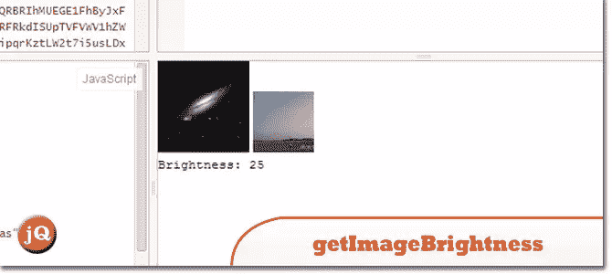

# 4 检测暗光背景 jQuery 插件

> 原文：<https://www.sitepoint.com/4-detect-darklight-background-jquery-plugins/>

在这篇文章中有一个列表，列出了 4 个检测暗光背景的 jQuery 插件。它们对于动态背景的网站非常有用，在这些网站中，浅色背景使用浅色，浅色背景使用深色。

## 1.背景检查

根据元素后面图像的亮度，自动切换到较暗或较亮版本的元素。

 
[源+演示](http://www.kennethcachia.com/background-check/)

## 2.colourBrightness.js

一个轻量级且易于使用的 jQuery 插件，它可以决定一个元素的背景颜色是亮还是暗。

 
[来源](https://github.com/jamiebrittain/colourBrightness.js) [演示](http://hex.colorrrs.com/)

## 3.jquery.adaptive-backgrounds.js

一个简单的 jQuery 插件，用于提取图像的主色，并将其应用于父元素的背景。

 
[来源](https://github.com/briangonzalez/jquery.adaptive-backgrounds.js/tree/master) [演示](http://briangonzalez.github.io/jquery.adaptive-backgrounds.js/)

## 4.getImageBrightness

亮度检测脚本。

 
[源+演示](https://jsfiddle.net/s7Wx2/)

延伸阅读:

*   [hacks.mozilla 链接](https://hacks.mozilla.org/2013/04/ambient-light-events-and-javascript-detection/)
*   [W3c 链接](https://www.w3.org/TR/ambient-light/)
*   [24 路链接](http://24ways.org/2010/calculating-color-contrast/)

## 分享这篇文章