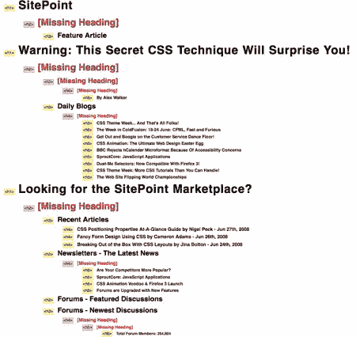
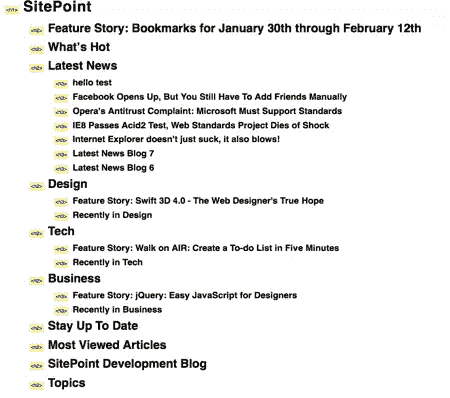

# 美化 HTML 标记的 4 种简单方法

> 原文：<https://www.sitepoint.com/4-easy-ways-to-spruce-up-your-html-markup/>

在最近一期的《T2 科技时报》中，我提到我正和团队一起努力为 sitepoint.com 设计新的头版。虽然我们的大部分时间都花在调整 CSS 样式和制作生成页面的 PHP 代码上，但是任何重大的重新设计都会带来改进网站核心 HTML 代码的机会。

当然，如今任何新编写的 HTML 代码都应该[验证](http://validator.w3.org/)。但是好的 HTML 代码不仅仅是验证。验证是你应该做的最基本的*工作，以确保你的代码质量。*

这一期，我想看看你可以做的四件简单的事情，来确保你的 HTML 有那种漂亮的、新的标记味道。

## 注意你的标题结构

这是我在之前在《科技时报》上发表的一篇文章。文档中的标题(`<h1>`、`<h2>`等)。)应该形成一个一致的层次结构:一个或多个`<h1>`部分，每个部分包含`<h2>`部分，每个部分又可能包含`<h3>`，抵制跳过标题层次的冲动(例如，在`<h1>`后面放置一个`<h5>`来表示内容中的“重要性”层次。

如今，检查标题结构最简单的方法是使用 Firefox 中的 [Web Developer 扩展](http://chrispederick.com/work/web-developer/)。只需点击**信息？查看文档轮廓**在新标签中查看页面轮廓。

SitePoint 目前的主页在这次测试中表现不佳。标题标签的选择很大程度上取决于它们所包含的文本的重要性。标题级别被跳过，重要的子标题通常比包含它们的章节的标题级别低。在某些地方，非标题文本甚至用标题标签来标记。

[](https://www.sitepoint.com/wp-content/uploads/2008/06/sitepoint-outline.png)

这种类型的标题结构对于像屏幕阅读器这样的辅助技术的用户来说几乎是不可能导航的。它是有效的 HTML，但是它并没有描述它想要描述的内容的结构。

新的 HTML 首页解决了所有这些问题。因为首页代表整个站点，所以页面包含一个单独的`<h1>`。然后，页面的所有部分都在顶级部分中标记有`<h2>`标签。

[](https://www.sitepoint.com/wp-content/uploads/2008/06/sitepoint-new-outline.png)

虽然文章标题的字体可能比“最新消息”这样的结构性标题要大，但用来标记它们的实际标签是用来描述页面的*结构*的，为屏幕阅读器用户导航提供了一个有用的地图。

## 用 id 替换命名锚点

这一点非常简单，但我仍然看到长期编写 HTML 的开发人员犯了一些错误。如果你想提供一个页面内特定点的链接(例如`https://www.sitepoint.com/#news`)，你不需要用`<a name="">`标签填充你的 HTML 代码——只需要在你已经*拥有的元素上使用`id`属性！*

 *在过去，如果你想提供一个链接到你的页面的“新闻”部分，你必须这样做:

```
<h2><a name="news"></a>News</h2>
```

如今，所有的浏览器都支持基于`id`属性和老式的`<a name="">`标签的页面内链接。因此，除了上面所说的，你可以这样做:

```
<h2 id="news">News</h2>
```

本页中的`"#news"`链接可以找到上面的任何一个示例标题，但是第二个更简洁，如果需要的话，还可以让你根据标题的唯一标识符来应用样式。

## 宣布你的语言

对于您来说，文档的内容是用什么语言编写的可能是显而易见的，但是对于搜索引擎和辅助技术来说，这是一条很重要的信息，很难猜对。

确保所有文档中的`<html>`标签包含一个 [`lang`属性](https://reference.sitepoint.com/html/core-attributes/lang)，该属性标识文档中使用的主要语言。对于英语，将其设置为`"en"`:

```
<html lang="en">
```

如果您的文档是 XHTML，您还应该设置 [`xml:lang`属性](https://reference.sitepoint.com/html/core-attributes/xml-lang)，它将被理解 XML 的系统识别:

```
<html  lang="en" xml:lang="en">
```

## 声明您的字符编码

这又是我要和很多应该更懂的开发者磨的一把斧子。Tech Times #134 完全专注于字符编码，以及每个 web 开发人员应该了解的内容。SitePoint 后来发表了 Tommy Olsson 的文章，[网络字符编码权威指南](https://www.sitepoint.com/guide-web-character-encoding/)。

简而言之，编码描述了 web 服务器发送给浏览器的二进制字节如何被翻译成构成 HTML 代码的文本字符。如果不指定编码，浏览器只能猜测。

根据您的代码编辑器的配置方式，您可能会使用 plain Latin 1 (ISO-8859-1)、Latin 1 的扩展版本 Windows-1252 或 Unicode 编码 UTF-8 对 HTML 进行编码。UTF-8 允许你在代码中包含尽可能多的字符，但是当前的浏览器会认为你的代码是 Windows-1252，除非你告诉他们不是这样。

要用 UTF-8 编码你的 HTML 页面，首先要确保你的文本编辑器(以及你网站上每个人的文本编辑器)设置为默认的 UTF-8 编码。如果你使用的是记事本这样的简单编辑器，你可能需要告诉它每次创建新文件时用 UTF-8 编码保存——这是不用记事本的又一个原因。

完成后，确保在所有 HTML 文档的`<head>`中包含一个`<meta>`标签，声明该页面是使用 UTF-8 编码的:

```
<meta http-equiv="content-type" content="text/html; charset=UTF-8"/>
```

这个标签越早出现在文档中，浏览器猜测文档编码的时间就越少，所以它应该是跟随开始标签`<head>`的第一件事。

最后，在你的站点上测试其中一个页面，确保浏览器能够识别它是用 UTF-8 编码的。在 Firefox 中，你可以右击页面背景，选择**页面信息**。编码应该显示在页面信息窗口的第一个标签上。如果它不是 UTF-8，请与您的服务器管理员联系，看看是在您的站点的 HTTP 响应头中声明正确的编码，还是简单地从这些头中删除编码，以便`<meta>`标签可以完成它的工作。

## 有什么建议吗？

这只是用最新的 HTML 技术更新标记的四种方法。如果你能想到任何其他的，一定要留下评论！我很想听听你是如何让你的 HTML 标记看起来性感又新颖的。

## 分享这篇文章*