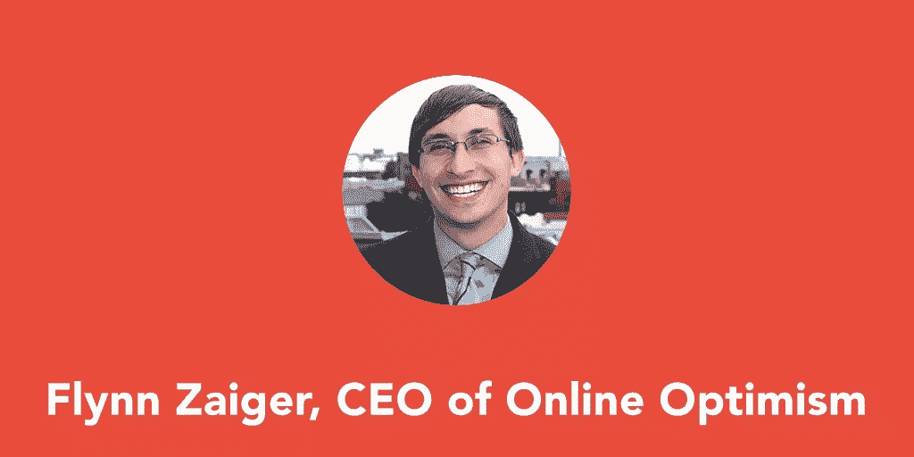
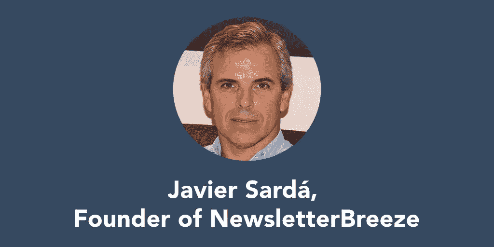
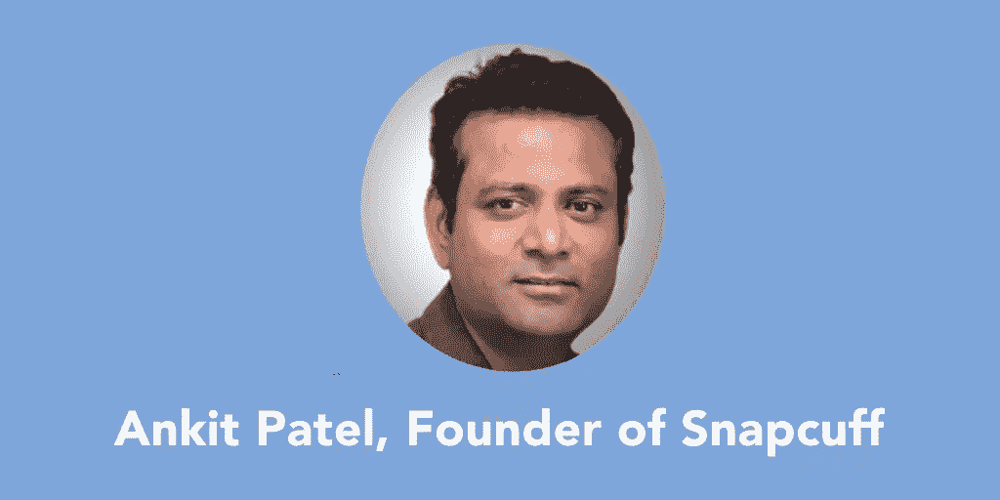

# 4 更多企业家关于“奋斗”的恐怖故事

> 原文：<https://www.sitepoint.com/4-entrepreneur-horror-stories/>

对于企业家来说，恐怖不会以嗜血的变种人或邪恶的玩偶的形式出现(当然，除非你是一个邪恶的玩偶制造商)。它不会追着你穿过树林，也不会把你送到地狱般的冥界。

不，对企业家来说，可怕的是全球金融危机，一个非常重要的法律的意外变化，一个无法构建的核心应用功能。

以下企业家已经尝到了这种恐怖，并活着讲述了这个故事。

## 弗林·扎伊格，在线乐观公司的首席执行官

在线乐观是一家数字营销机构，致力于帮助企业在网上做一切事情。2015 年，CityBusiness 将其评为新奥尔良最佳工作场所之一。

* * *

我最大的创业挣扎是解雇我的第一个员工。

这带来了两个大问题:首先，我们必须真正意识到他们在拖我们的后腿。我们对员工的自主权感到自豪，而不是微观管理他们的行为，所以我们没有参考点来意识到他们搞砸了。

这是第一课:员工评估至关重要。

第二是我们已经投入训练他们的简单沉没成本。在那段时间和工作时间之间，解雇他们并再次经历整个面试/培训过程对我们来说是一个巨大的损失。

但六个月后，它得到了巨大的回报，他们的替代品是非常值得的。古老的格言是正确的:雇用慢，解雇快。这些是我们的创业公司现在赖以生存的话。

## 尤金·艾默博士，[瑞哈设计](http://RehaDesign.com/)的所有者

*欧洲医疗服务公司制造并分销创新的轮椅配件。*

* * *

当我创办公司时，我的想法是帮助美国医药企业发展欧洲销售。我们的第一个合作伙伴是一家美国轮椅制造商。从 2004 年开始，我们将合作伙伴的欧洲销售额提高到约占其总销售额的 25%。后来，该公司被一家日本轮椅制造商收购，以增加他们在美国的销售额。

2008 年 12 月，我们的合作伙伴终止了我们的协议。

时机很糟糕。全球金融危机刚刚袭来，我妻子怀上了我们的第一个孩子，预产期是 2009 年 5 月。一夜之间，我们的收入下降了 90 %!

我从这次经历中学到了很多，尽管它非常令人沮丧。付款总是被拖延。出现了质量问题。我们努力为我们的合作伙伴建立市场，在我们取得如此巨大的成功后，看到我们的工作和收入消失令人沮丧。

但我了解这个市场，并建立了一个良好的网络，我可以很快进入。我们也一直在尝试销售我们自己的一些产品，这给了我们一些产品设计、开发和分销的经验。

我发誓再也不依赖别人，我决定重建我们的公司，专注于我们自己的品牌和产品。

在接下来的六个月里，我的重点是增加我们的产品组合，改善我们的销售渠道。现在，差不多六年过去了，我们已经走了很长的路。业务和品牌已经建立，我们仍在推出新产品，我们最新的轮椅配件本周刚刚上市。我妻子也创办了自己的公司，是公司的一个独立部门，相当成功。

## Javier Sardá， [NewsletterBreeze](http://newsletterbreeze.com/) 创始人

NewsletterBreeze 是一项时事通讯策展服务，面向那些希望拥有一份令人惊叹的时事通讯，但没有时间或资源来持续创作优秀内容的人。

* * *

2014 年 3 月，我们在西班牙推出了一个新闻聚合器，为对此类行业感兴趣的公司汇集非常具体的行业新闻。

我们推出几个月后，西班牙批准了一项新法律。这项法律对链接到外部内容的网站征税。这项法律旨在让谷歌向西班牙媒体缴纳税款，因为他们在谷歌新闻中放置了链接和文本片段。

这项法律的结果是，[谷歌新闻放弃了西班牙](http://searchengineland.com/responding-strict-new-copyright-law-google-shutter-news-site-spain-210648)。

这条法律直接影响了我们的 startrup，因为从一天到另一天，我们的客户认为他们需要支付他们没有预料到的税款。我们失去了大部分客户，不得不大幅降低价格，以继续与极少数没有离开我们的客户打交道。

由于这项税收，向新客户销售变得非常困难，尽管这项税收从未强制执行，但它的存在使得在西班牙销售变得非常困难。

这迫使我们采取以下措施:

*   走向国际，因为这项法律只影响西班牙。(然而，现在欧洲正在讨论类似的版权改革法，将我们置于非常危险的境地。)
*   将我们产品的性质改变为[简讯策展服务](http://newsletterbreeze.com)。为了确保我们的生存，这个支点在 2015 年 6 月推出是必要的。

这些决定产生了许多后果。

最初，我们有一个允许我们直接销售给客户的价格。现在我们有了一个更便宜的产品，需要在网上销售。

尽管产品相似，但由于销售模式的改变，它对业务产生了重要影响。

随着这一切的发生，很难前进，因为除了考虑客户想要什么，我们还必须记住，欧洲版权改革法的结果可以改变一切。

## 安基特·帕特尔，Snapcuff 的创始人

*Snapcuff 是一款适用于 iPhone 和 Android 的个人安全应用*

* * *

2007 年 iPhone 发布后，我想到了一个个人安全应用程序的想法。

我的第一个挣扎是我的技术背景。我是个药剂师，对编码一窍不通，但还是决定试试，给 app 和网站画了 UI。我们花了 18 个月的时间建立了一个原型，因为我在美国，我的开发人员在印度，作为一个非技术人员，很难解释我想要什么。

到 2009 年，原型已经完成。然后我们开始测试，并立即遇到了一个问题。经过这么多的压缩，照片上传仍然需要五分钟，我想把它减少到几秒钟。

在接下来的六个月里，我一直在测试它，试图找到一种加快上传速度的方法，但我无法将上传速度降低到四分钟以下。对于一个个人安全应用程序来说，这是不可接受的，所以我决定我们应该休息几年，在未来移动运营商可以提高速度的时候重新审视它。

快进到 2014 年，我们现在有足够的速度快速上传照片。我开始编写和绘制 UI，这一次，技术发生了很大的变化，我甚至可以添加更多的功能。

但是，我还是不知道怎么编码，为了按时完成 app，我请了代理。起初事情进展顺利，但后来开始出现小故障。这拖了将近一年，最终我不得不把这个项目从他们手里拿走，交给另一个开发人员。他们完成了应用程序，但是功能比我想要的少得多。

现在我正与第三家机构合作，我认为第三次就是魅力所在。我们有望在 10 月底前完成这个项目。

在我创建 Snapcuff 的过程中，我经历了太多的失败，有数百次我想放弃。我没有做的唯一原因是因为我想:如果我不做，谁会做呢？

全世界的女性已经遭受了几千年的痛苦，尽管我的几个竞争对手(例如 Life360)的下载量超过了 5000 万，但这些应用仍然没有影响滥用率。这给了我继续前进的动力。

最后，我可以告诉你，我奋斗了八年多，未来八年我都在奋斗，但我不会停止，直到我有所作为。

## 分享这篇文章