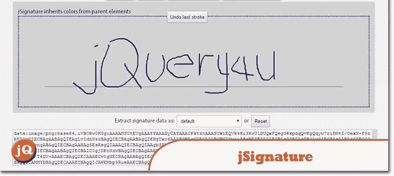
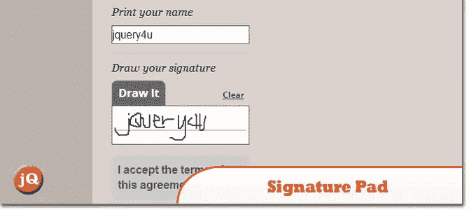
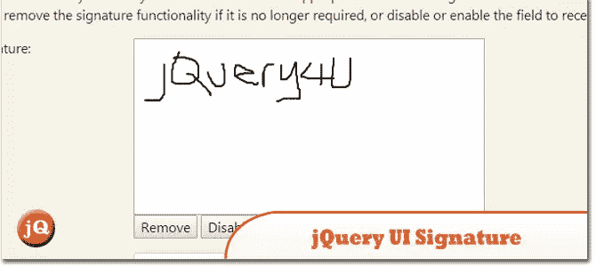
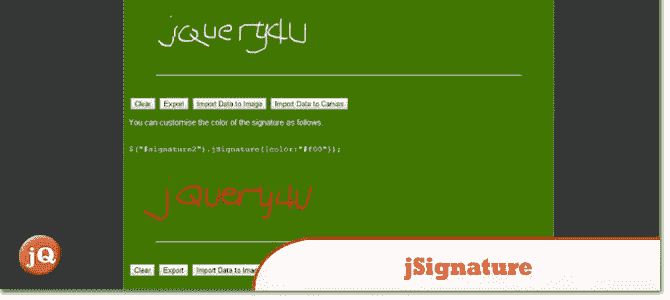

# 4 个 jQuery 数字签名插件

> 原文：<https://www.sitepoint.com/4-jquery-digital-signature-plugins/>

允许用户在浏览器窗口中绘制签名的方法有很多，其中很多都涉及到巧妙的 jQuery 插件。一切都在数字化，这是我们都必须期待的未来。这里是我发现的最好的数字签名插件。

## 1.联合申诉委员会

一个 jQuery 插件,它简化了浏览器窗口中签名捕获字段的创建，允许用户使用鼠标、笔或手指来绘制签名。查看一个[演示](http://willowsystems.github.io/jSignature/#/demo/)。

## 2.签名板

jQuery 插件用于帮助创建基于 HTML5 画布的签名板。将绘制的签名记录在 JSON 中，以便以后重新生成。查看一个[演示](http://thomasjbradley.ca/lab/signature-pad/require-drawn/)。

## 3.jQuery UI 签名

捕获或绘制签名的 jQuery UI 插件。它需要 jQuery UI 小部件和鼠标模块，并且需要用于旧 IE 版本的 excanvas.js 插件。

## 4.联合申诉委员会

一个用于添加 web 签名功能的 jQuery 插件。查看一个[演示](http://www.unbolt.net/jSignature/)。

 
来源

## 分享这篇文章