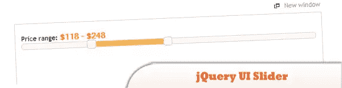
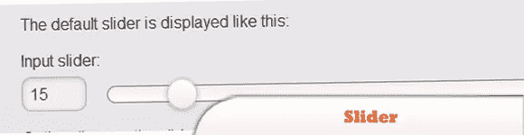
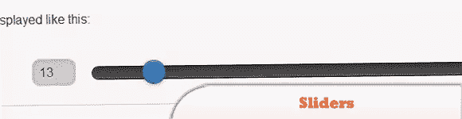
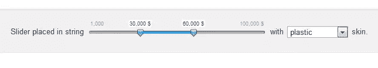

# 4+ jQuery 移动价格滑块(范围选择)

> 原文：<https://www.sitepoint.com/4-jquery-mobile-price-sliders-range-select/>

今天的帖子是一份 **jQuery 移动价格滑块**的列表。这些插件可以用于数字、价格或任何需要选择范围的东西。移动滑动为移动用户提供了一种简单的方法来选择值，只需用手指滑动任何触摸设备，当前值就会显示在框中。我们最喜欢的是#2，因为它允许轻松创建，最小/最大设置和主题。尽情享受吧！

**相关帖子:**

*   [15 个精彩的 jQuery 手机网站实例](http://www.jquery4u.com/mobile/15-exciting-jquery-mobile-examples/)
*   [50 个 jQuery 移动开发技巧](http://www.jquery4u.com/mobile/50-jquery-mobile-development/)
*   [移动开发的 10 个移动备忘单](http://www.jquery4u.com/mobile/10-mobile-cheat-sheets-iphone-android-blackberry-app-development/)

## 1.jQuery UI 滑块

jQuery UI Slider 插件将选定的元素制作成滑块。有多种选项，如多个手柄和范围。可以用鼠标或箭头键移动手柄。

  
[源+演示](http://jqueryui.com/demos/slider/#range)

## 2.jQuery 移动滑块

这个插件将在任何包含文本输入的页面上自动初始化。

  
[源+演示](http://jquerymobile.com/demos/1.0/docs/forms/slider/)

## 3.JsFiddle

是 web 开发人员的乐园，一个可以在许多方面使用的工具。人们可以使用它作为一个在线编辑器来编辑 HTML、CSS 和 JavaScript 代码片段。

[源+演示](https://jsfiddle.net/NkjQr/12/)

## 4.滑块

当您拖动滑块时，输入将会更新，反之亦然，所以它们总是同步的，这样您就可以用一种简单的方式提交滑块值。

  
[源+演示](http://jquerymobile.com/demos/1.0a2/#docs/forms/forms-slider.html)

## 5.杰利德

另一个我发现了一些体面的定制。
 
[源+演示](http://egorkhmelev.github.com/jslider/)

## 分享这篇文章