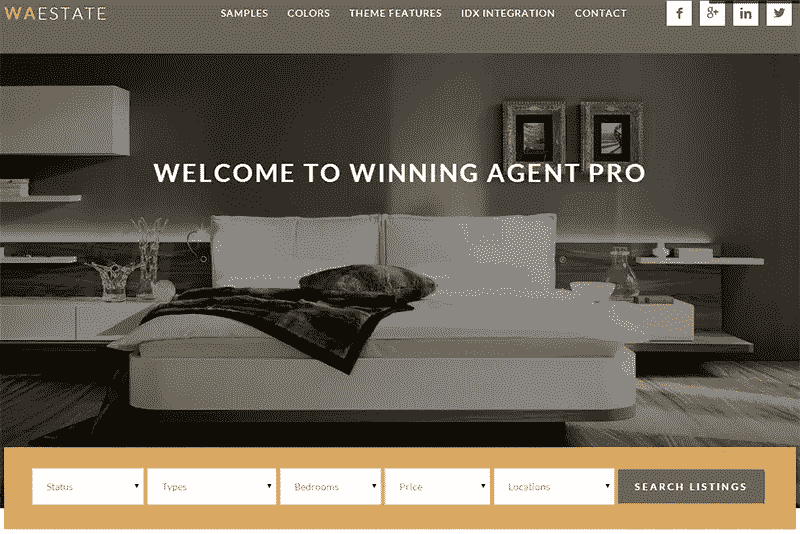
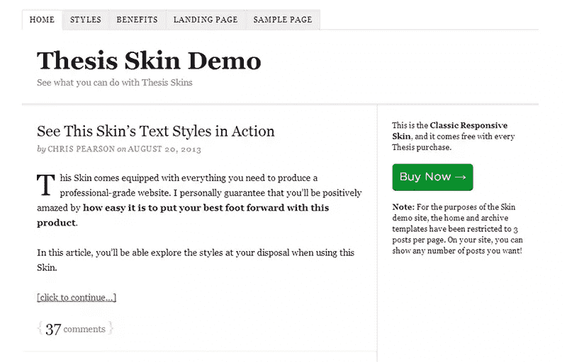
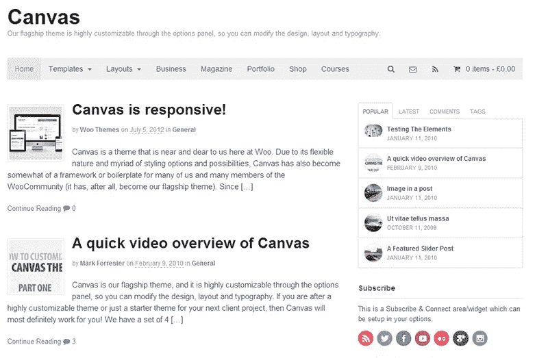
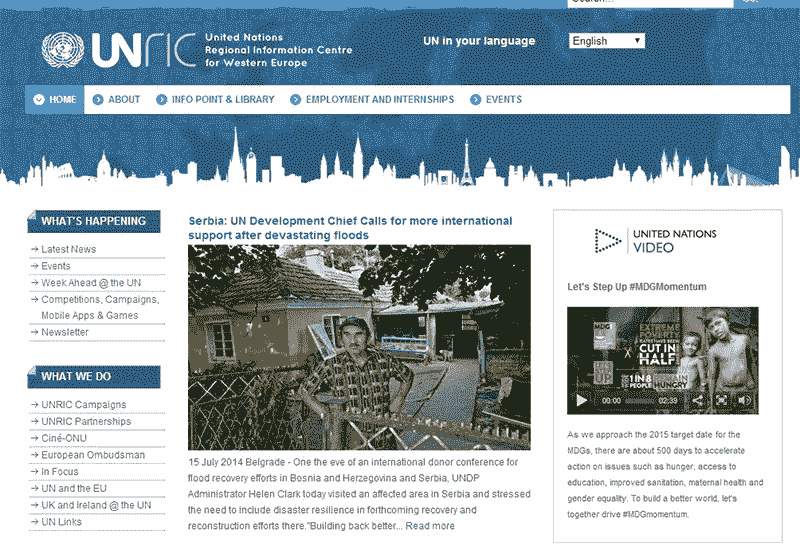
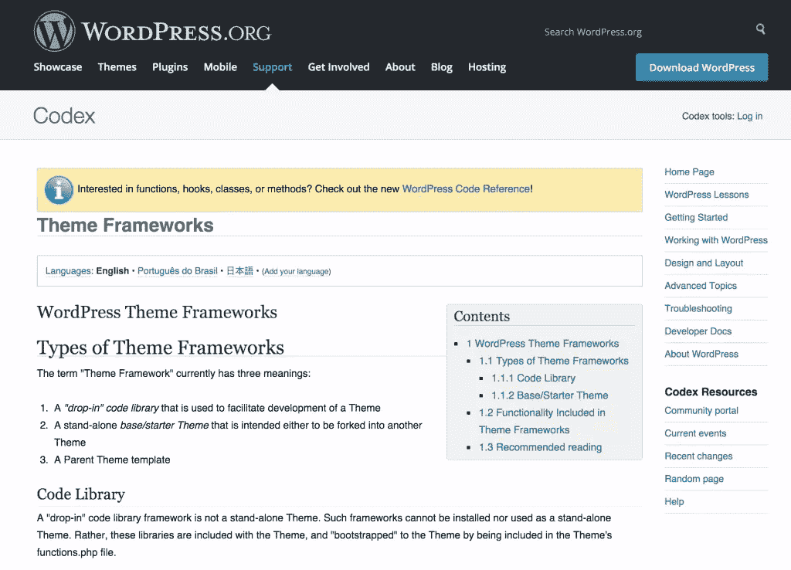

# 4 个最流行的 WordPress 主题框架

> 原文：<https://www.sitepoint.com/4-popular-wordpress-theme-frameworks/>

框架越来越流行用来构建主题。它们允许基于最佳实践的快速开发，而不需要每次设计一个新主题都重新发明轮子。

## 什么是 WordPress 主题框架？

WordPress 主题框架允许你像大众汽车一样构建主题。他们只使用少数几个平台，在这些平台上，他们可以为自己的四大品牌打造几十种不同的车型。每种车型都有一套通用的部件，如发动机、动力传动系统或悬挂系统。但在设计内部和外部时，每个品牌都赋予自己独特的味道。

例如，如果你把“引擎”替换为主题选项“T1”，把“动力系统”替换为“T2”文档“T3”，把“悬挂”替换为“T4”SEO“T5”，你就会明白这些共享组件的意思。框架为主题奠定了基础，所以你可以专注于设计而不是编程。对于一些框架，80%的工作在你开始之前就已经完成了，所以你只需要担心如何使用剩下的 20%来使你的主题独一无二。

框架确实有一个主要缺点，这在汽车平台上也能看到。它们限制了灵活性和创造性，并且基于框架的主题有看起来都一样的趋势。此外，作为一名开发人员，可能需要一些时间才能完全理解框架。

如果你投入足够的时间，你会发现让你的主题脱颖而出是可能的。就像我们都想要一个独特的设计，我们大多数人宁愿开奥迪 A3，而不是大众高尔夫。如果你学会了你所选择的框架，至少你总是可以确信你的基础是正确构建的。

## 流行的 WordPress 主题框架

在这篇文章中，我将向你展示一些当前流行的 WordPress 主题框架。其中三个是付费的，一个是免费的，各有特色。我还会看看他们的支持选项，并向您展示一些已完成的主题是什么样子的。

## [1。创世纪](http://my.studiopress.com/themes/genesis/)

[创世纪试玩 1](http://my.studiopress.com/themes/winning-agent/#demo-full)
创世纪试玩 2T5[创世纪试玩 3](http://my.studiopress.com/themes/epik/#demo-full)

价格:59.95 美元
支持:包括无限支持+活跃论坛

Genesis 是目前最流行的 WordPress 主题框架之一。它是由一家专业营销公司 Copyblogger Media 的团队开发的，该公司是一家备受推崇的内容营销公司，并提供一系列与 WordPress 相关的服务。他们将自己的经历融入到这个框架中，这转化为一些有趣的功能，如:

*   详细的搜索引擎优化选项，你可以指定最详细的设置，支持[Schema.org](https://www.sitepoint.com/using-schemas-improve-content-visibility-search-results/)
*   基于 HTML5 的响应式设计
*   吨(非常漂亮)预制儿童主题(额外付费)，你可以根据自己的主题
*   对开发人员友好，有大量文档来降低学习曲线
*   无限的支持和更新

单从定价和支持来看，Genesis 绝对值得一试。它上面运行着许多受欢迎的网站，包括著名的 Problogger.net。Genesis 开发者社区也非常活跃，所以如果你是开发主题的新手，这是一个很好的框架。

## [2。论文](http://diythemes.com/)

[论文演示 1](http://diythemes.com/demo/?skin=thesis_classic_r)
[论文演示 2](http://www.smartpassiveincome.com/thesis-theme-switch/) (全定制+激励)
[论文演示 3](http://diythemes.com/demo/?skin=nina_cross_promo)

价格:推荐版 197 美元，专业版。
支持:无限支持(专业计划及以上)+活跃社区

论文是一个先进的 WordPress 主题框架，提供更多的设计和功能控制。但是随着灵活性的增加，如果你想写你自己的代码，学习曲线会变得更高。幸运的是，他们还提供了一个带有可视化模板编辑器的拖放布局工具，因此非开发人员无需离开仪表板就可以创建自定义设计。

论文的主要特点是:

*   盒子，有点像模板插件，你可以用它来为时事通讯、脸书之类的盒子添加大量的集成。
*   专注于排版，给你几乎无限的控制你的字体
*   轻松集成搜索引擎的好东西，如 Authorship 和谷歌网站管理员工具
*   使用论文 API 真正深入代码的能力

论文是更高级的主题开发者的完美框架。与其他框架相比，它的价格相当高，特别是如果您想要一些基础皮肤(因为这些不包括在较便宜的$87 基本许可证中)。专业许可证附带无限的支持和更新，以及一些额外的盒子和皮肤。不要期望跳过使用这些基础皮肤中的一个，因为在我看来，老实说这些是非常丑陋的。

## [3。WooFramework +画布主题](http://www.woothemes.com/products/canvas/)

[画布演示 1](http://demo.woothemes.com/?name=canvas)
[画布演示 2](http://www.catherinelashbrooke.com/)
[画布演示 3](http://www.utique.co.za/) (画布+ WooCommerce)

价格:97 美元
支持:1 年支持和更新+社区支持

WooThemes 是 WordPress 世界中领先的主题商店之一。他们把所有的主题都建立在自己的框架上，叫做“WooFramework”。框架不能自己买，所以他们开发了一个叫 Canvas 的基础主题。这将作为你自己主题的基础，画布已经是一个相当不错的主题了。
WooFramework 和 Canvas 结合起来提供了以下重要特性:

*   WooCommerce 就绪
*   具有高级显示选项的组合功能
*   从仪表板中一键更新
*   非常坚实的基础，是 WooThemes 建立自己的主题的框架(他们每年卖出几千个)

画布主题受到世界各地许多开发人员的喜爱。本身就已经很有吸引力了，更容易入手。它已经包括一些流行的功能，如投资组合功能和自定义短码。唯一的缺点是你只需支付一年的支持和更新费用，而其他付费框架是无限的。

## [4。龙门架](http://gantry-framework.org/)

[龙门演示 1](http://www.unric.org/en/)
[龙门演示 2](http://thefarmfactory.co.uk/)
[龙门演示 3](http://www.shoresmusic.com/)

价格:免费支持:99 美元一年的付费支持+ 2 个活跃的谷歌群组

Gantry 是另一家热门主题店 [RocketTheme](http://www.rockettheme.com/) 的框架。他们自己提供了一些漂亮的主题，并在 GPL 许可下提供了他们的框架。他们很好地记录了 Gantry，并根据他们的经验和社区意见积极地改进它。它可以轻松地与其他框架竞争。它的一些最重要的特征是:

*   基于 Twitter Bootstrap 的响应式设计
*   广泛的定制选项，如空白部件，以实现更好的定位
*   大量包含的小部件和内置字段
*   支持更少的 CSS 和流行的 960 网格系统

Gantry 不是最容易使用的框架，但是它允许极端的定制。看看上面的演示，所有的主题都非常不同，但都建立在同一个平台上。如前所述，文档非常棒，Gantry Google 小组中有许多开发人员，他们可以帮助您了解更多信息。

付费支持是可用的，但前提是你必须在 RocketTheme 上购买商业许可。一年 99 美元并不便宜，但也可以选择以更少的金额购买更短的支持期。如果您仍然不确定是否要在一个框架上工作，Gantry 可能是一个试水的好选择。

## 其他主题框架

WordPress Codex 有一长串本文中没有提到的主题框架，我只介绍了我见过的开发人员和设计人员使用的更流行的框架。

如果你对更多的主题框架感兴趣，我强烈推荐你去看看主题框架的 [WordPress Codex 页面。WordPress Codex 也是了解主题开发最佳实践的权威地方。](http://codex.wordpress.org/Theme_Frameworks)

SitePoint 还在 2011 年报道了 [WordPress 主题框架，看看从那时起事情是如何发展的很有趣！](https://www.sitepoint.com/wicked-wordpress-theme-frameworks/)

## 结论

除了这四个框架之外，还有很多其他框架可供使用，尽管这些都是最流行的。有很多互相竞争的主题框架项目，其中很多看起来非常有趣。归根结底，这是一个跟上当前趋势、最佳实践和倾听听众意见的问题。有些框架更适合设计师，而不是开发人员。有些比其他的更轻量级，有些有更多的支持和社区选项。最终，最适合您的框架是最适合您的需求和工作流程的框架。

*请在下面评论，告诉我你最喜欢的框架是什么。请随意建议不同的框架并分享您的经验。*

## 分享这篇文章