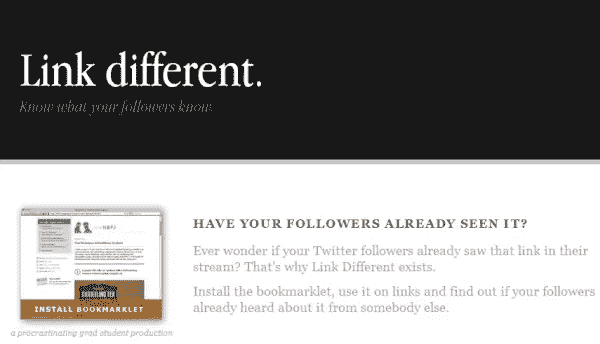
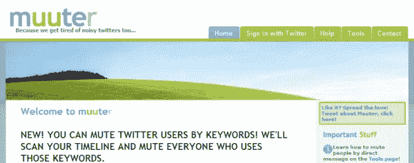
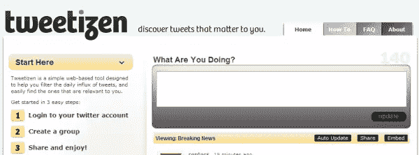

# 让你的追随者开心的 4 个 Twitter 工具

> 原文：<https://www.sitepoint.com/4-twitter-tools-for-followers/>

有很多 Twitter 应用程序可以管理你的账户，跟踪和分类关注者，使用列表，增强你营销业务的能力。每天都有新的应用程序出现，而且列表还在不断增长。

我在这些不同的 Twitter 工具上发了一些帖子，主要集中在扩展你使用 Twitter 的方式，帮助你作为一个参与者从它那里获得更多。例如:

*   [6 个你可能没听说过的 Twitter 客户端](../2010/04/29/new-twitter-clients/)
*   [更好地利用 Twitter 列表的 7 个工具](../2010/04/21/twitter-list-tools/)
*   [周末可以玩的 5 款新 Twitter 应用](../2010/02/06/new-twitter-tools/)

今天，我没有关注那些只会让你直接受益的应用，而是挖掘了一些专注于让你的粉丝开心的工具。这里有一些你的追随者可以使用的(或者你可以为你的追随者使用的)改善 Twitter 体验的最佳工具。

## [链接不同](http://www.linkdifferent.net/)

Link Different 允许您检查一个链接是否已经出现在您的关注者的流中，这样您就可以提供新鲜的内容并让您的关注者参与进来。要使用这个工具，你需要安装一个书签工具，在与你的追随者分享链接之前，从任何页面点击它。

## [计算机](http://www.muuter.com/)

Muuter 允许你通过手动选择一个用户，或者通过识别关键词自动静音 Twitter 用户。虽然这项服务实际上会在一段时间内取消关注你账户中的静音聚会，然后重新允许他们，但它的工作原理就像简单地将某人静音，而不会忘记稍后重新允许他们。您可以使用来自任何应用程序或设备的直接消息(包括短信)来启动静音。

## [Tweetizen](http://www.tweetizen.com/)

Tweetizen 是一个基于网络的工具，旨在帮助你过滤每天涌入的推文，并找到与你相关的推文。您可以使用 Tweetizen 创建 Twitter 群组，过滤推文并邀请其他人加入您的群组。您也可以将您的小组嵌入到您自己的网站和博客中。

## [twt qpsk](http://twtqpon.com/)

twtQpon 允许你创建一个 Twitter 优惠券与你的追随者分享。这可能是一个伟大的方式来促进产品或服务，提供追随者购买的动机。要使用这项服务，在 twtQpon 网站上创建一张优惠券，然后会有一条推文，上面有一个链接，让人们回到你的网站来兑换优惠券。

## 

你会把什么关注粉丝的应用添加到列表中？

## 分享这篇文章