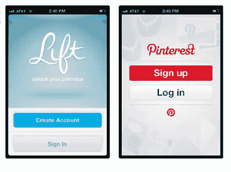
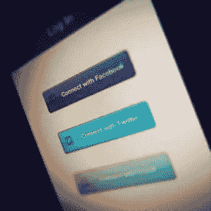

# 改进你的应用程序的 4 种方法 UX

> 原文：<https://www.sitepoint.com/4-ways-improve-app-ux/>

照片:monsieurlam

在创建你的应用时，用户体验总是一个主要因素。

然而，许多应用程序开发人员并没有把它放在足够重要的优先位置，而是陷入了假设他们的想法和设计有效，而没有真正考虑用户的真实体验。

因此，这里有 4 种方法来改善你的应用程序 UX。

## #1:尽早获得反馈

不要等到你的应用发布后才发现你可以做得更好，利用用户测试服务，如[验证](http://verifyapp.com/)、[测试](http://www.utest.com/)和【UserTesting.com】测试，了解用户如何与你的应用交互，并找出缺失的部分。

测试你的目标用户群和利基目标很重要，这样你才能了解不同的人在寻找什么。

当从用户那里获得反馈时，找出他们想要什么基于任务的功能，他们没有使用什么，以及如何改进设计。

不要只是确定用户喜欢什么和不喜欢什么，而是真正理解为什么某个过程对他们来说是复杂的，并在做出改变后，再次测试他们，看看他们的满意度提高了多少。

在应用程序的每一步进行适当的调整，而不仅仅是在发布应用程序之前或之后。最成功的应用总是完成用户测试，然后在每次更新后重新测试。

## 第二:第一印象很重要，所以布置要简单。

今天的移动用户时间紧迫，并且经常被复杂的注册或移动应用程序的设置说明所拒绝。

尽可能减少登录和设置步骤，在用户安装应用程序后，确保您的应用程序设置易于找到，以尽可能为用户提供可定制的体验。

当涉及到通知，声音，甚至登录协议时，用户希望有选择的能力。

当设计你的登录/注册页面时，注意使它既有图形吸引力又容易。另外，注意你所强调的内容。新用户应该不难知道如何创建一个帐户，或者现有用户登录。

Lift 和 [Pinterest](http://www.pinterest.com/ "Pinterest homepage") 提供了简单而容易的登录页面的范例。

两者都强调了新用户注册或创建账户的选项，从而很容易吸引和吸引那些尚未使用该应用的用户。

另一个有效的登录选项是将登录与社交媒体集成在一起，这样用户就可以用他们的社交媒体帐户快速登录。这也有利于不想被多个帐户用户名和密码困扰的用户。

记住不要为了清晰而牺牲简单。始终向用户清楚他们的信息将如何被使用。

## #3:就人性化设计而言…

“用户友好的设计”是什么意思？它不仅仅意味着一个直观的界面(尽管这总是很重要)。

不仅如此，人性化的设计真正迎合了你特定的用户群。

精通技术的青少年所需要的，很可能与匆忙的商人或经验丰富的游戏玩家所寻求的大相径庭。

因此，当你想到用户友好的设计时，就要想到适合用户的设计。简化您的设计，以符合您的目标受众的规格。

记住，你认为容易的事情可能并不适合你的用户。所以回到第一点——反馈，反馈，反馈！

除了让你的应用针对你的用户群，无论你的目标是谁，都有一些通用的设计准则要遵循。

*   确保你的按钮和字段大小合适。平台和手指大小不一。

*   确保你的设计是适合平台的，或者，如果你的应用是用于多个平台的，确保你已经在每个平台上测试过了。

*   移动用户时间紧迫，经常在外，所以不要浪费他们的时间或屏幕空间。确保你的应用程序有快速的加载时间，减少混乱，这样屏幕的每一部分都可以有效地使用。

## #4:底线？为用户着想！

这似乎是显而易见的和多余的，但是在你的应用上花费如此多的时间，你很容易忘记一个从未见过它的用户会有什么反应。

如果你的应用程序与一个网站或其他程序相关联，不要认为所有用户都会熟悉它。

总是看着你的应用程序，就像你从来没有见过它一样，并且质疑它的每一个部分的简单性、导航的便利性和价值。

虽然你的应用程序的一部分很容易使用，但是它对你的用户有真正的价值吗？

或者，从另一方面来说，是你的应用程序中一个非常有价值的组件，只是用户很难找到？

这些都是 app 开发每个阶段要考虑的最重要的问题。

## 分享这篇文章