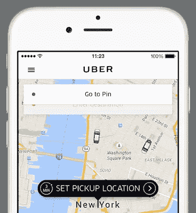
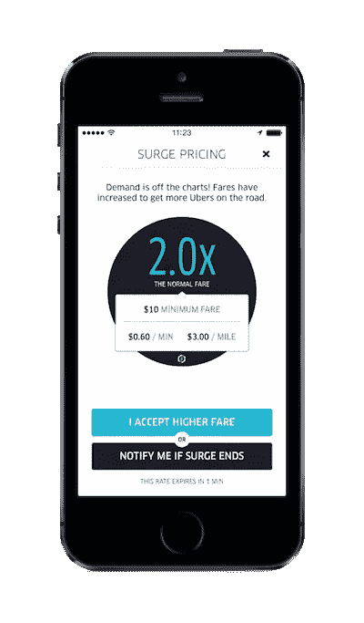
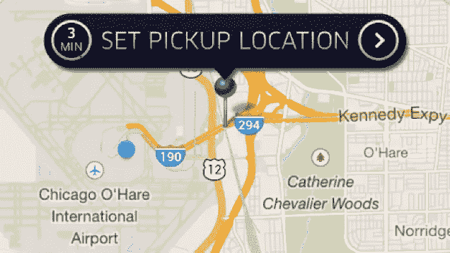
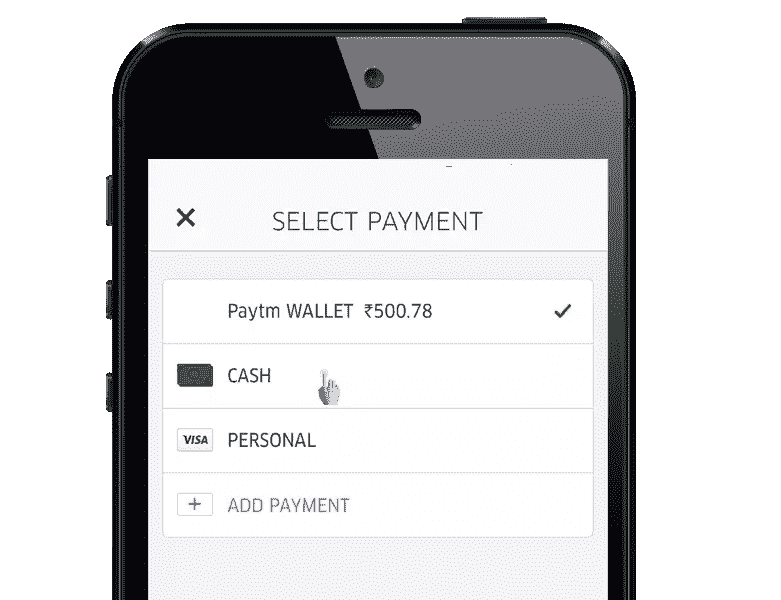

# 优步通过消除摩擦赢得 UX 的 4 种方式

> 原文：<https://www.sitepoint.com/4-ways-uber-wins-ux-wars-by-killing-friction/>

无论你是调高汽车音响的音量，还是向右滑动 [Tinder](https://www.gotinder.com) ，用户界面都仅限于控制面板、触摸屏和显示器。

用户体验不是。

智能手机扩大了 UX 的管辖范围。现在，按需服务正在将用户体验的范围扩展到口袋大小的触摸屏之外。

[优步](https://www.uber.com)、 [Instacart](https://www.instacart.com) 、[door dash](https://www.doordash.com)——利用 GPS 跟踪和无现金交易的服务清单正在不断增加。因此，它正在改变我们作为人的日常体验，而不仅仅是用户。

## 优步取得了什么成就？

公共交通(经常)很糟糕。你必须等待预定的服务，你必须用现金支付，而且从来没有地方可以坐。

传统出租车也好不到哪里去。你仍然要等待，你经常要用现金支付，而且你要为自己骑行的奢侈支付额外费用。

优步通过识别和解决乘客用户体验中的摩擦，对传统出租车进行了改进。现在，他们正试图通过拼车服务 UberPOOL 与公共交通竞争。

优步有他们有据可查的问题，但他们令人兴奋的全球扩张告诉你，他们做了一些正确的事情。

优步解决了哪些现实世界中的 UX 问题才来到这里？

## 问题#1:等待时间

无论是在一次大型旅行的前一天晚上预订出租车，还是在甜点之前溜出去给出租车公司打电话，在请求搭车和接受搭车之间的等待一直是一个痛点。

即使站在马路中间，扫视迎面而来的车流寻找一辆空出租车也是一种浪费时间的行为。

优步利用先进的技术来应对这一挑战。由于智能手机配备了全球定位系统，按需拼车服务可以使用软件将乘客和司机配对。

这种配对可以是瞬间的，但不总是如此。优步的效率证明了该公司如何监管其市场，而不是其移动应用程序的 UX。

众所周知，优步会在高峰时段提高价格——激增定价——以帮助抵消需求。乘客不喜欢高峰定价，但该功能通过减少需求和吸引下班的司机回到道路上来确保有足够的可用乘坐。

毫无疑问，飙升的价格对优步来说是一个艰难的公关挑战。[当然，一些用户在过去已经成为高峰定价的受害者](http://www.businessinsider.com/women-raises-362-to-pay-for-uber-ride-2014-11)，所以[优步将很快在你同意乘坐之前显示大概的费用](http://mashable.com/2016/06/24/uber-upfront-fares)，无论高峰定价是否有效。

一个高度数据驱动的系统允许优步通过分析一条路线与另一条路线的接近程度并尝试将乘客配对来解决高需求问题。这种拼车功能(UberPOOL)降低了骑手成本，增加了网络容量(减少了等待时间)，甚至为日常通勤提供了一种社交解决方案。

“普通老式出租车”能提供与之竞争的服务吗？技术上来说，是的。许多公司开发了更复杂的数据服务。创造性地使用这些数据是他们的天性吗？谁知道呢，但我倾向于怀疑。

## 问题#2:联系

通过电话下订单可能会很麻烦，因为重要信息(如信用卡号、地址、时间、日期等。)必须进行沟通和审核。

每当我不得不预约牙医或者做其他一些传统方式安排的事情时，总会有这样的时刻“嗯..我想我们很好”这是我讨厌的。我没听错时间吧？他们记下时间了吗？会不会是沟通不畅？

所有重要的细节都存储在优步应用程序中，便于更新和分享。当然，所有基于应用的服务都有这个特点，但痛点还是被消除了。

## 问题 3:方向

方向曾经是一个巨大的痛苦。出租车司机也是人，如果你不提供仔细的指示和密切关注，他们可能会错过出口。

有了拼车服务，GPS 可以带你去你想去的地方。键入一个地址，司机就能知道方向。

此外，当你与朋友共乘一辆车，并且你们有不同的目的地时，为司机指路会成为你乘车的主要焦点。优步通过向司机发送目的地并允许乘客根据需要提交后续目的地来解决这个问题。

## 问题 4:付款

虽然一些出租车司机仍然强迫你用现金支付，但你不必随身携带信用卡就能使用优步。

除了存储信用卡，优步还能自动连接智能手机上的苹果支付和安卓支付。携带现金的需求即将结束，而优步正在加速这一趋势。

优步还允许你和朋友分摊车费。这样就不需要像 [Venmo](https://venmo.com/) 这样的第三方 app 了。它减少了朋友之间的紧张，使进出汽车更快。

## 未来

优步有严重的问题，但他们不会回避大问题。

人类司机目前是优步的一个摩擦源。他们抱怨自己是承包商，要求更高的工资，并试图组织工会。

总是足智多谋的优步为无人驾驶车队[启动了一系列道路测试](https://newsroom.uber.com/us-pennsylvania/new-wheels/)来解决这个问题。

## 分享这篇文章