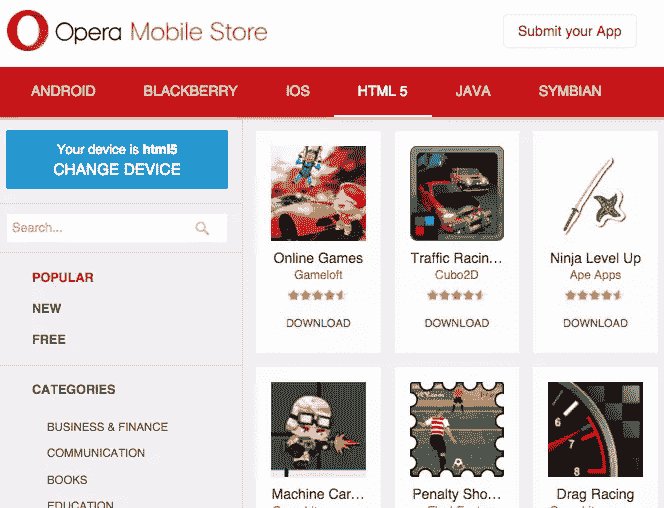

# 5 个可供选择的应用商店来销售你的应用

> 原文：<https://www.sitepoint.com/5-alternative-stores-to-sell-your-apps/>

开发一个应用程序需要时间和金钱。当它准备好发布时，你会想尽一切办法来确保你可观的投资有一个稳定的回报。

根据 Fueled 的数据，苹果 iOS 平台上超过 25%的应用程序每月收入超过 5000 美元，而在 Android 平台上，16%的应用程序达到了同样的门槛。在苹果商店上，你正在与 150 万个其他应用程序竞争，而谷歌 Play 有超过 160 万个应用程序。

替代应用商店可以给你更多的选择。一些公司有更好的收入计划，而另一些公司则提供特定的客户资料。随着竞争的减少，你的应用有可能成为小池塘里的大鱼。除了两个主要的应用商店之外，多样化也可以让你在大商店中生存下来。

这里有五个可供选择的应用商店，你应该考虑。

## 1.亚马逊地下

Amazon Underground 适用于安装了 [Amazon Underground 应用程序的 Amazon Fire 平板电脑、Android 和 Blackberry 10 设备上的应用程序。如果你不收取应用程序下载或应用程序内费用，商店将根据用户使用你的应用程序的时间来付费。Amazon Underground 背后的理论是，免费功能吸引了更多用户，开发者可以专注于客户体验。你不是从用户那里收钱，而是从亚马逊那里得到报酬。](https://developer.amazon.com/public/solutions/underground/docs/amazon-underground-frequently-asked-questions-faq)

这里有一个[一些注意事项](https://developer.amazon.com/public/solutions/underground/docs/amazon-underground-eligibility-and-submission-checklists)。要获得资格，你必须有一个应用程序的付费组件(应用程序内购买或收取使用费)，并且它必须具有“…与其他应用程序商店上的任何类似产品基本相似或更好…”的功能。

## 2\. GetJar

GetJar 拥有 70，000 个移动应用，免费向开发者提供分发服务。要求是最低的，你将达到 2300 多部电话。通过 GetJar 每天有超过 300 万次的下载，该公司的创始人 Ilja Laurs 说，他的公司最有价值的事情是他们提供大规模的分发。GetJar 平台上有 [849，036 款移动应用](http://www.getjar.com/about "Alternative App Stores")，Java ME、BlackBerry、Android、Windows Mobile 和 Symbian 的用户可以下载。

提交过程没有痛苦，审批也不会花很长时间。从[developer.getjar.com/login](http://developer.getjar.com/login/)开始。

## 3.AppBrain

AppBrain 列出了来自 Google Play 商店的应用程序，为 Android 应用程序及其开发者提供了一个按安装付费的系统。当你通过 Google Play 将你的应用程序添加到他们的目录中时，他们还会让你免费访问 AppLift SDK，这为你提供了对你的应用程序的分析，你可以用它来向广告商展示。当发现你的应用程序中的弱点时，该平台还会提出行动建议(“优化”)。目前，[有 50，000 人使用 SDK](http://www.appbrain.com/info/monetize) 将其应用货币化。

## 4.Opera 移动商店

Opera 移动商店包含超过 7500 种手机型号的超过 30 万个移动应用程序，包括黑莓、Windows Phone、Android 和 iOS。应用程序在 250 多个国家销售，每月有 105，000，000 名访客，每天有 2，000，000 个应用程序被下载。

[注册你的应用程序是免费的](https://publishers.apps.opera.com)而且你不需要删除任何应用程序内的下载，这个平台不会介入你商业模式的这个方面。扣除税收和交易成本后，开发者从黑莓、Symbian 和 Android 上的应用程序中获得 70%的版税。对于 Java，这个比例是 50/50。

## 5.亚马孙

亚马逊商店为其商店接受安卓、Fire TV 和网络应用[。像 Opera 移动商店一样，开发者将](https://developer.amazon.com/public/support/submitting-your-app)[获得 70%的销售额](https://developer.amazon.com/public/support/faq)。应用程序可以是免费的，也可以是收费的，在 200 多个国家都可以使用，并面向数千万亚马逊客户。如果你出于营销考虑提交了你的应用程序并被接受，亚马逊将通过社交媒体渠道以及亚马逊网站、Fire 平板电脑和移动设备上的商店前台为你推广它。

## 有什么损失呢？

如果你想要额外的曝光率和赚取更多收入的机会，你应该调查一些替代应用商店。尽管苹果和安卓拥有最大的市场份额，但是将你的应用添加到其他应用商店也不会有什么损失。这可能会对你的收入产生重大影响，并为你在不同市场赢得新客户。

## 分享这篇文章