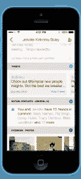
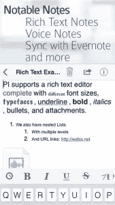
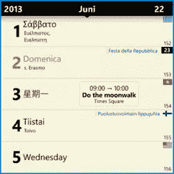

# 智能手机日历的 5 款最佳替代应用

> 原文：<https://www.sitepoint.com/5-best-calendar-apps-2014/>

如果你的移动设备的默认日历应用程序被证明是有限的，可能是时候投资升级了。幸运的是，有数百个应用程序可以提供更多的功能和更好的可用性。更幸运的是:我们已经为你做了艰苦的工作。

我们在网上搜索所有操作系统的最佳应用，并根据可用性、功能、跨平台兼容性和价格选出最佳应用。以下是五款最佳日历应用，旨在让你的 2014 年成为最有效率的一年。

## 节奏智能日历(免费，iOS)

Tempo 智能日历提供了对通讯录、智能提醒等的深入了解

[Tempo 智能日历](https://www.tempo.ai/)可用于 iOS 设备，并拥有智能查找和组织所有约会的功能。其中一些功能包括让您能够拨入电话会议，自动通知您日历中列出的任何人，联系信息更新，位置信息和驾驶时间，以及为您所有的亲人自动安排生日礼物。最棒的是，Temp 智能日历是完全免费的。

它仍然有一些缺点，包括下载应用程序的等待时间长，Tempo 智能日历中包含的功能但不完全支持，以及无法在应用程序中注册两个以上的电子邮件帐户。更何况 app 没有安卓支持。

尽管存在这些缺陷，但底线是 Tempo Smart Calendar 是一款直观的应用程序，其开发者承诺在不久的将来添加更多功能。

## EasilyDo 智能助手(免费，iOS 和 Android)

EasilyDo 智能助手提供生日通知、查看流量的功能，以及利用您的社交媒体账户的功能

EasilyDo 智能助手做 Tempo 智能日历做的一切，但与它的竞争对手相比，它是一个更完整的产品。重要的是，它适用于 iOS 和 Android 设备，并且可以免费下载。

该应用程序附带了许多功能，允许你在各种平台上同步联系人，通知即将到来的生日、重要事件和约会，还可以检查你所在位置的交通状况，并在天气不好时通知你。这些功能变得更加强大，能够将它们链接到你的脸书和推特账户以及所有的电子邮件。

像这个列表中的大多数应用程序一样，它会主动告诉你需要去哪里，但它的功能远不止于此。它完全与您的智能手机设备集成，甚至允许您从自己的界面下载 iTunes 库中的相关应用程序。

然而，EasilyDo 智能助手会引起一些人的隐私担忧，因为它能够访问你的 Gmail、脸书、Twitter、LinkedIn、Yahoo！，Evernote，还有很多账号。但是只有在你同意的情况下，访问权才会被授予，而且很容易被撤销。总的来说，这个方便的小应用程序非常强大，可以成为你不想放弃的个人助理。

## 日出日历(免费，iOS)

日出日历提供了一个华丽的平面设计，强调图像和视觉信息

如果你正在为你的日历应用程序寻找一个有趣、美丽和丰富多彩的界面，那么[日出日历](http://www.sunrise.am/)绝对不会错。它看起来绝对华丽，有一个现在大多数 iOS 7 用户都熟悉的“平面”用户界面。

它允许你链接你的所有账户，包括脸书、Gmail、LinkedIn 和谷歌日历，并为所有这些添加了一个丰富多彩的转折。但是 Sunrise Calendar 与其他日历的不同之处在于，它强调以视觉方式提供信息，例如为您的联系人提供照片和表示天气状况的可爱图标。

缺点是 Sunrise Calendar 不支持自然语言，例如只需告诉手机就可以添加事件，例如“周日下午 3 点的约会”。也没有安卓版本，但他们最近发布了 iPad 版本。尽管如此，它看起来和用起来都很棒，另外，它还可以处理 iCloud 事件共享，这是其他应用程序很少能做到的。

## 口袋线人(iOS:14.99 美元“高级”应用内购买免费，Android:9.99 美元)

袖珍信息员是一个功能非常全面的日历应用程序

用一个略显险恶的名字(说真的，是哪个营销大师决定叫它“线人”的？，袖珍线人是个畜生。鉴于购买(或者在 iOS 上解锁完整版)的高昂价格，它当然应该如此。但让这个价格合理的是，这个应用程序超越了简单的约会安排，本质上是一个功能齐全的笔记应用程序。

只需轻触一个按钮，您就可以保存语音笔记，将笔记备份到云，与谷歌和 Evernote 同步，查看多个日历视图，以及通过一系列主题增强其外观和功能。使用这款应用程序，一天内处理多个约会轻而易举，如果有任何冲突，它会主动警告你，甚至让你知道你是否可能错过约会，因为你当前的位置距离你需要去的地方有几个小时的路程。

不过，价格会让很多人望而却步，界面缺乏一定的细节，使用起来不如其他一些产品直观。但总的来说，这个应用程序在管理你的日历、笔记和任务方面非常强大。

## Chronos 日历(1.99 美元，Windows Phone)

Chronos Calendar 是 Windows Phone 商店中最好的约会应用

对于越来越多的 Windows Phone 用户来说， [Chronos Calendar](http://www.windowsphone.com/en-us/store/app/chronos-calendar/18aae83d-c70c-4ac1-8bf6-c6e726e031df) 是目前该平台上最好的日历应用。它可以使用你的微软账户或谷歌账户与你所有的日历和约会同步，如果你不确定非常合理的 1.99 美元是否值得花，还可以免费试用五天。

它还支持多种语言，包括葡萄牙语和简体中文，并将根据您的要求将许多不同国家的所有文化活动添加到日历中。事实上，据开发者称，它内置了 50 多个文化和国家的节日和特殊节日信息。

它缺乏在内部日历中添加重复事件的能力，这意味着你可能会使用与 Chronos 同步的外部日历，而不是其他应用程序。除此之外，这是一个功能强大的应用程序，信息丰富，完全可定制的动态磁贴，用户友好的界面，和多个日历同步。

## 你最喜欢的日历应用是什么？

无论你是在追求一个吸引人的设计还是一个功能更全的应用程序，这个列表应该足以让你按计划进行。这些是我们最喜欢的，但是你呢？您使用哪个日历应用程序来组织您的生活？请在评论中告诉我们。

## 分享这篇文章