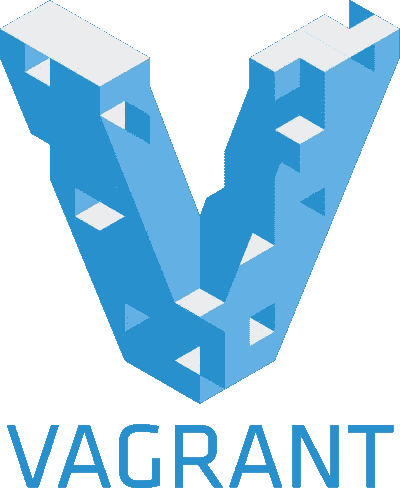

# 在流浪者上开始使用 PHP 的 5 个简单方法

> 原文：<https://www.sitepoint.com/5-easy-ways-getting-started-php-vagrant/>

[vagger](http://www.vagrantup.com/)是一个用于[创建和管理](https://www.sitepoint.com/vagrantfile-explained-setting-provisioning-shell/)虚拟环境的工具，帮助许多开发者不必关心“在我的机器上工作”的问题。流浪者创造了[可重复使用的开发系统](https://www.sitepoint.com/create-share-vagrant-base-box/)，可以一次又一次地使用，帮助你保持你的系统没有太多的安装。

当你专注于开发并且缺乏系统管理员的技能时，最好的办法(如果你打算在开发过程中使用 vagger)是尝试另一种方式来设置你的 vagger 配置。

说到 PHP 开发，有一些在线服务可以简化这些流浪虚拟机的设置和配置。以下是其中一些服务的列表。

## 1.普菲特

[PuPHPet](https://puphpet.com/) 可能是这些服务中最“出名”的，也可能是其中最“专业”的一个。它让你能够在本地机器上，在 Digital Ocean、Rackspace 或 Amazon Web Services 上托管虚拟机。你只需点击一个按钮就可以添加转发端口，共享源文件夹也是如此简单。您可以通过设置规则并根据需要删除规则来自定义防火墙。至于 web 服务器，您可以在 Apache 和 Nginx 之间进行选择，选择访问应用程序的别名和端口。

说到编程语言，PuPHPet 并不全是 PHP。除了 PHP，你可以选择安装 Python，Ruby，NodeJS 和 [HHVM](https://www.sitepoint.com/hhvm-and-wordpress/) 。你不能同时安装 PHP 和 HHVM，因为服务不允许这样做——使用[家园改进版](https://www.sitepoint.com/quick-tip-get-homestead-vagrant-vm-running/)同时运行两者。在安装 HHVM 时，你也可以选择安装夜间发布，这给了你测试脸书的[黑客](http://hacklang.org/)语言的可能性。

至于数据库，PuPHPet 有最大的数据库，有 6 个不同的数据库。可以在 MySQL/MariaDB(不能两者兼得)、PostgreSQL、Redis、SQLite、MongoDB 中选择。您可以选择安装 [Adminer](http://www.adminer.org/) 进行数据库管理，但是不要将其安装到生产服务器上。

在结束之前，PuPHPet 允许你安装工具，比如 [RabitMQ](http://www.rabbitmq.com/) 、 [Elasticsearch](http://www.elasticsearch.org/) 等。

PuPHPet 对你的所有要求就是你用一个不低于 1.6 的流浪版本。此外，您需要 VirtualBox 来使用本地机器上的配置。你可以在 GitHub repo 的[上找到 PuPHPet 的源代码，在这里](https://github.com/puphpet/puphpet)可以找到更深入的指南[。](https://www.sitepoint.com/build-virtual-machines-easily-puphpet/)

## 2.原型盒子

Protobox 是另一个在线流浪服务。有很多理由[使用 Protobox](http://getprotobox.com/docs/why) 。它实际上是作为 Puppet 的一个分支开始的，但结果是一个完整的其他项目，因为一些与[木偶](http://puppetlabs.com/puppet/what-is-puppet)(不是 pupppet)有关的问题。Protobox 已经成长为一个伟大的服务，帮助创建 web 应用程序开发的流浪配置。

使用 Protobox 时，您可以从应用程序类型列表中选择:

*   [Drupal](https://www.drupal.org/)
*   [拉勒维尔](http://laravel.com/)(也有自己的流浪配置——[家园](https://www.sitepoint.com/quick-tip-get-homestead-vagrant-vm-running/))
*   [柠檬架](https://lemonstand.com/)
*   PyroCMS
*   [西西里岛](http://sylius.org/)
*   [symphony](http://symfony.com/)
*   WordPress(也有 VVV-不同的流浪者)

您可以将这些应用程序中的多个添加到配置中。至于 web 服务器，Apache 和 Nginx 都可用。你只能选择三种语言:PHP、HipHop(带 HHVM)和 Ruby。

在撰写本文时，Protobox 仅支持 MySQL 和 MariaDB，但其他数据库，如 PostgreSQL、MongoDB、Redis 和 Riak 即将推出。通过勾选复选框可以安装 [Ngrok](https://www.sitepoint.com/use-ngrok-test-local-site/) 和 NewRelic tools ( [PHP 代理](http://newrelic.com/php)和[节点代理](http://newrelic.com/nodejs))等工具。

你可以在他们的 [GitHub repo](https://github.com/protobox/protobox) 中找到 Protobox 的源代码。

## 3.显形的

[Phansible](http://phansible.com/) 是基于 [Ansible](http://www.ansible.com/home) 的另一款创建流浪配置的工具，灵感也来自 PuPHPet。

Phansible 比上面的服务要简单一些。它同时支持 Apache 和 Nginx，只有当你选择 Nginx 时才支持 HHVM。除了 PHP，你不能选择任何其他语言，但是你可以在 PHP 的版本之间进行选择。还有，除了 MySQL，不能选择其他任何数据库。

当你预定只使用 Apache/Nginx、PHP 和 MySQL 时，Phansible doens 与上面的其他服务没有太大区别。否则，您将不得不手动安装其他工具。

## 4.流浪

罗夫可能是其中最简单的一个。您可以选择任何典型的配置，导轨和灯，或者您可以手动创建您的配置。

Rove 支持 CouchDB、MongoDB、MySQL、PostgreSQL、Redis 和 SQLite 作为数据库。你想选多少就选多少。它还支持与 PuPHPet 相同的语言，除了 HHVM 语。

## 5.定制配置

也有一些其他的特定于情况的浮动配置，*例如，*用于单个 PHP 框架。

这里我要提一下 [Laravel 的家园](https://github.com/laravel/homestead)，这让 Laravel 的开发变得小菜一碟，前端和后端都是如此。自带 PHP5.6，Nginx 作为 web 服务器，MySQL 和 PostgreSQL 都有；还有 NodeJS，用 Bower，Grunt 和 Gulp 进行前端开发。这里有一个改进版的家园。

Phalcon 也有一个浮动配置，这可以节省你在现有服务器上安装和配置它的时间，尽管你可以按照[这个快速提示](https://www.sitepoint.com/quick-tip-install-zephir-phalcon-2-vagrant/)在 [Homestead 改进的](https://github.com/Swader/homestead_improved)实例上安装 Phalcon。

WordPress 有自己的流浪者配置，[VVV——变化不定的流浪者流浪者](https://github.com/Varying-Vagrant-Vagrants/VVV)。SitePoint 上有一个[的完整教程](https://www.sitepoint.com/wordpress-meets-vagrant-vvv/)，告诉你如何使用 VVV。

### 最后的话

流浪者有时可能很难使用，但值得追求，因为它可以非常有用。如果你厌倦了为你的每一个项目配置你的机器，那么 vanguard 就是你合适的工具。如果你在配置你的机器时遇到了问题，那么使用一个预先包装好的 travel box 是解决你的问题的最好方法。我们错过的上述服务有什么替代方案吗？让我们知道！

## 分享这篇文章