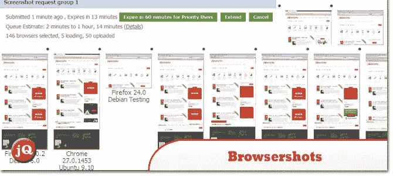
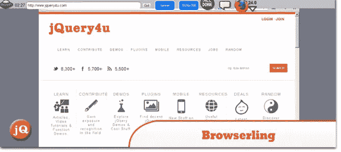
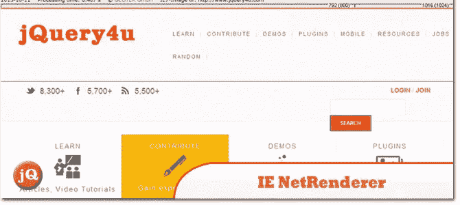
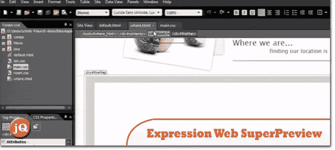
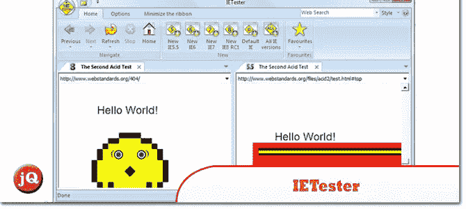
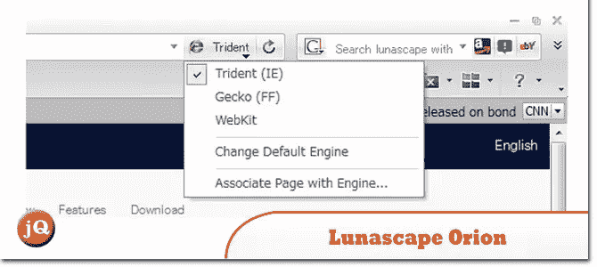

# 5 个免费的在线浏览器测试工具

> 原文：<https://www.sitepoint.com/5-free-online-browser-testing-tools/>

另一套自动化浏览器测试工具，但在本文中它们是免费的——**6 个免费的在线浏览器测试工具**。它们使跨浏览器浏览你的站点的过程自动化。尽情享受吧！

**相关帖子:**

*   [**6 付费在线浏览器测试工具**](http://www.jquery4u.com/?p=17522)

## 1.浏览器主机

它可以在不同的操作系统和浏览器中对你的网页设计进行截图。

 
[源+演示](http://browsershots.org/)

## 2.浏览

交互式跨浏览器测试。

 
[源+演示](https://browserling.com/)

## 3.IE 网络渲染器

允许您检查从位于德国的高速数据中心看到的 Internet Explorer 10、9、8、7、6 或 5.5 如何呈现网站。

 
[源+演示](http://netrenderer.com/)

## 4.Expression Web 超级预览

用于跨浏览器测试的可视化调试工具。

 
[来源](http://www.microsoft.com/en-us/download/details.aspx?id=2020) [演示](http://msdn.microsoft.com/en-us/expression/ff723803.aspx)

## 5.IETester

它是一个免费的 WebBrowser，允许你在 Windows 8 桌面、Windows 7、Vista 和 XP 上拥有 IE10、IE9、IE8、IE7、IE 6 和 IE5.5 的渲染和 javascript 引擎，以及在同一进程中安装的 IE。

 
[源+演示](http://www.my-debugbar.com/wiki/IETester/HomePage)

## 6.月球风景猎户座

一个简单易用的 Windows 浏览器。

 
[源+演示](http://www.lunascape.tv/)

## 分享这篇文章