# 5 个免费的基于网络的 Photoshop 替代品

> 原文：<https://www.sitepoint.com/5-free-web-based-photoshop-alternatives/>

[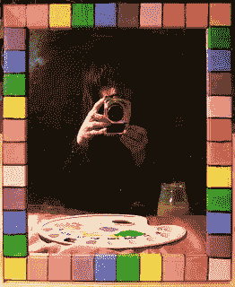](http://www.flickr.com/photos/auntiep/395898922/)

图:P 阿姨

对于许多设计师来说，Photoshop 是唯一能够胜任的图形程序。尽管 Photoshop 无疑提供了很多功能，但它绝不是唯一能够完成这项工作的软件。

你们大多数人都听说过 GIMP(或者甚至使用它)作为 Photoshop 的替代品。对于 Windows、Mac 或 Linux 来说，至少还有十几种桌面选择。

但是今天，我想谈谈越来越多令人印象深刻的基于网络的、独立于操作系统的 Photoshop 替代品。我需要声明的是，这些程序并不能完全取代所有 Photoshop 功能*。*

 *所以，如果它们不是完全的替代品，为什么还要麻烦呢？

首先，如果你检查你的工作流程，你可能会发现你在 95%的时间里使用相同的 5%的功能。

剪切、粘贴、裁剪、图层、文本工具、不透明度、颜色调整、蒙版和套索选择可能覆盖了你所做的大部分内容。

其次，如果你像我们中的许多人一样，你可能会在家里和工作中操作两台、三台甚至更多的计算机。不可避免地，一些是更老和更弱的单位。

在每台机器上安装一个成熟的、资源密集型的图形应用程序可能既不明智，甚至也不可能——无论是从财务角度还是性能角度。

第三，如果我们已经跨云(Dropbox、Google Drive 等)存储和共享我们的*文件*，以同样的方式共享功能是非常有意义的。对于许多任务，我们的浏览器可以有效地成为我们的新桌面。

在本文中，我将回顾几个最好的基于浏览器的图形替代品。

## 1.Pixlr

Pixlr 是一个真正的 GIMP，甚至可以说是 Photoshop 的竞争对手。它又快又免费，真的提供了很多。您可以使用它来编辑您现有的图像或从头开始创建图像。

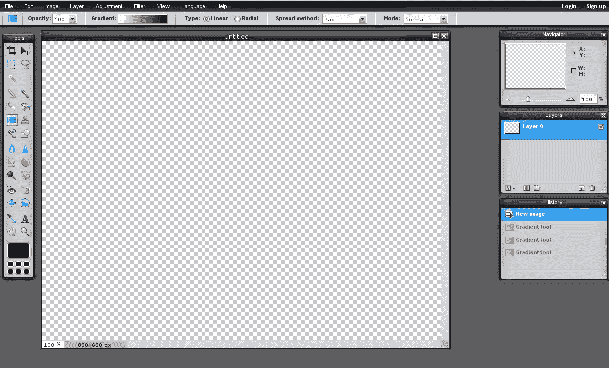

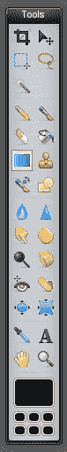

创建新图像时，您可以从预设图像尺寸(其中一些是标准横幅尺寸)中选取，但不能设定分辨率。Pixlr 支持 JPG、PNG、BMP、TIFF 和 PXD(它们自己的分层格式)。

如果您处理 Web 图形，那么大小、分辨率和格式限制不是太大的问题。我重复一遍，Pixlr 并不是 Photoshop 的替代品。创建一个横幅或网页图片已经足够好了，但绝对不是打印的选择。

Pixlr 界面看起来很熟悉，因为它类似于桌面图形程序的界面——菜单在顶部，工具箱在右侧，浮动窗口在左侧。

在工具箱中，你会发现任何桌面图形程序中都有的工具。这些工具与 Photoshop 或 GIMP 中的工具并不完全匹配，但是您已经拥有了您需要的工具。

Pixlr 有相当多的选项来处理图层、图像调整和滤镜。同样，这些不一定与你在 Photoshop 或 GIMP 中找到的完全匹配。

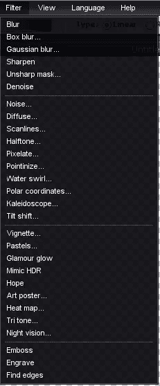

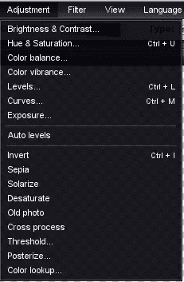

另外需要提到的两点是，Pixlr 的界面有多种语言，它甚至还有一个移动版本。

的确令人印象深刻。

## 2.Sumopaint

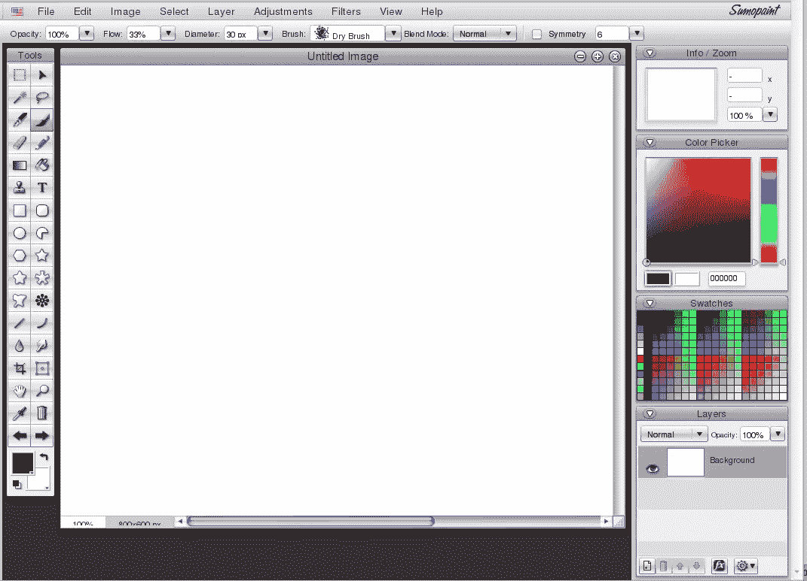

Sumopaint 是著名桌面应用的另一个真正的竞争对手。它的功能与 Photoshop 或 GIMP 中的基本功能(没有插件)相当。

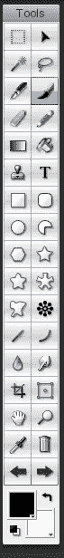

与 Pixlr 类似，使用 Sumopaint，您可以创建一个新图像或打开一个现有图像。至于格式，免费版只支持原生相扑格式，以及 PNG 和 JPG。

但是对于 web 图形来说，这对于大多数情况来说已经足够了。

Sumopaint 的界面与 Photoshop 非常相似——关键区别在于免费版有广告。

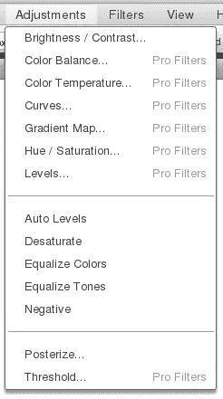

为了公平地比较 5 个基于网络的程序，我只比较 Sumopaint 的免费版本。这比 Pro(一个成本有效的 9 美元终身许可)或 Pro Plus(19 美元终身许可)版本的功能更少，但即使是免费版本也有一个非凡的功能集。

我不打算列出该计划的所有特点。相反，这里有一些它的工具箱和一些菜单的截图。

在那里你可以找到一些很棒的工具，包括一个对称工具，它在 Photoshop 或 GIMP 中甚至没有明显的对等物。

总而言之，Sumopaint 是一个很棒的网页图形程序。对于大多数常见的设计任务，它很可能是 GIMP 或 Photoshop 的可行替代品。

## 3.Photoshop Express

Photoshop Express 是 Adobe 的一款免费图形程序。正如你所料，这是一个非常精简的 Photoshop 版本，但它将 Adobe 的熟悉度与“免费”相结合，无疑对许多用户来说非常有吸引力。

与 Pixlr 和 Sumopaint 相比，Photoshop Express 是一个可怜的亲戚。首先，你只能使用 JPEG 格式。其次，你不能从零开始创建一张照片——除非你没有上传一张空照片。

第三，它只有一小部分功能。

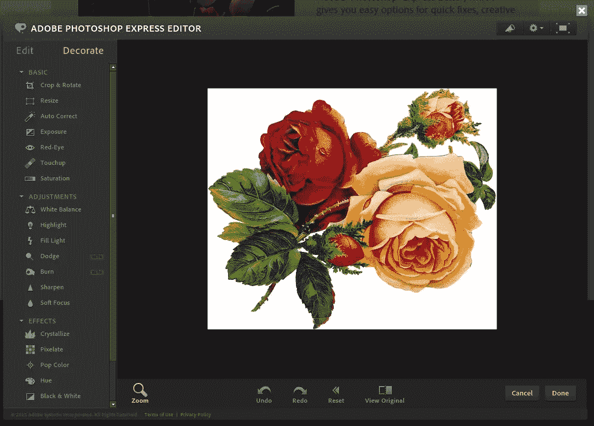

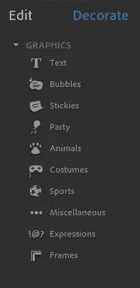

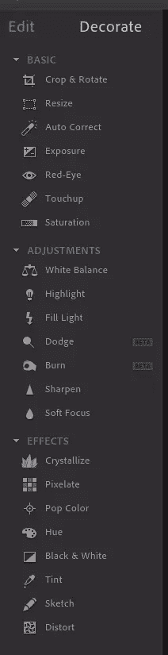

具有讽刺意味的是，Pixlr 的界面，尤其是 Sumopaint，比 Photoshop Express 的界面更类似于 Photoshop，所以如果你习惯了 Photoshop 的界面，你可能会发现自己在搜索基本的东西。

另一方面，Photoshop Express 的功能非常有限，搜索和理解整个应用程序不会花很长时间。

大多数功能都集中在左侧框架中(通常是工具箱所在的位置)。这里有两个选项卡——编辑和装饰。编辑包含诸如裁剪、调整大小、红眼、修饰、基本调整(如白平衡、锐化)等选项。以及诸如结晶、像素化等效果。

“装饰”标签包含文本、气泡、框架等选项。

这是你从 Photoshop Express 得到的所有东西，它似乎更坚定地定位于家庭和小型办公室照片修图人员，而不是任何以操纵图像为生的人。

当然不是一个全面的 Photoshop 或 GIMP 替身，但对于基本任务仍然有用，如果你习惯于 JPEG 格式的输出。

## 4.新月形

Lunapic 是又一个免费的、支持广告的图形编辑器，有很多选项。它的界面融合了 web 应用程序和 GIMP/Photoshop，但这并不令人困惑。

就功能而言，它有很多功能——既有桌面图形程序的标准功能，也有许多其他编辑器拥有的功能。

例如，使用 Lunapic，您可以加密/解密图像或将图像保存到您的电脑、Imgur、电子邮件、Tumblr、Picasa、脸书、网络等。这些对于网页图形来说很方便，即使你不经常使用它们也很好。

Lunapic 工具箱有点…奇特，包含剪切、复制、粘贴或打印等选项。虽然大多数其他图形编辑器不倾向于将这些选项视为“工具箱中的工具”，但我必须承认，将它们放在那里很方便。

菜单也是类似的情况。

你可以从 GIMP/Photoshop 中找到相同的命令，但是它们存在于奇怪的地方，比如“编辑”菜单中的“裁剪”、“调整大小”或“缩放”。

当然，这并不是世界末日，但如果你习惯了 GIMP/Photoshop 中菜单项的排列方式，这一开始会有点混乱。

Lunapic 的菜单与 GIMP/Photoshop 中的菜单的另一个区别是，Lunapic 提供的功能(可能)比 GIMP 和 Photoshop 的基础版本更多。

当然，您可能永远也不会需要这些功能，但是知道它们的存在还是很好的。

看看 ****就知道了，只是你有的一些**选项！**

 **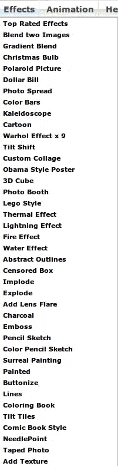

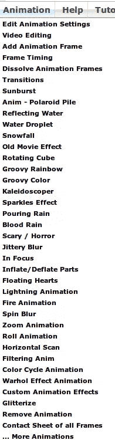

老实说，我无法尝试菜单中的所有选项——这需要一两天的时间——但从我的测试来看，这一切都令人印象深刻。

*你甚至可以用 Lunapic 编辑视频*，更不用说众多的动画选项了。总而言之，Lunapic 是一个令人着迷的编辑器，我敢说在某些方面它甚至比 GIMP/Photoshop 还要好。

## 5.摄影爱好者

FotoFlexer 是一个有很多选项的免费程序。他们宣传自己是世界上最先进的在线图像编辑器，尽管我不会这么说——尤其是当我把它与名单上的其他编辑器进行比较时。

对我个人来说，FotoFlexer 不是 GIMP/Photoshop 替代品的真正竞争者，这不仅仅是因为它有一个网络应用程序的界面，而不是一个桌面图形程序。

对于一个习惯了 GIMP/Photoshop 界面的设计师来说，这种 Web-app 界面令人困惑。更重要的是，它们不遵循标准的菜单惯例——也就是说，平滑和锐化在美化之下。

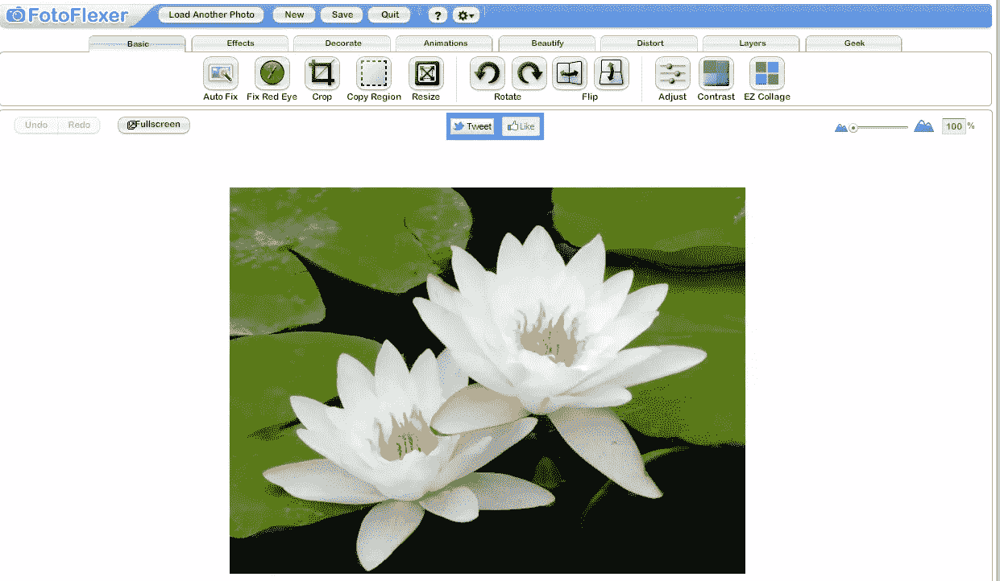

当然，如果其他一切正常，那么接口问题在开始时只是一个小故障。不过 FotoFlexer 有广告，也有点慢。

当然，这些不一定是交易破坏者，因为它确实有基本的图像编辑和超越的好选项，对于许多设计任务来说，它是一个选择。

下面是 FotoFlexer 的菜单，让你知道它能做什么。

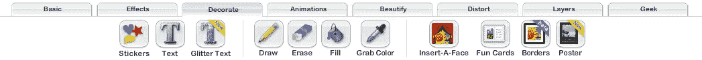

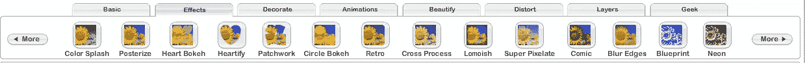

有一些很好的选项，你可以用 FotoFlexer 做很多事情，但我不能把它作为一个真正的 Photoshop/GIMP 替代品。

## 结论

Pixlr、Sumopaint 和 Lunapic 都有异常丰富的功能，可以轻松地与 Photoshop 和 GIMP 竞争许多日常图形项目。当然，它们不能复制 Photoshop 和 GIMP 的所有功能，但它们为高级设计任务提供了足够多的功能。

它们是可行的替代品，根据你的设计任务，很可能是 GIMP 和 Photoshop 基本版本的替代品。

我个人不能缺少的一个方面是 GIMP/Photoshop 插件基础设施，但如果要比较基本功能，对于网络图形，Pixlr、Sumopaint 和 Lunapic 都可以让我放弃对桌面的依赖。

Photoshop Express 和 FotoFlexer 当然功能更少，限制更多，但可以执行一系列相对复杂的图形任务。

然而，他们有限的功能将他们排除在最基本的设计任务之外。

我对现代浏览器所能实现的一切感到惊讶。

即使只是拜访父母或朋友，也要试一试这些应用。

## 分享这篇文章***