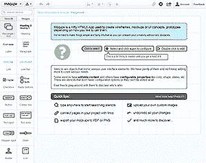
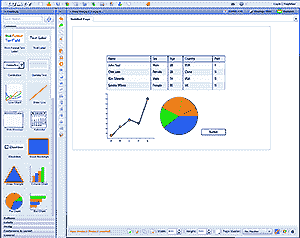
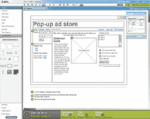
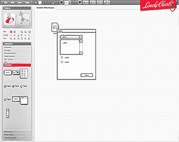
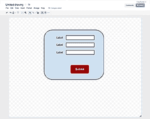

# 5 个最好的免费在线线框应用

> 原文：<https://www.sitepoint.com/5-free-wireframe-applications/>

许多成功的网页设计者和开发者可以在脑海中想象界面。这是很少有人拥有的技能。考虑你的客户。如果你足够幸运地收到一份说明书，他们在尝试你精心制作的应用程序的时候，是否重新评估了他们的界面？

线框有助于最小化这些问题。可以向客户提供一系列草图截图或模拟界面，他们可以在编码前尝试。有一些很好的商业产品——Balsamiq 是比较有名的一个——但是有几个免费的在线应用你可以考虑。作为奖励，有些提供可以共享的协作和演示 URLs

##  1。Moqups.com

Moqups 是我目前的最爱。它速度快，易于使用，不需要浏览器插件。可以链接屏幕和按钮，以便您可以发布演示供客户查看和使用。还可以为规格图导出图像。

Moqups 是用标准的 HTML5 和 JavaScript 创建的，这让它更加令人印象深刻。强烈推荐。

##  2。Lumzy.com

我已经用 Lumzy 做了几个项目。这是一个 Flash 应用程序，虽然界面不是最漂亮的，但它很快，提供了协作选项，并提供了一系列易于编辑和配置的控件。

屏幕可以有弹出提示，控件可以链接到其他屏幕进行在线演示。对于非常大的项目，Lumzy 可能会变得有点慢，但它仍然是一个很棒的应用程序。

## [ 3。Gliffy.com](http://www.gliffy.com/)

Gliffy 是另一款 Flash 产品。它比 Lumzy 更光滑，更漂亮，也更容易使用。它还提供了进一步的图表类型，如流程图，平面图，文氏图，网络，进程和导出到 SVG，JPEG 和 PNG 的 UML。

唯一的缺点是 Gliffy 主要是为单页图设计的。控件形状更受限制，您不能创建一系列链接的线框屏幕。

## [ 4。可爱的图表(网络)](http://lovelycharts.com/web)

可爱的图表是该公司的桌面和平板电脑应用程序的 Flash 版本。在功能上，它类似于 Gliffy，有一系列的图表类型和导出选项，但是您必须在使用之前注册。

同样，它提供的控制形状比 Moqups 或 Lumzy 少，并且不能输出可视的演示。但是，如果您正在创建书面文档，您可能会更喜欢它。

## [ 5。谷歌驱动绘图](https://drive.google.com/)

虽然 Google Drawings 不是一个线框应用程序，但它可以用于简单的屏幕模型。该工具速度快，提供协作，使用起来绝对令人愉快。图表可以输出到一系列文件类型，并嵌入到其他 Google Drive 文档中。

我错过了你最喜欢的在线线框应用程序吗？

对这篇文章的评论已经关闭。有关于线框的问题吗？为什么不在我们的[论坛](https://www.sitepoint.com/forums/forumdisplay.php?1-Website-Design?utm_source=sitepoint&utm_medium=link&utm_campaign=forumlink)上问呢？

## 分享这篇文章