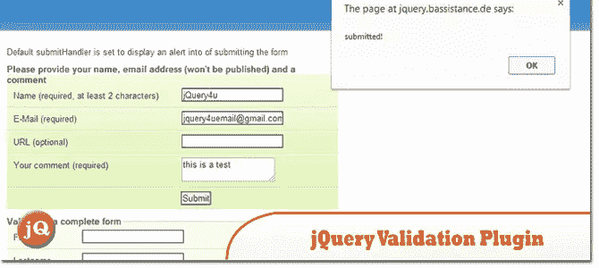
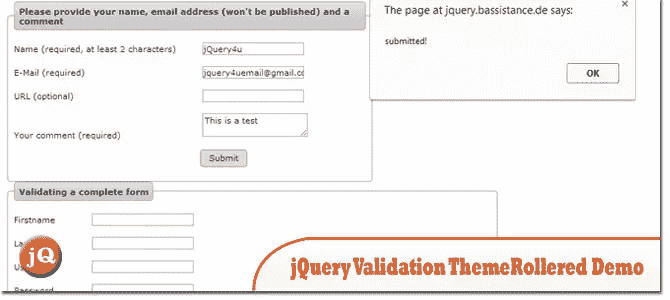
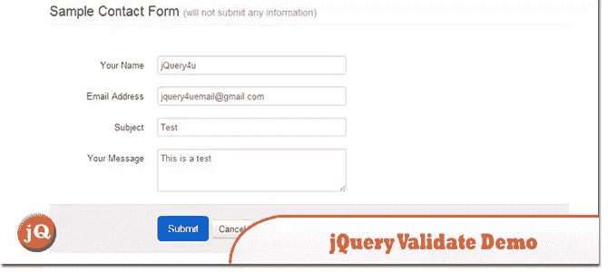
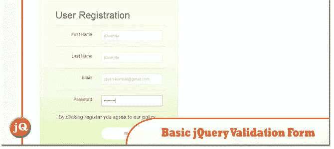
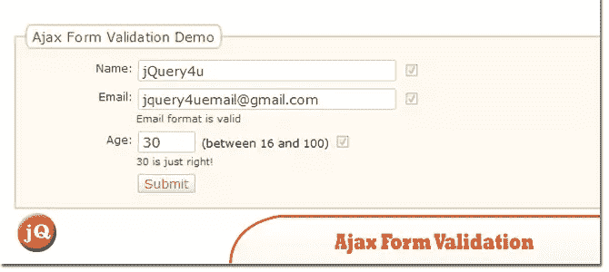

# 5 个好的 jQuery 验证表单演示

> 原文：<https://www.sitepoint.com/5-good-jquery-validate-form-demos/>

目前有大量的表单验证插件。所以今天我们分享我们认为的 5 个非常好的 jQuery 验证表单演示。当然是 jQuery 提供的！享受=)

另请参见:[基本 JQUERY 表单验证示例(2 分钟)](http://www.jquery4u.com/forms/basic-jquery-form-validation-tutorial/)

## 1.jQuery 验证插件

这个 jQuery 插件使得简单的客户端表单验证变得容易，同时还提供了大量的定制选项。

 
[来源](http://jqueryvalidation.org/) [演示](http://jquery.bassistance.de/validate/demo/)

## 2.jQuery 验证插件–滚动演示

滚动演示。

 
[源+演示](http://jquery.bassistance.de/validate/demo/themerollered.html)

## 3.jQuery 验证演示

使用来自 Twitter Bootstrap 的样式

 
[源+演示](http://alittlecode.com/files/jQuery-Validate-Demo/index.html)

## 4.基本 jQuery 验证表单演示

这个演示向您展示了使用一点 jQuery 来验证您的表单是多么容易。它使用 jQuery 验证插件和一些基本的输入验证规则。

 
[源+演示](https://github.com/sdeering/jquery-form-validation-demos)

## 5.Ajax 表单验证示例

这展示了使用 JavaScript(使用 jQuery)在表单中进行客户端验证的两个例子。

 
[源+演示](http://jqueryfordesigners.com/demo/ajax-validation.php)

## 分享这篇文章