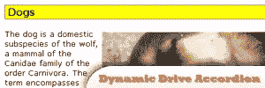
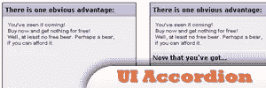
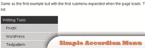
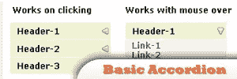

# 5 大 jQuery 共识

> 原文：<https://www.sitepoint.com/5-great-jquery-accordions/>

Now we are on into jQuery accordions, the first questions comes into your mind is probably “What is jQuery Accordion?” **Basically a jQuery Accordian is a type of a jQuery menu wherein multiple items can be included, but can only display one menu’s content at a time**. For instance we have an accordion menu, if item 1 was clicked it’ll show its content then if item 2 was clicked it’ll hide item 1’s content then show its own content. **Here is a selection of great jQuery accordion plugins:**

## 1.动态驱动手风琴

这个插件将把内容组合在一起，当用户点击它们的标题时就会显示出来。
 
现场演示:
[http://www.dynamicdrive.com/dynamicindex17/ddaccordion.htm](http://www.dynamicdrive.com/dynamicindex17/ddaccordion.htm)

## 2.Design Reviver 水平手风琴

这个 jQuery 脚本是一个水平类型的 accordion，它允许您将缩略图作为内容的标题。
 
现场演示:
[http://designreviver . com/tutorials/jquery-examples-horizontal-accordion/](http://designreviver.com/tutorials/jquery-examples-horizontal-accordion/)

## 3.jQuery UI 手风琴

这个插件是一个设计简洁折叠菜单。
 
现场演示:
[http://jquery.bassistance.de/accordion/demo/](http://jquery.bassistance.de/accordion/demo/)

## 4.简单的 jQuery 折叠菜单

这是一个灵活的 jQuery 折叠菜单插件，适合人们建立网站的各种需求。它还允许在同一网页上出现多个菜单实例。
 
现场演示:
[http://www.i-marco.nl/weblog/jquery-accordion-menu-redux/](http://www.i-marco.nl/weblog/jquery-accordion-menu-redux/)

## 5.基本 jQuery 手风琴

一个非常基本的 jQuery 折叠菜单，提供鼠标经过和点击事件来操作。
 
现场演示:
[http://roshanbh . com . NP/2008/06/accordion-menu-using-jquery . html](http://roshanbh.com.np/2008/06/accordion-menu-using-jquery.html)

## 分享这篇文章