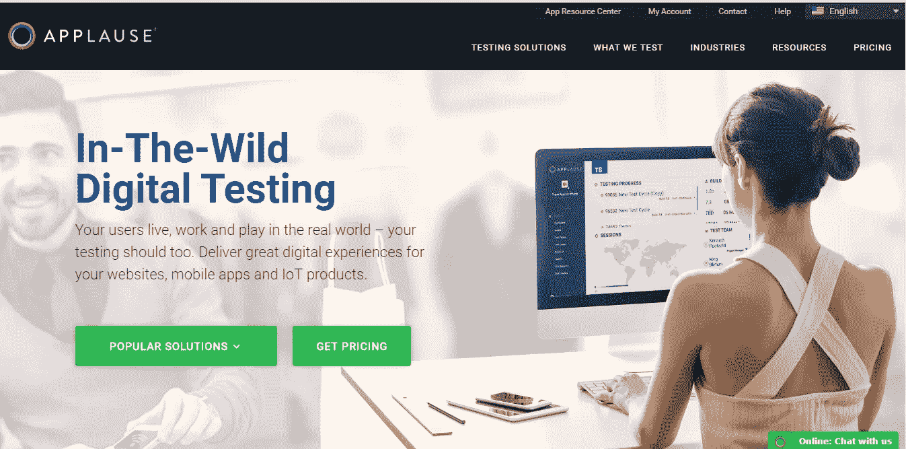
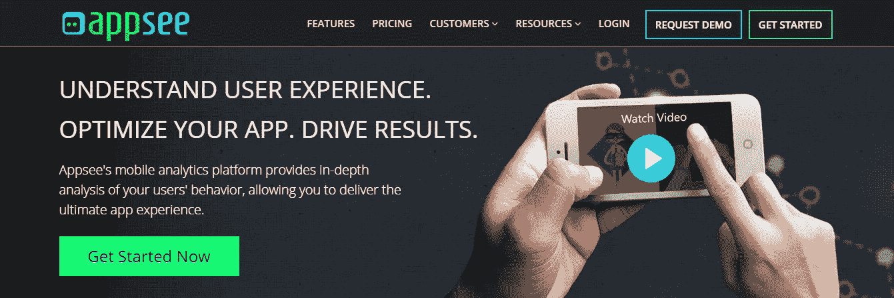

# 优化您的移动应用的 5 大服务

> 原文：<https://www.sitepoint.com/5-great-services-to-optimize-your-mobile-apps/>

现在可能有一个应用程序，可以满足你需要、不需要或可以想象的一切。但是*有多少移动应用真正满足了我们的需求，给了我们很好的体验？*大量应用程序未能完成这项任务。有些应用程序的设计很糟糕，使得用户的操作很难完成。有些应用会在用户采取某些行动时崩溃，或者不够直观，难以使用。当我说一个**平庸的手机应用应该是一个急需解决的问题**时，我希望你会同意。如果您正在寻找可以帮助您优化移动应用程序的工具，您会很高兴地知道选择范围很广。在今天的帖子中，我将介绍 5 种伟大的服务和工具，如果结合使用，可以最大限度地提高您的效果。

## 1.喝彩

[掌声](https://www.applause.com)社区由 250，000 多名经验丰富的 QA 测试人员组成，他们提供测试解决方案，包括:

*   功能测试
*   测试自动化
*   可用性测试
*   可访问性测试
*   本地化测试
*   安全测试负载测试
*   拥挤测试

plateau 在真实世界的环境中进行测试，在所有设备上，在你想要接触的受众生活的任何地方，为 iOS 和 Android 提供每一种可能的配置/组合。您可以管理测试以适应您的时间表，例如频率(每天、每周或随机)和开始时间。第一批结果应该在几小时内开始出现，或者在某些情况下是实时出现的。你将能够列出最紧急的问题，对错误进行优先排序，并提高你的工作效率。

plateau platform 提供的最有趣的功能是可以通过其[移动测试版管理](https://www.applause.com/mobile-beta-management/)发布移动应用的测试版。

由于这个功能，分析用户如何与你的应用程序交互变得更加容易。这项服务包括为合格的参与者创建有针对性的调查，以及专家团队的持续帮助，旨在提供关于如何促进/改善开发流程和应用可用性的宝贵反馈。

## 测试精灵

[TestFairy](https://testfairy.com/) 是一款针对原生和非原生 Android 和 iOS 应用的免费测试工具。你可以上传一个应用到平台上，并使用电子邮件地址或基于网络的测试应用邀请测试人员。这些测试人员会收到一个下载你的应用程序的链接，只需点击一下就可以开始使用它。然后，您可以在用户执行它们时观察结果，并初步体验您需要改进以满足期望的特性。

通过 TestFairy 的应用内错误报告模块，您的测试人员可以通过填写表格来分享他们的感受和印象。提交的反馈会被直接推送到您正在使用的 bug 跟踪系统，同时还有一份从设备收集的所有崩溃、日志和内部指标(包括 CPU 使用和内存)的报告。每个 TestFairy 应用程序都可以有一个公共测试登录页面，您可以在线发布该页面，以招募测试人员来测试您想要测试的应用程序。这项服务提供的最有用的功能是显示测试如何进行的视频记录。你有机会看到潜在用户在做什么，他们在使用移动应用程序时如何行动，并从他们的行为中学习。

如果你想看看这个工具是如何工作的，[你可以看看这里的演示](https://app6.testfairy.com/projects/50-groupshot/builds/4461/sessions/17/?accessToken=C7fplNuETC94Sd89RrkRm2aarfQ#t=0m35s)。基本包是免费的，但如果你正在寻找公司计划，并想了解更多关于 TestFairy 为更大的团队提供的启动和企业包，[与他们的专家](https://app.testfairy.com/account/enterprise/)取得联系。

## Azetone 移动 AB 测试/个性化

Azetone 提供广泛的测试和个性化解决方案，旨在满足客户的需求。它的分割测试平台可以帮助你根据需要创建和评估尽可能多的应用版本。您可以在不同的设备上同时执行测试，并获得关于用户如何参与和与您的应用程序交互的无与伦比的见解。

[体验洞察和移动 UX 分析](https://www.azetone.com/mobile-ux-analytics/)是这项服务的最佳部分。Azetone 为其客户提供详细的文档，显示用户在使用该应用程序时如何行动以及做出什么决定。所提供的报告是全面的，涵盖了所执行的手势(在哪个页面上，持续多长时间，成功/满意程度等)，您可以按设备类型或时间段过滤它们。

一旦分析完成并且所有结果都可用，您就可以检查需要实现的改进的完整图片。

如果这满足了你的胃口，并且你想让你的应用更上一层楼，我建议你看一看针对移动设备的 [A/B 测试](https://www.azetone.com/mobile-ab-testing/)。理解诸如字体风格、配色方案、文本大小或按钮位置等元素如何影响用户体验并相应地改变它们会容易得多。

你可以免费试用 aze tone(持续 30 天)或者[与他们的专家团队一起安排一次演示](https://calendly.com/azetone)。

## Appsee 移动分析

[Appsee](https://www.appsee.com/) 是一款面向 iOS 和 Android 的移动分析 SDK，可以帮助您检查应用的性能以及用户如何与之交互。通过个人访问用户记录，您可以发现应用程序中需要改进的功能，并找出界面中最受关注的区域。

Appsee 在其平台中集成了一些您目前已经看到的服务。除了 Azetone，它还提供了[触摸热图](https://www.appsee.com/features/touch-heatmaps)，这些热图汇总了用户在每个屏幕上的所有手势(点击、滑动、挤压)，帮助你选择那些不会在应用程序中触发响应的手势。像 TestFairy 一样，它让你有机会通过观看真实用户会话的[视频记录来了解人们如何使用你的移动应用。更容易发现他们有哪种问题，如果这些问题导致用户沮丧并迫使他们退出应用程序，以及你可以做些什么来避免它。最后，它提供了崩溃记录，所以你永远不会担心试图找出发生了什么。您可以通过填写此表格](https://www.appsee.com/features/user-recordings)联系团队[请求演示](https://www.appsee.com/contact/demo)或[开始为期 14 天的免费试用(包括所有功能)。](https://www.appsee.com/start)

## 测试机器人

我要给大家介绍的最后一个服务是 [Testdroid。](https://testdroid.com/)。这是一项测试 Android 和 iOS 应用程序的在线服务，由 Bitbar 在欧洲和美国的专用托管中心托管。它提供:

*   **在数百台设备上同时进行大规模测试**，并提供即时反馈。
*   **在线和 API 访问**，这意味着无需预订设备或准备测试运行。
*   **通过您的应用**瞄准更多的受众，这将转化为更高的质量和更大的支持。
*   **在新设备**上测试，甚至在定制设备集群上测试。
*   **无需编程或配置**。您上传一个 APK 或 IPA 和仪器测试文件，它将在平台上自动运行。

如果你想免费试用 Testdroid，你可以创建一个云账户，然后决定是否需要升级到每月订阅或安排在线直播演示。

## 让您的应用更出色

无论你是一个单独的开发人员还是大公司团队的一员，在投入高成本开发之前，花时间组织你的测试活动，研究你的潜在用户的行为。

本文中介绍的所有工具和平台都可以帮助您开发一个功能齐全且可用的移动应用程序。通过使用这些服务中的一种(或多种)，你将更容易理解你所做的所有选择是否有效，以及你需要改进什么。

我建议结合使用它们来测试你的产品最重要的特性。通过这种方式，您将知道您已经一次性测试并优化了它们。

*你还有其他的工具或平台可以推荐吗，请在下面告诉我*。

## 分享这篇文章