# 2016 年 5 大热门标志设计趋势

> 原文：<https://www.sitepoint.com/5-hot-logo-trends-of-2016-to-know-in-2016/>

网页设计师们经常讨论新年*网页*趋势预测，但是标志趋势呢？俗话说，“细节决定成败”，即使看似微小的商标变化也会对你的品牌发展产生巨大影响。

虽然这些预测的趋势很少是全新的，但我们在 2016 年已经看到了 5 种特定的趋势。

## 单线铁路

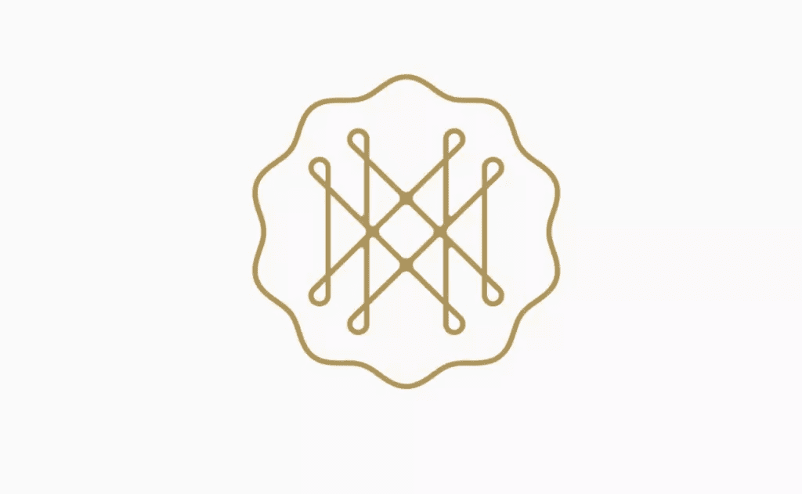

去年，我们开始看到线条艺术的形成，这要归功于设计师们仍然拥抱平面设计，看起来这将延续到标志设计中。

单线标志正是他们的声音。它们是由重量不变的单线制成的标志——看起来像是由一股金属丝制成的。单线提供了一个剥离下来，裸骨的外观，同时给了一个流行的网络图标点头。

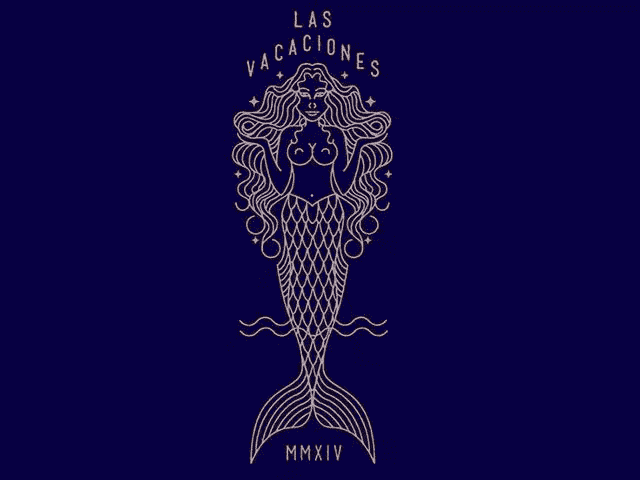

单线作品通常也是单调的，所以它给你的设计一个清晰的，没有杂乱的工艺外观。单线让自己美丽地帮助你创造复杂的设计作品，可以真正使你的品牌流行，但仍保持清晰。

当然，单线并不适合所有人，有些利基市场比其他市场更适合这种外观。你能把这些精细的设计缩放到多小总是有限制的。上面的片段不会在按钮上工作。

我注意到食品和饮料行业以及小型精品店和沙龙都采用这种风格，但它足够灵活，可以适应更广泛的市场。

## 文字标记

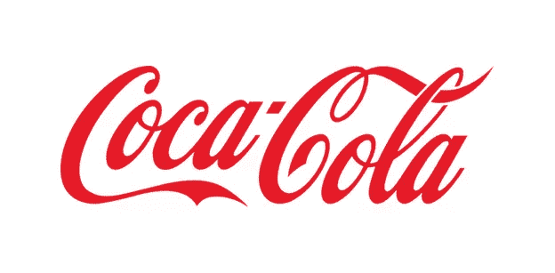

正如上面这个有着 100 年历史的设计所证明的那样，把你的标志作为文字标志并不是什么新鲜事。除了可口可乐，著名的例子包括有线电视新闻网，麦当劳和迪斯尼。

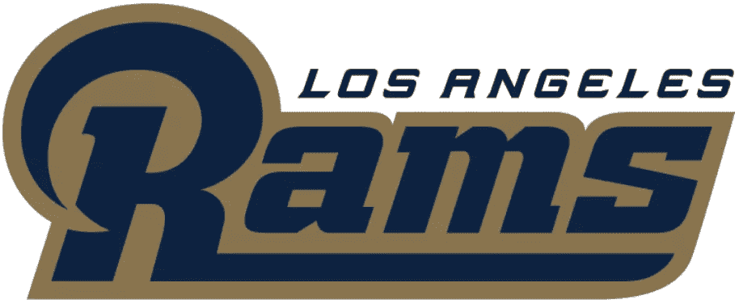

洛杉矶公羊商标–2016 年 1 月推出。

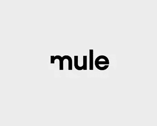

<small>骡子:由[Xalion](https://logopond.com/gallery/detail/209320)</small>

文字标记是设计中的印刷符号，是品牌的视觉符号。它们本质上是极简主义的，但当涉及到位置、字体形状、颜色和其他设计因素时，它们通常是创造性的。

文字商标的伟大之处在于，即使每一家公司都决定采用这一趋势，每一种外观都将是独一无二的，因为它们旨在呈现一种视觉身份。

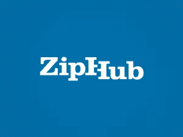

<small>斯坦尼斯拉夫·莱文的 ZipHub–Brandcut.com</small>

与传统的图形标志相比，文字标志可以将设计内容保留在文字中，从而有助于提高品牌召回率。焦点的减少减少了杂乱的机会。

wordmark 可以用于大多数领域，但是由于它只有文字格式，所以需要大量的思考和创造力。如果上面提到的例子有什么值得一提的话，那这个单词标志实际上是永恒的。

## 消极空间:不要害怕消极

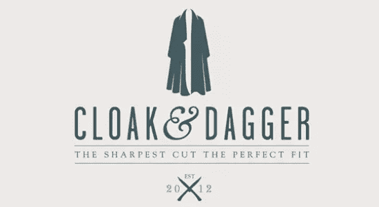

负空间的使用已经流行了好几年了，尤其是当它作为一个整体出现在网页设计中的时候，所以它成为标志的趋势也就不足为奇了。

在设计中使用负空间有助于在你使用的元素之间建立平衡和设置和谐，这对使用多种形状和类型的标志特别有帮助。负空间给你的设计增加了“更多”，即使你实际上用得更少。

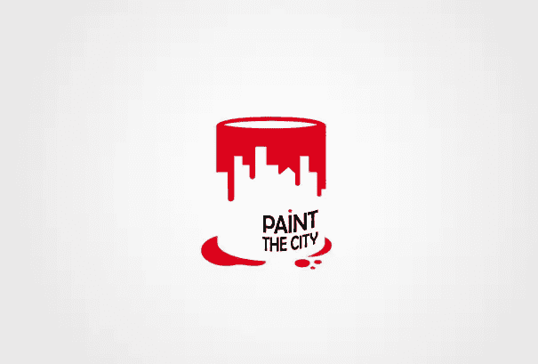

它还可以帮助创造很酷的视错觉。有经验的设计师可以利用负空间不仅保持他们的标志干净，还可以设计出令人难忘的外观，使他们的品牌与众不同。

就像商标一样，在利用负面空间趋势时，你的品牌并不重要。这完全取决于你的创造力和尝试的意愿，这将使这一趋势为你所用。

## 双色调〔t0〕

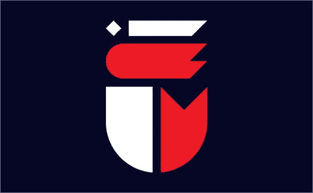

对于 2016 年的网页设计趋势，duotones 在名单上，现在正跨越到今年的标志，尽管我们已经看到一些受欢迎的公司已经这样做了。

最初，双色主要用于以大幅照片背景为特色的网站，但很快就转移到了彩色品牌标识上。使用两种颜色可以让你的标志真正为你“说话”,现在大胆的颜色正成为潮流，没有更好的时间来尝试你的标志双色化。

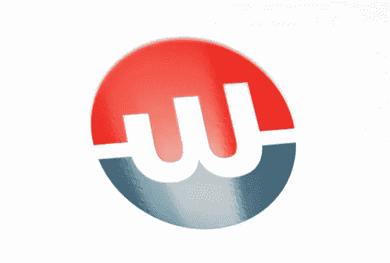

<small>logoholik.com 博扬·斯蒂法诺维奇的网络工厂—</small>

虽然你的 logo 设计会起到一定的作用，但是保持两种颜色的 logo 会让你的 logo 不会太忙。目标市场将能够更快地认同设计，加上独特的外观是一个很好的刷新相比单调的标志。

除了颜色限制之外，就你的品牌而言，双色真的没有什么坏处。那些有复合名称，甚至有两种形状组成的商标的企业真的可以利用这种趋势。

## 手工外观

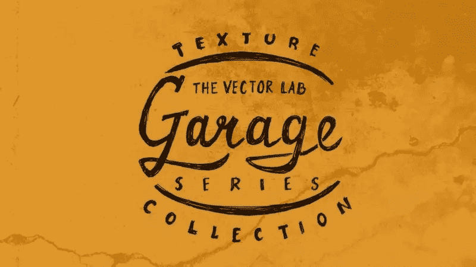

随着今年似乎专注于更独特和真实的设计以获得更好的用户体验，徽标也将受到冲击也不足为奇。

是的，从技术上讲，标志是在概念上勾勒出来的，但设计师不会追求圆滑、干净、复杂的最终结果，而是会拥抱更有趣的动态和理性。手工或手绘的外观让你的设计看起来更有个性，这总是一件好事。

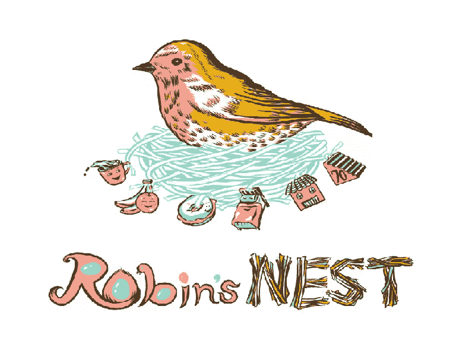

至于你想让你的 logo 看起来怎么样，有很多选择。你可以去找一个边缘参差不齐的粗糙插图。也许异想天开的柔和线条——就像上面的“知更鸟的巢”的例子——或者可变的笔触也是你可能想要考虑的一些其他选择。您甚至可以尝试单色、双色或添加多种颜色和纹理，打造富有创意的最终外观。

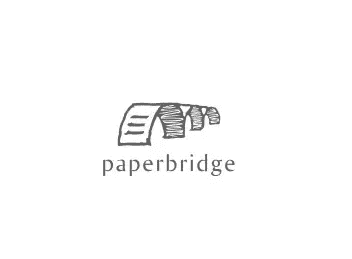

<small>Goran Vujinovic 设计的纸桥标志</small>

选择手工制作的外观可能会给你的品牌带来一些准复古的外观，而不会过度使用我们经常认为是数字艺术的花哨功能。

手工方法能够创造出强烈的阳刚或阴柔的美感，这取决于你如何画出它们，这使得它成为实验设计师的一个可行的选择。还有一个好处是，你可以用手工制作的标志来实现一种以上的趋势，让它看起来有艺术感，而不是太忙。

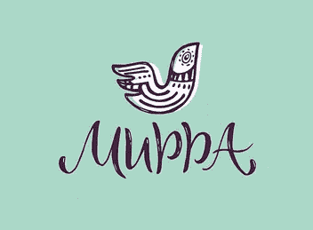

<small>mirra─[Rita konik](https://dribbble.com/shots/2463861-Mirra)</small>

手工制作的外观需要谨慎使用。最适合那些比较艺术的领域和博客。正规企业可能希望远离这种趋势，以避免品牌与目标受众之间的误解。

## 总结会

当然，有时候获得令人难忘的设计的最好方法是抓住最热门的设计趋势，然后反其道而行之。即便如此，首先理解什么是“流行”也是很重要的，今天我向你展示了我越来越经常看到的五个选项。

如果你正在更新你的 logo，或者甚至正在为你自己或客户设计一个新的 logo，你可能想试试这些(或者把它们混在一起)。谁知道你会创造出什么，因为可能性是无穷无尽的。

今年你有最喜欢的标志趋势吗？会使用这些或另一个。

## 分享这篇文章