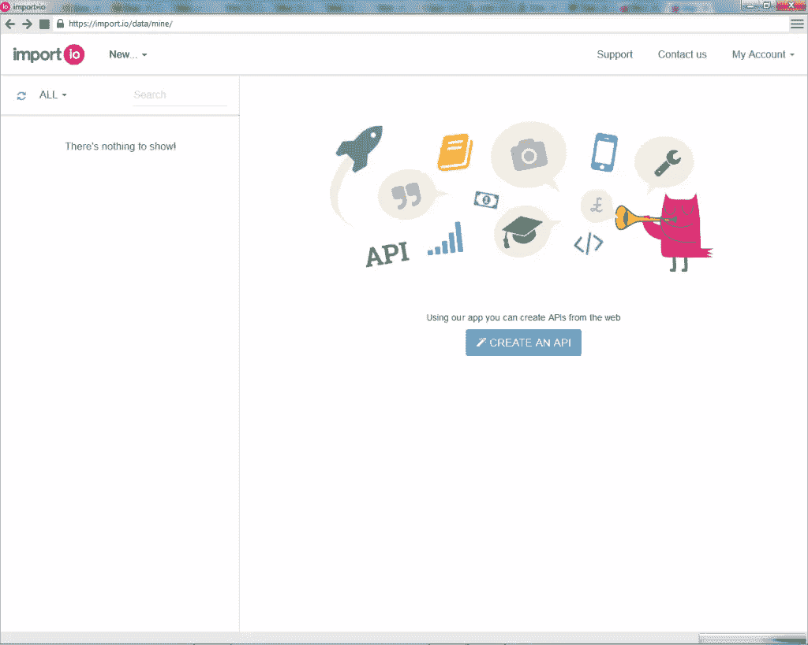
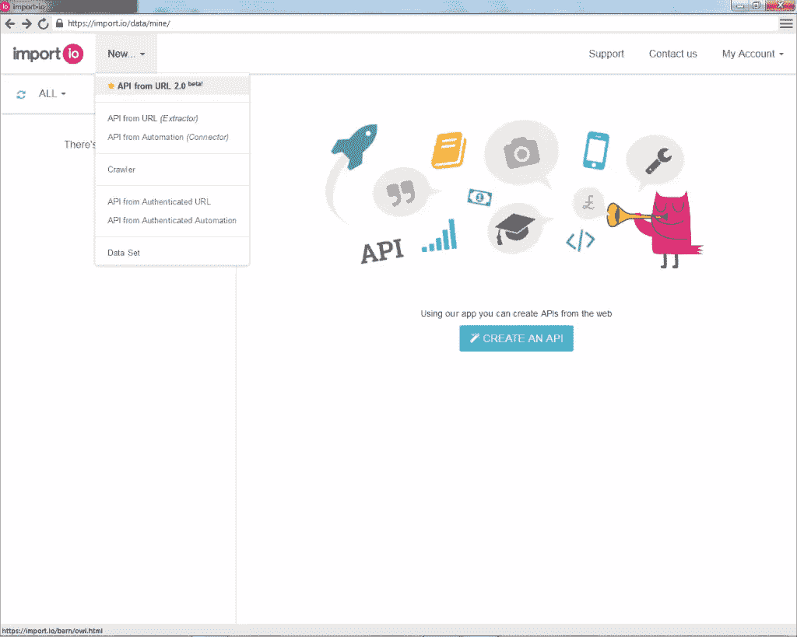
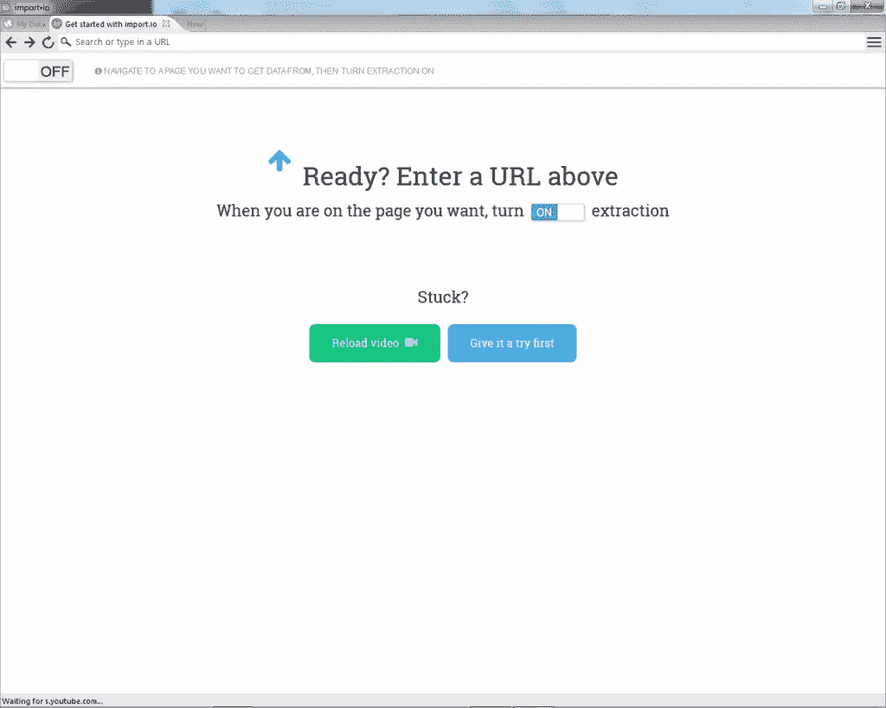
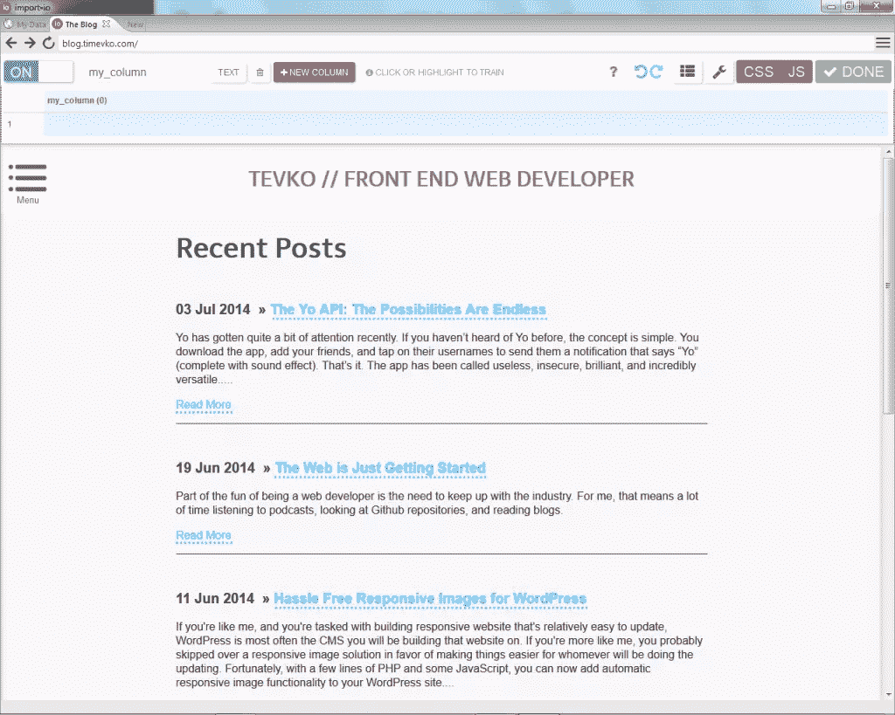
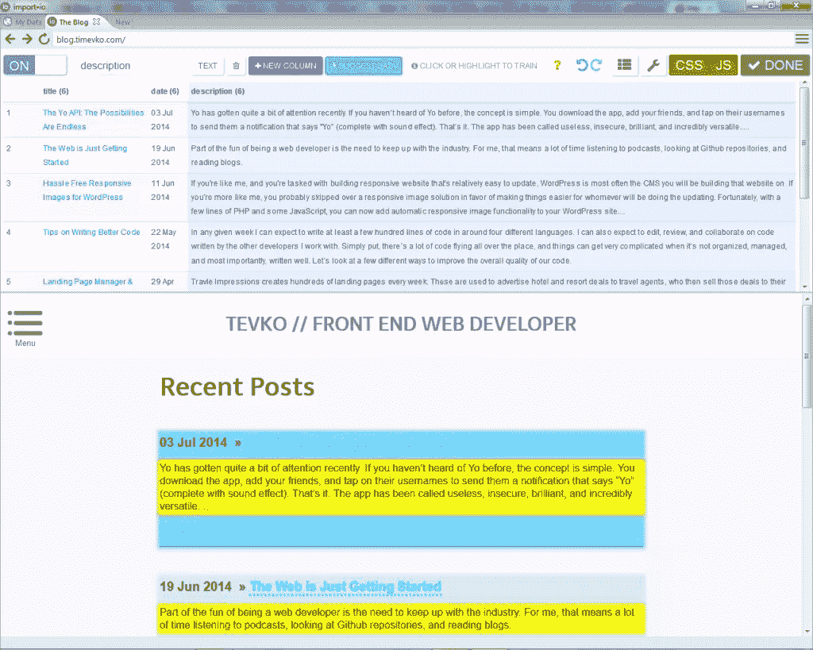
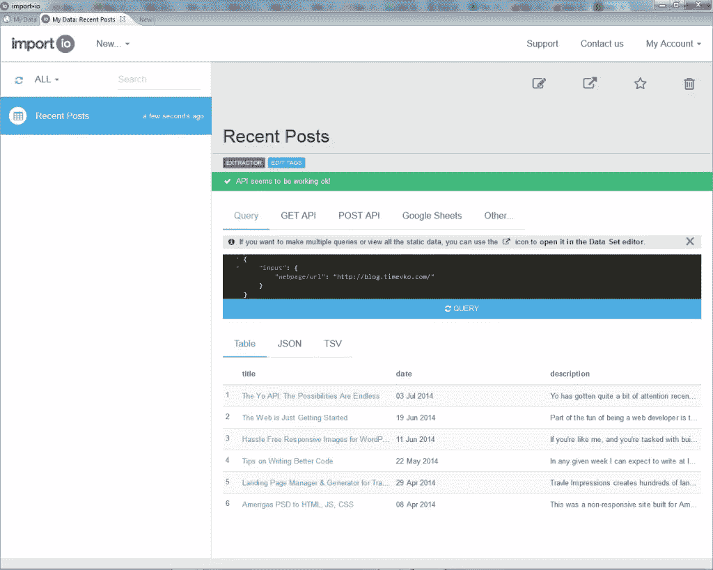
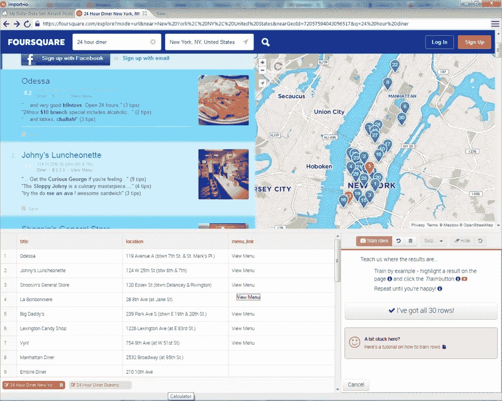
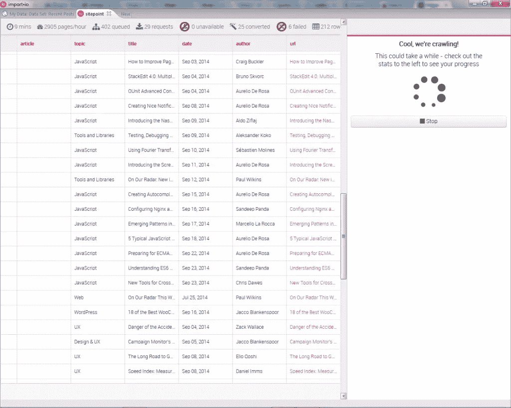

# 使用网络数据的 5 种创新方式

> 原文：<https://www.sitepoint.com/5-innovative-ways-use-web-data/>

*本文由 [import.io](https://import.io/) 赞助。感谢您对使 SitePoint 成为可能的赞助商的支持！*

网络上充满了有趣和有用的信息。一些最成功的网络应用程序无非是以一种用户容易理解的创造性方式组织信息——听说过一个叫谷歌的小公司吗？然而，组织来自网络的数据可能是一个困难且耗时的过程，因此许多项目从未启动。现在，import.io 正在解决这个问题，这意味着 web 数据终于可以轻松地收集、组织和使用了。

## 什么是 import.io？

import.io 允许您从网络上收集数据，然后通过简单的用户界面访问和操作这些数据。正如他们在[介绍视频](https://www.youtube.com/watch?v=cdmsTxu45-c)中强调的，这个过程非常快，完全不需要任何编码知识就可以完成。收集数据后，您可以查看数据并根据需要进行编辑，将其作为 API 集成到您的应用程序中(import.io 提供了大量文档，说明如何以多种语言完成此操作)，或者以多种格式下载数据。

## 使用 import.io

大多数涉及复杂和大量计算的应用程序都有同样复杂的用户界面。我惊讶地发现 import.io 是如此容易导航和使用。

注册后，我下载了他们的桌面应用程序(你将需要收集数据)。

对于我的第一个数据收集项目，我决定从一个 URL 创建一个 API，以收集我的个人博客上的帖子的形式。

然后，我在地址栏中输入我的博客地址，然后打开提取功能，开始构建我的 API。

顺便提一下，import.io 提供的另一个很棒的特性是，如果您需要从 JavaScript run 应用程序收集数据，可以打开或关闭 JavaScript 支持。从这里开始，创建数据表就像导航一个简单的点击式界面一样简单，在这个界面中，我告诉应用程序我希望表中有多少行(一行或多行)，并在命名要放置的列时单击所需的数据。令人印象深刻的是，应用程序正确地预测了我需要的其余数据的位置，并且我不必指定下一篇文章的标题、日期或描述在哪里。import.io 不仅仅是收集数据，它还可以预测你的数据将会在哪里，并在数据在页面上的位置发生变化时进行自我调整。

所有的数据都准备好之后，我点击“Done ”,回到应用程序的“My Data”部分，在这里我可以根据需要编辑、实现和导出我的数据。您可以通过多种方式导出数据，包括 JSON、TSV 或使用 Google Sheets。

下面是从我最近收集的帖子数据中自动生成的 JSON 代码示例:

`{
"title": "http://blog.timevko.com/2014/07/03/yo-possibilities-endless",
"title/_text": "The Yo API: The Possibilities Are Endless",
"description": "Yo has gotten quite a bit of attention recently. If you haven’t heard of Yo before, the concept is simple. You download the app, add your friends, and tap on their usernames to send them a notification that says “Yo” (complete with sound effect). That’s it. The app has been called useless, insecure, brilliant, and incredibly versatile.....",
"date": "03 Jul 2014",
"title/_source": "/2014/07/03/yo-possibilities-endless"
}` 

使用 import.io 创建这个快速数据收集只花了我大约五分钟，而且非常准确。最精彩的部分？我一分钱都没付。import.io 可以终身免费使用，也可以选择企业解决方案。

现在我们知道了从网络上收集和使用数据是多么容易，我们还能利用它做些什么有趣的事情呢？

## 1.开发一个应用程序，找到你附近开门的餐馆

假设这是一个深夜，你在纽约市，你很饿，你真的很喜欢食客。如果你想找几个你附近还开着的，你会怎么做？使用 import.io，您可以构建一个 web 应用程序来完成这项工作！这怎么可能呢？

嗯，我们已经看到以一种易于使用的 JSON 格式获取我们的数据是多么容易，而且 [Foursquare](https://foursquare.com/explore?mode=url&near=New%20York%2C%20NY%2C%20United%20States&nearGeoId=72057594043056517&q=24%20hour%20diner) 在查找纽约的 24 小时用餐者方面真的很好。因此，我们可以使用 import.io 来收集关于用餐者的所有信息，然后创建一个简单的界面，在浏览器提供的[谷歌地图 API](https://developers.google.com/maps/) 和地理定位 API 的帮助下，在地图上列出离我们当前位置最近的用餐者。

如果听起来好得难以置信，不要害怕！已经用 import.io 创建了一个类似的项目，它运行得非常好，以至于他们[专门为此写了一整篇博文](http://blog.import.io/post/wifi-and-plugs)！

## 2.获取您最喜欢的网站的统计数据

SitePoint 每天都会发很多文章。我们如何获得这些文章的统计数据，以及它们最常见的主题、平均评论数和最常见的作者？

我们的第一步是创建一个网络爬虫，[这个过程在这里详细描述](http://support.import.io/knowledgebase/articles/247570-create-a-crawler)。然后，我们可以将爬虫提供的数据导出为 JSON，并使用 javascript 创建一组函数来推送 URL、评论计数、作者姓名等。数组中，并返回计数的平均值，或者最频繁出现的主题和作者姓名。

我设置了一个样例爬虫来演示这一点，这个过程快速而无缝。

这里有一个示例 codepen，它使用来自我的 Sitepoint crawler 的一些 JSON 数据来列出站点上最近(当时)的一些文章。

在 [CodePen](http://codepen.io) 上看到 Tim ( [@tevko](http://codepen.io/tevko) )的笔 [HGant](http://codepen.io/tevko/pen/HGant/) 。