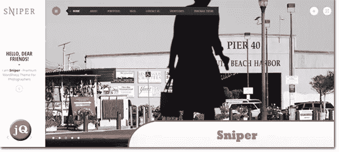
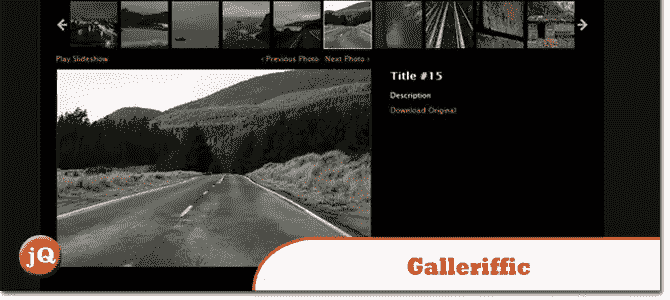
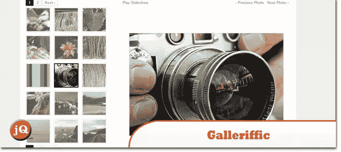
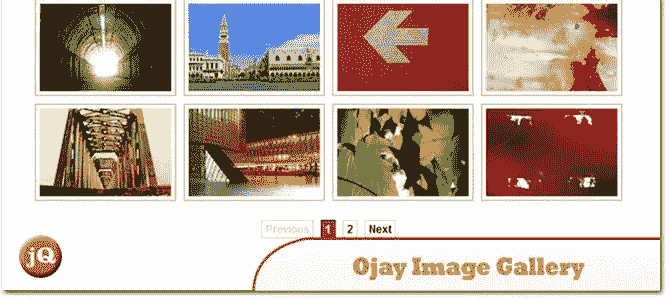

# 5 个 jQuery 图片库插件

> 原文：<https://www.sitepoint.com/5-jquery-image-gallery-plugins/>

这里列出了 5 个 jQuery 图片库插件，可以帮助你展示你的照片/图片。还有很多其他可用的，但这些是我们认为最酷和最容易使用的，相比之下，有数百万的其他人。享受=)

**相关帖子:**

*   [**5 款最酷的 jQuery Touch Swipe 图库插件**](http://www.jquery4u.com/mobile-devices/5-jquery-touch-swipe-image-gallery-plugins/)
*   [**世界上最好的 jQuery 图库插件**](http://www.jquery4u.com/plugins/10-premium-jquery-image-gallery-plugins/)

## 1.滑块旋转–响应式 jQuery 插件

这个插件具有大量独特的过渡效果，一个图像预加载器，视频嵌入，自动播放，停止用户交互和许多易于设置的选项来创建自己的效果。

 
[来源](http://codecanyon.net/item/slider-revolution-responsive-jquery-plugin/2580848?ref=1stwebdesigner) [演示](http://themes.themepunch.com/?theme=revolution_jq)

## 2.狙击兵

一个强大的高级响应+动态 WordPress 主题，为摄影师、创意机构或组合网站而构建。

 
[来源](http://themeforest.net/item/sniper-premium-photography-theme/3828191?ref=1stwebdesigner) [演示](http://themes.evgenyfireform.com/?theme=sniper%20wordpress)

## 3.Galleriffic 1

使用自定义上一页/下一页控件的替代布局

 
[源+演示](http://www.twospy.com/galleriffic/example-5.html#11)

## 4.画廊 2

缩略图翻转效果和幻灯片交叉渐变

 
[源+演示](http://www.twospy.com/galleriffic/example-2.html)

## 5.Ojay 分页图像库

使用 Ojay 分页图片库。这个例子演示了如何使用 Ojay。Paginator 将预先存在的页面内容压缩到一个较小的可滚动区域中，为用户提供了一个在页面之间滚动的 GUI。

 
[源+演示](http://ojay.othermedia.org/examples/paged_gallery.html#gallery=page_1)

## 分享这篇文章