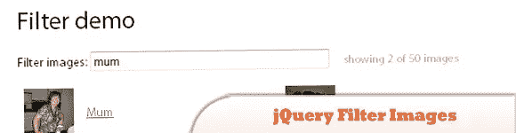
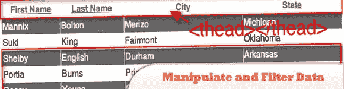
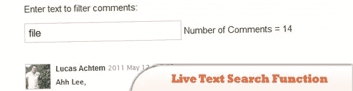
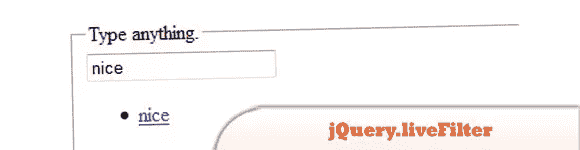

# 5 个 jQuery 动态过滤器插件

> 原文：<https://www.sitepoint.com/5-jquery-live-filter-plugins/>

今天这里列出了 **5 个 jQuery Live Filter 插件**。这些插件的一般目的是在你打字时过滤，使你的搜索更容易更快。通常，结果是通过在文档加载时加载整个数据集，然后简单地隐藏不匹配的数据集，只让匹配搜索过滤器的数据集在屏幕上可见。尽情享受吧！

**相关帖子:**

*   [jQuery 过滤函数示例](http://www.jquery4u.com/function-demos/filter/)
*   [30 个惊人的 jQuery 表](http://www.jquery4u.com/plugins/30-amazing-jquery-tables/)
*   [10 jQuery Live 页面编辑插件](http://www.jquery4u.com/plugins/10-jquery-live-page-edit-plugins/#.T8tSY9Xrpio)

**2013 年 19 月 5 日更新:**发现一个很酷的拖放/过滤插件，名为 jQuery.Shapeshift。

## 1.jQuery 快速实时过滤器

专为速度和易用性而打造。这是因为现有的工具不充分(太慢，错误的功能集)。

  
[来源](http://anthonybush.com/projects/jquery_fast_live_filter/)
[演示](http://anthonybush.com/projects/jquery_fast_live_filter/demo/)

## 2.jQuery 过滤器图像(搜索过滤器)

一个非常漂亮的照片图像搜索过滤器，当你开始输入时，它可以搜索和更新图片。

  
[来源](http://www.jquery4u.com/image-scripts/jquery-filter-images/#.T8hJ-VJMiSo)
[演示](http://mattryall.net/demo/filter/)

## 3.使用 jQuery 操作和过滤数据

这个插件有四种技术来操作和过滤日期:悬停效果、斑马行、过滤和排序。

  
[源+演示](http://net.tutsplus.com/tutorials/javascript-ajax/using-jquery-to-manipulate-and-filter-data/)

## 4.使用 jQuery 的实时文本搜索功能

只需几行代码和一个文本输入框，您就可以向任何网站内容添加文本过滤器。

  
[来源](http://www.designchemical.com/blog/index.php/jquery/live-text-search-function-using-jquery/)
[演示](http://www.designchemical.com/lab/jquery/demo/jquery_demo_live_comment_search.htm)

## 5.jQuery.liveFilter

一个 jQuery 插件，用于过滤数据或元素列表。

  
[来源](https://github.com/straps/jquery-livefilter)
[演示](http://cheeaun.github.com/jquery.livefilter/)

## 分享这篇文章