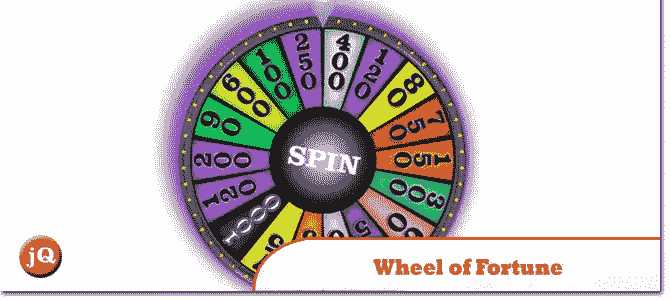
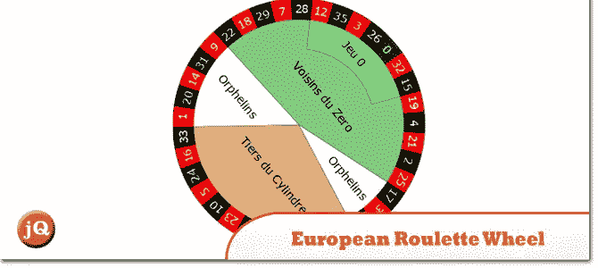
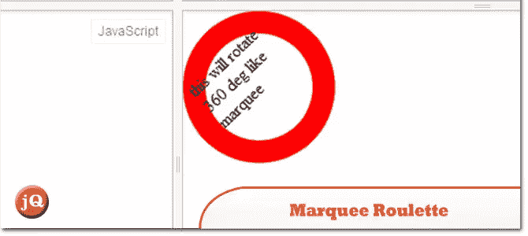
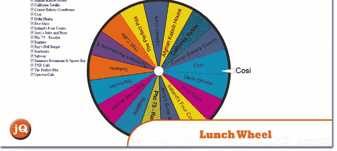
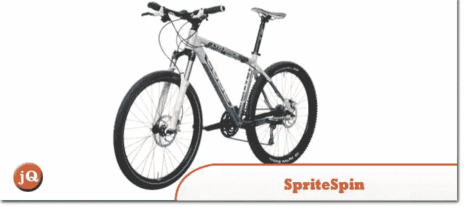
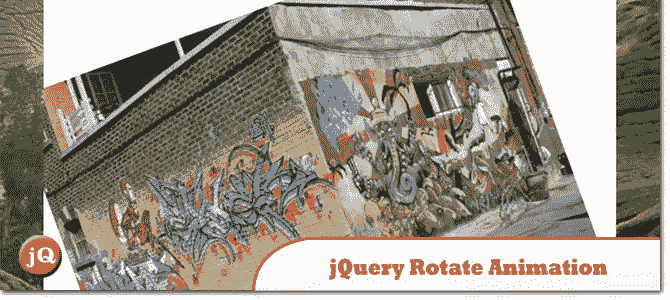
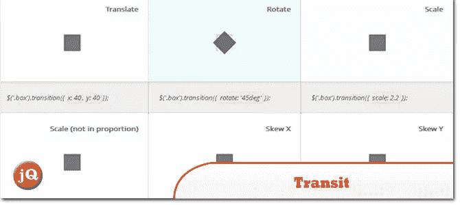

# 5+ jQuery 旋转/旋转图像插件和演示

> 原文：<https://www.sitepoint.com/5-jquery-spinrotate-image-plugins-demos/>

查看我们收集的 **jQuery 旋转/旋转图像插件**。非常适合旋转您的展示图像！；)享受！

**相关帖子: [jQuery 360 度图片展示插件](http://www.jquery4u.com/plugins/jquery-360-degrees-image-display-plugins/)**

## 1.轮滑

幸运之轮演示

 
[源+演示](https://jsfiddle.net/jquery4u/2bZrv/)

## 2.欧洲轮盘赌

欧洲轮盘赌

 
[源+演示](https://jsfiddle.net/YNBxz/674/)

## 3.(就像)跑马灯轮盘赌

这将像跑马灯一样旋转 360 度

 
[源+演示](https://jsfiddle.net/HS68a/2/)

## 4.HTML5 画布:午餐轮

了解如何使用 HTML5 画布元素。

 
[来源](http://bramp.net/blog/2011/07/html5-canvas-lunch-wheel/) [演示](http://bramp.net/javascript/lunchwheel.html)

## 5.斯普利特平

一个能够播放精灵图像动画的 jQuery 插件。

 
[来源](http://spritespin.ginie.eu/) [演示](http://spritespin.ginie.eu/examples)

## 6.jQuery 旋转动画

鼠标悬停和鼠标释放时图像的旋转动画

 
[源+演示](http://ajaxlabs.co.uk/lab-0008)

## 7.jqueryrotate

jQuery 插件，可以任意角度旋转图像(并制作动画)

 
[源+演示](https://code.google.com/p/jqueryrotate/wiki/Examples)

## 8.运输

jQuery 的超平滑 CSS 过渡和转换

 
[源+演示](http://ricostacruz.com/jquery.transit/)

## 分享这篇文章