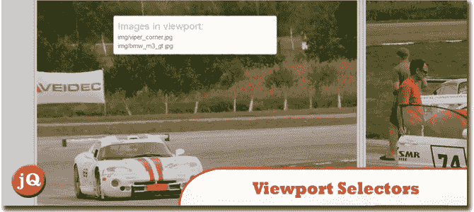
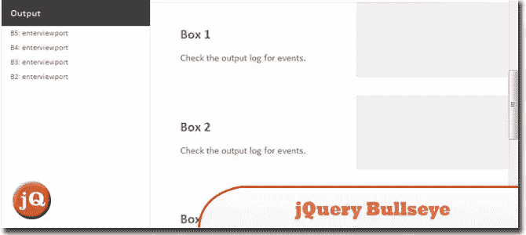
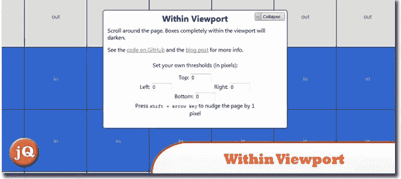
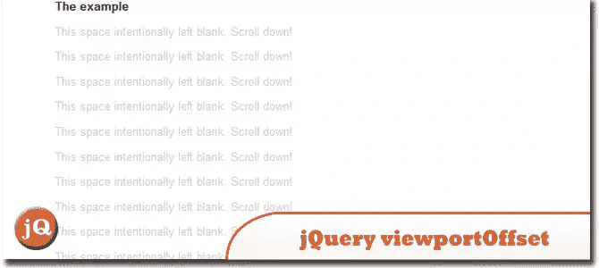
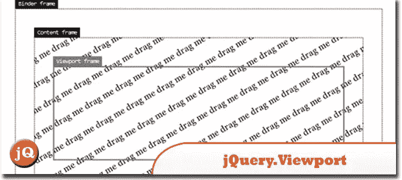

# 5 jQuery 视口插件

> 原文：<https://www.sitepoint.com/5-jquery-viewport-plugins/>

基本上，视窗是用户当前可以看到的网页的一部分，滚动条移动视窗来显示页面的其他部分。如果你的设备开发包括视口元标签是必须的！今天我们分享我们认为的 5 个最好的 jQuery Viewport 插件，你一定会发现它们对你的布局需求非常有用。

## 1.jQuery 的视口选择器

使用这些选择器，你可以检查元素是在视窗内部还是外部。
 
[来源](http://www.appelsiini.net/projects/viewport) [演示](http://www.appelsiini.net/projects/viewport/3x2.html)

## 2.jQuery 牛眼——jQuery 的视口检测插件！

一个通用的轻量级 jQuery 插件，用于向元素添加 enterviewport 和 leaveviewport 事件。
 
[源+演示](http://static.pixeltango.com/jQuery/Bullseye/)

## 3.在视口内

指示元素是否完全在视区内。它还允许你指定你的站点的有效视窗(例如，考虑固定的标题和导航条)，并提供一些方便快捷的符号。
 
[来源](http://patik.com/blog/within-viewport-javascript-and-jquery-plugin/) [演示](http://patik.com/code/within-viewport/)

## 4.jQuery viewportOffset

比如内置的 jQuery。offset()方法，但是根据元素相对于视口的位置计算 left 和 top，而不是根据文档。
 
[来源](http://benalman.com/projects/jquery-misc-plugins/#viewportoffset) [演示](http://benalman.com/code/projects/jquery-misc/examples/viewportoffset/)

## 5.jQuery。视口

这是一个非常有用的轻量级 jQuery 插件，可以让一个元素作为一个方便的窗口来显示具有绝对位置的元素。
 
[源+演示](http://borbit.github.com/jquery.viewport/)

## 分享这篇文章