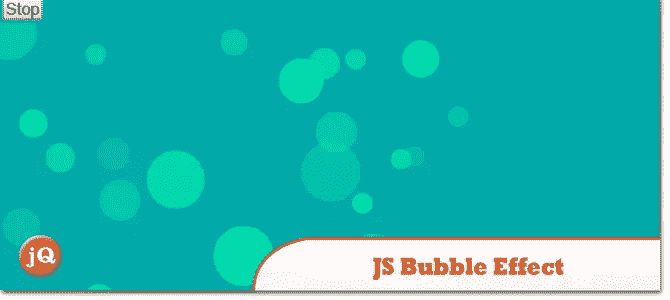
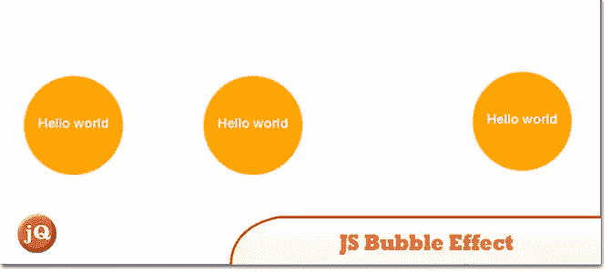
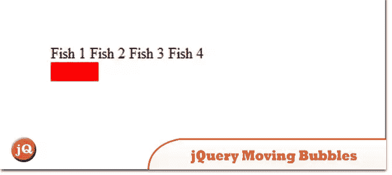
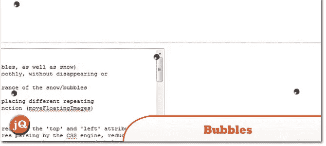

# 5 JS 随机移动气泡效果

> 原文：<https://www.sitepoint.com/5-js-random-moving-bubbles-effects/>

这些 **5 JS 随机移动的泡泡效果**用 JavaScript/jQuery 中很少的几行代码展示了很酷的动画“泡泡”效果。看看他们！

## 1.JS 气泡效应#1

JS 气泡效果 1

 
[来源](http://fiddle.jshell.net/DYN6U/) [演示](http://fiddle.jshell.net/DYN6U/show/light/)

## 2.JS 气泡效应#2

JS 气泡效应#2

 
[来源](https://jsfiddle.net/exr4N/1/) [演示](https://jsfiddle.net/exr4N/1/show/)

## 3.jQuery .移动气泡

创建这个 jQuery 插件是为了让你可以轻松地让对象在页面中移动

 
[来源](https://github.com/svrooij/jQuery.moving-bubbles)

## 4.气泡

图像现在可以上下浮动(允许气泡和雪)

 
[源+演示](http://drewnoakes.com/code/javascript/bubbles.html)

这里需要加个五度！找到好的就留言评论吧！

## 分享这篇文章