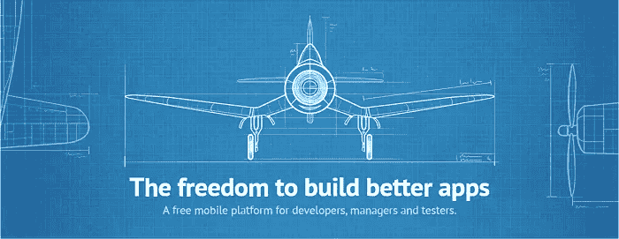
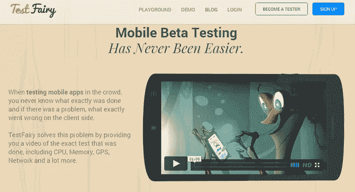
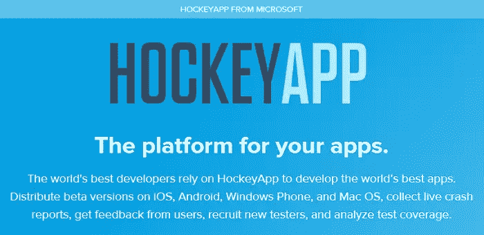
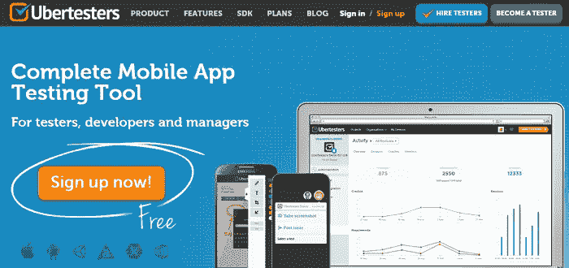

# 5 款移动应用测试工具

> 原文：<https://www.sitepoint.com/5-mobile-app-testing-tools/>

作为一名应用程序开发人员，你需要确保你的应用程序能够正常工作，并且在发布时尽可能少出现问题。有许多测试工具可以帮助分发测试版，并邀请用户给出反馈和报告问题。

借助应用测试工具，你通常可以收集崩溃报告、分析、反馈等等。在这篇文章中，我将列出一些免费和付费的选项，帮助你发布更好的应用。

有些工具只适用于 iOS，有些则是跨平台的。

## 面向 iOS 开发者的试飞

TestFlight 对于 Android 和 iOS 应用开发者来说是一个非常棒的工具，但是它被苹果收购了，Android 支持被移除了。

如果你是 iOS 8 开发者，TestFlight 是一款免费的 app 测试工具。通过 TestFlight Beta 测试，你可以很容易地邀请用户在发布前测试你的应用。

TestFlight 允许您使用电子邮件地址邀请多达 1000 名外部用户或测试人员。一旦外部测试人员被邀请参加 TestFlight，他们就会收到一个从 App Store 下载官方应用的链接。

要快速获得团队成员的反馈，您可以与多达 25 名团队成员共享您的测试版本。团队成员必须被分配 iTunes Connect 中的技术或管理角色。每个团队成员可以在多达 10 台设备上测试您的 beta 版本。

试飞使得从真实用户那里收集反馈变得简单明了。您可以使用 TestFlight 在运行 iOS 8 或更高版本的 iPhone、iPad 和 iPod touch 上测试您的应用程序，但不能测试 Mac 应用程序。

尝试试飞

## 测试精灵

TestFairy 是 100%免费的，但是为更大的团队提供了企业包。

TestFairy 为应用开发者提供了一些很棒的特性。其中一个突出的特点是客户端视频录制，而不仅仅是屏幕截图。TestFairy 提供了来自客户端的精确测试的视频记录，包括 CPU、内存、GPS、网络监控、日志、崩溃报告等等。

使用 Android 应用程序，您不需要将任何 SDK 或 API 集成到您的应用程序构建中。你上传你的 APK (Android 应用文件)到 TestFairy 平台。然后 TestFairy 把你的 APK 文件拆开，在正确的地方插入必要的钩子来收集信息，然后重新组装，分发给 beta 测试人员。

如果你是 iOS 开发者，那么你必须添加一行代码。

你可以通过电子邮件或本地或基于网络的测试应用邀请测试人员。这些应用程序可以通过 TestFairy 托管的公共测试网页分发给测试人员。

[开始使用 TestFairy](http://testfairy.com/)

## Google Play 原生应用测试版

如果你是一个 Android 开发者，你可能会访问谷歌开发者控制台。你可以使用谷歌个人账户来访问这个。如果你是机构，谷歌建议注册一个新账号。

2014 年 7 月，[Google Play 团队宣布](http://android-developers.blogspot.com/2014/07/grow-with-google-play-scaled-publishing.html)[Google Play 开发者发布 API](https://developers.google.com/android-publisher/) 现已面向所有开发者开放。

> 订阅和应用内购买 API 允许您管理应用内购买和订阅。发布 API 允许你上传和发布应用程序，并执行其他与发布相关的任务。

这包括一些类似测试的功能，例如:

*   提醒的电子邮件通知
*   优化技巧
*   增强的收入统计
*   批量导出评论
*   深度链接和网站验证[优化搜索结果](https://developers.google.com/app-indexing/)和参与度

*注意*:如果你打算出售应用程序或应用程序内购买，检查你是否在你的国家有一个商业账户，并且你手边有你的信用卡来支付 25 美元的注册费。

[注册 Google Play 开发者控制台](https://play.google.com/apps/publish/)

## 霍克亚普

HockeyApp 允许开发者分发 iOS、Android、Windows Phone 和 Mac OS 应用的测试版。微软现在拥有 HockeyApp。

HockeyApp 不提供免费计划，但是你可以免费试用 HockeyApp 一个月。价格从每月 10 美元开始，这允许你创建多达 5 个应用程序。HockeyApp 为所有计划提供无限的存储空间和无限数量的开发人员或测试人员。

功能包括:

*   跨所有平台整合分发以处理更新
*   可以与版本控制集成的崩溃报告和分析
*   对用户的简单反馈
*   用户、硬件和操作系统分析
*   团队和用户管理

试试 HockeyApp

## Ubertesters

Ubertesters 是一个全面的测试解决方案，提供了广泛的工具来分发新的构建和报告 bug。您甚至可以为测试启用和禁用特定的构建。Ubertesters 提供免费和高级计划，免费计划提供 100MB 的存储和 2 个项目。目前支持 iOS 和 Android 应用程序，未来将支持 Windows。

功能包括:

*   通过平台操作系统和状态分析错误报告
*   测试版本和更新的分发
*   小组管理
*   信息发送
*   与外部缺陷跟踪系统的集成

Ubertesters 的一个独特功能是，你可以雇人在各种真实设备上和真实条件下帮助和测试你的应用程序。

[试试 Ubertesters](http://ubertesters.com/)

## 结论

这只是开发人员允许外部测试人员访问他们的应用程序的一些工具的选择。您尝试过并会推荐以上哪一项(或其他选项)？

## 分享这篇文章