# 设计师必备的 5 款安卓应用

> 原文：<https://www.sitepoint.com/5-must-have-android-apps-for-designers/>

[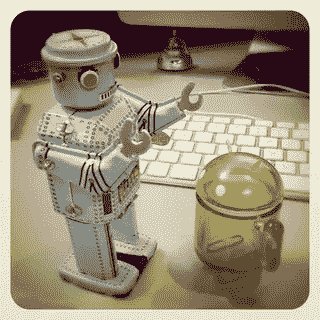](https://www.flickr.com/photos/modulor/5751894686/)

照片:模块

在 web 开发的短暂历史中，我们唯一可以依赖的图形平台是桌面计算机。

作为 SitePoint 的读者，我想我必须告诉你，由于技术创新的不断驱动，今天我们有许多其他选择。智能手机和平板电脑已经超越了“小工具玩具”的范畴，可以提供生产质量的设计工具。

这些设备最重要的两个操作系统无疑是苹果的 iOS 和谷歌的 Android。

后者由于其开源性和灵活性，已经成为世界上最广泛使用的操作系统，每月活跃用户超过 10 亿。

由于 Android 的广泛流行，它拥有一个几乎荒谬的充满活力的应用生态系统，包括几十个非常适合帮助设计师和开发者的应用。

然而，选择并不总是像人们所说的那样。如此庞大的应用范围意味着需要大量的时间和经验来筛选平庸的海洋，寻找真正有用的宝石。

这就是为什么，在这篇文章中，我们将向你展示 5 个最好的 Android 设计应用，无论你在哪里，它们都可以提高你的工作效率。

## 无纸绘画、素描、写字板

我们要分析的第一个 app 是“无纸化——画图、素描、平板”。有了这个软件，你可以使用 6 种不同的工具，让你着色，素描和插入文本注释。当然，你可以保存你的作品，并将其整理成册，如果你想向朋友展示你创作的图片，你可以直接在脸书上分享它们，而无需离开应用程序。

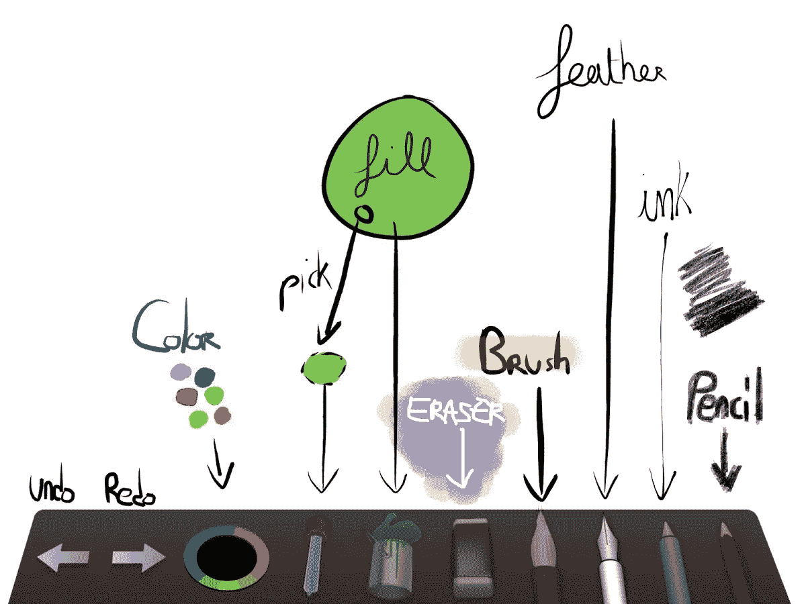

“无纸”让你有机会创建多达三个不同的层，并管理图片不同部分的不透明度。

总的来说，“无纸”对设计师来说是一个很好的应用，但如果你想创造伟大的杰作，它就没什么帮助了。在我看来，这个 app 更适合实现你项目的一个初稿，而不是整个作品。

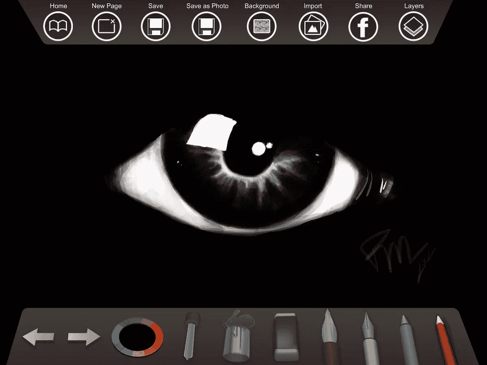

#### 这款应用程序只需 1.50 欧元或 2.02 美元，可在此下载:

*   [https://play.google.com/store/apps/details?id = air . com . jeremieklemke . drawing](https://play.google.com/store/apps/details?id=air.com.jeremieklemke.drawing)

## 画出来

这个应用程序不是针对最有经验的设计师，但它对那些正在发展绘画技能的人来说很棒。事实上，一旦你下载了这个应用程序，你会发现几个教程，解释你如何以最好的方式素描。教程是一步一步进行的，分为三个不同的难度级别。

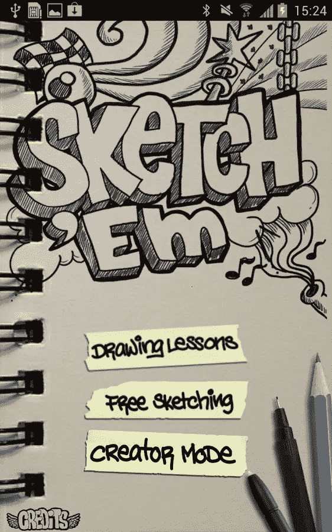

在“素描”中，就像在“无纸”中一样，你可以在 Twitter 和脸书等社交网络上分享你的成果。

此外，该应用程序是完全免费的，这意味着你不必支付安装费用，也不必花钱进行应用程序内升级。

总的来说，这个应用程序对于第一次接触设计世界的人来说非常有用。

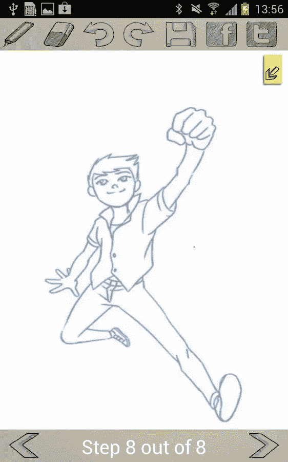

#### 你可以在这里画草图:

*   [https://play.google.com/store/apps/details?id=com.oneglobalapps.draw](https://play.google.com/store/apps/details?id=com.oneglobalapps.draw)

## AutoCAD 360

这无疑是设计师、工程师和建筑师用来创建项目的历史最悠久的应用程序之一。事实上，AutoCAD 360 是一个功能强大的绘图和制图移动应用程序，允许您在任何地方查看和编辑 AutoCAD 绘图。

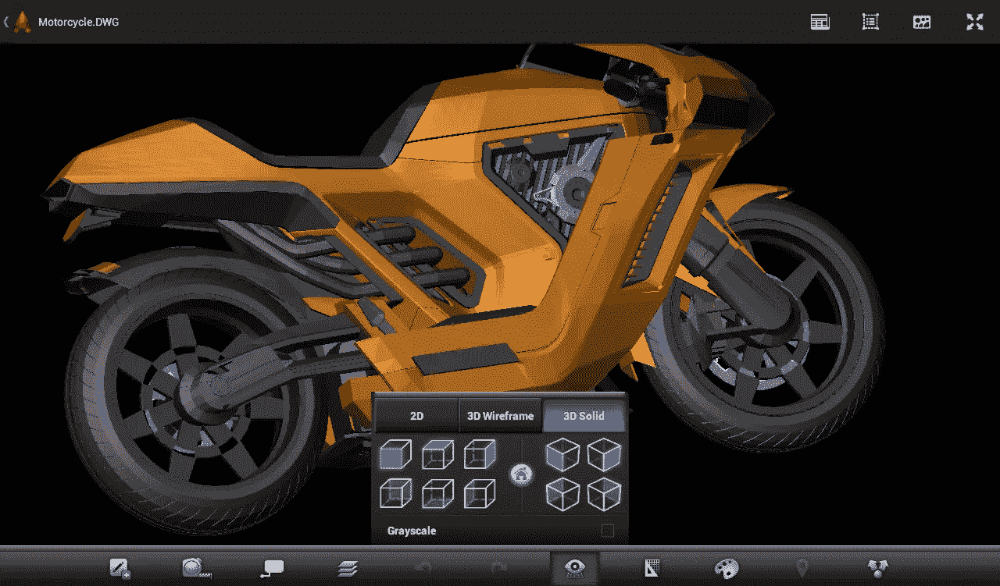

顾名思义，AutoCAD 不是照片处理或图形设计的首选工具，因为它明显面向技术设计。

这款应用不一定一目了然，你可能需要一些时间来理解它的微妙之处。一旦你理解了这个应用程序，你将可以使用很多高端功能，你将能够创建准确，令人印象深刻的图纸。

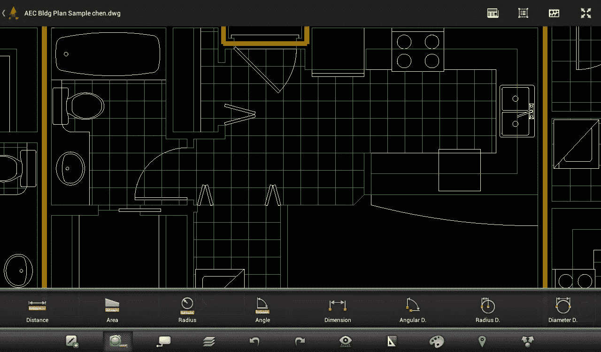

#### 既然这个应用程序可以免费下载，它绝对是一个真正的便宜货。请点击此处:

*   [https://play.google.com/store/apps/details?id=com.autodesk.autocadws](https://play.google.com/store/apps/details?id=com.autodesk.autocadws)

## SketchBook Pro

Sketchbook Pro 是一款应用程序，通过创建美丽的设计，让您有可能表达您的所有想象力。该应用程序使用与其桌面版本相同的绘画引擎，但在这里你可以只用手指使用铅笔、钢笔和画笔。

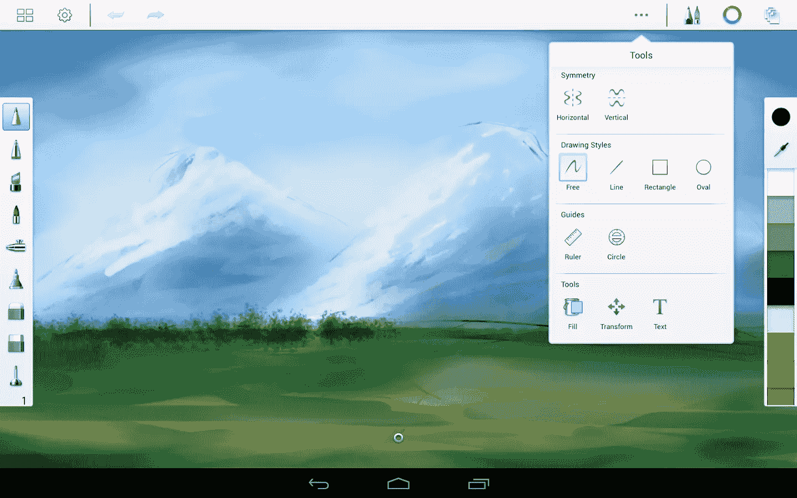

SketchBook Pro 为您提供了全屏工作空间，具有横向或纵向方向，并支持多点触控。您还可以使用 100 种不同的画笔，所有这些都可以自定义，并使用拾色器工具。

与“无纸”相比，这个令人印象深刻的应用程序没有明显的层限制(可用 ram 之外)。

总之，我认为，即使这款应用售价 4.99 欧元或 6.75 美元，它也必须出现在每个设计师的设备上。

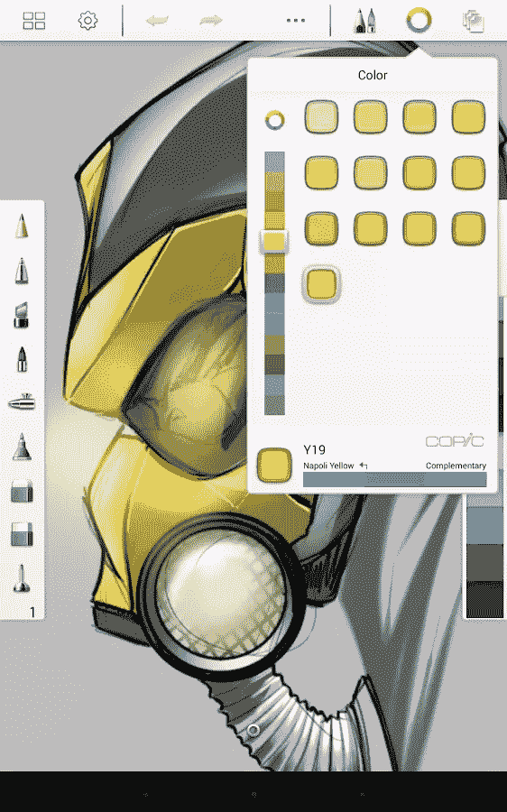

#### 您可以通过以下链接下载该应用程序:

*   [https://play.google.com/store/apps/details?id=com.adsk.sketchbookhd](https://play.google.com/store/apps/details?id=com.adsk.sketchbookhd)

## art flow-table sketchbook

ArtFlow 是一个想把你的智能手机或平板电脑变成画布的应用程序。

事实上，该应用程序的开发是为了让用户能够极其简单地绘制和设计每个主题。

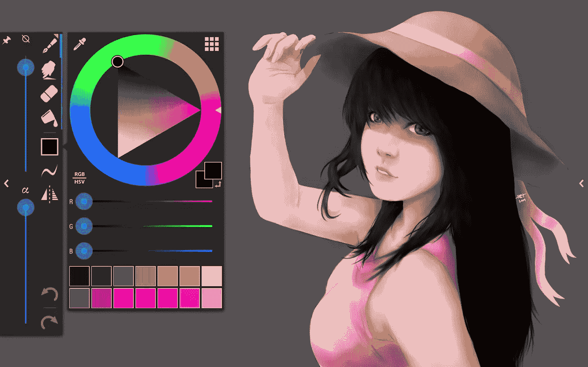

该软件围绕高性能渲染引擎构建，支持大量颜色、亮度和饱和度调整，无限撤销和重做，同时支持屏幕上的压力敏感性。

层是可用的，你甚至可以选择如何混合它们。此外，您可以将您的作品保存在。png，。jpeg 和。psd:如果你选择了最后一种格式，你可以自由地将你的作品导入 Photoshop，而不会丢失图层。

很明显，ArtFlow 与 SketchBook Pro 非常相似，但据我估计，它提供了更多的功能。例如，在 ArtFlow 中，你有一个很好的“涂抹工具”，一般来说，选择画笔的颜色要容易得多。支持 ArtFlow 的另一点是价格:这款应用可以免费下载，你只需为更高级的功能付费。

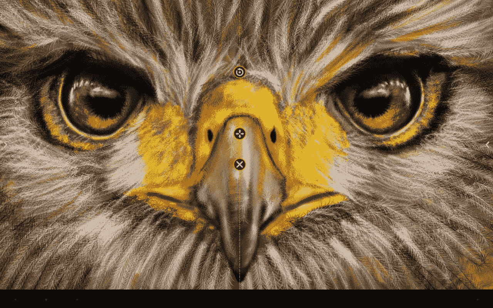

#### art flow–table t sketchbook 可通过以下链接下载:

*   [https://play.google.com/store/apps/details?id=com.bytestorm.artflow](https://play.google.com/store/apps/details?id=com.bytestorm.artflow)

因此，这些是我们最喜欢的 Android 应用程序，它们绝对应该出现在你的设备上，因为它们可以帮助你完成设计相关的任务，或者为你的后续项目捕捉最初的灵感。

你用过上面提到的软件吗？或者你已经找到了自己不可或缺的宝石？如果有，请在评论中告诉我们。

## 分享这篇文章