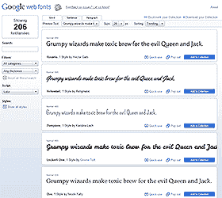
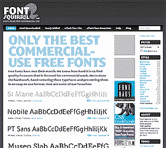
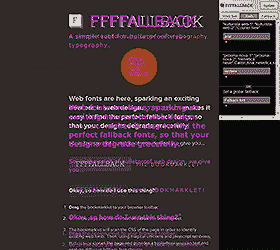

# 5 个最好的 CSS3 字体工具

> 原文：<https://www.sitepoint.com/5-of-the-best-css3-font-tools/>

自从浏览器增加了图形支持后，字体给网页带来了最引人注目的视觉冲击。几年前，除了 Arial、Verdana、Tahoma、Times New Roman 或 Georgia *(或者，但愿不会如此，Comic Sans)* 之外，你根本不可能找到其他网站。

虽然标准字体堆栈没有什么问题，但它们可能会变得有点单调。十多年来，Internet Explorer 一直支持网络字体，但它的竞争浏览器花了更长的时间才赶上来。许可仍然是一个问题——你不能使用任何商业字体——但你应该能够找到一种允许网络使用或与你的公司风格相似的字体。

然而，选择越多，责任越大。幸运的是，有几个在线工具可以帮助你找到和使用 CSS3 字体…

## [ 1。谷歌网络字体](http://www.google.com/webfonts)

如果你没有访问过谷歌网页字体，你去过哪里？谷歌提供了 200 多种字体，审查工具令人惊叹。

您可以下载任何字体文件，但该工具还允许开发人员通过 HTML `link`标签、CSS @import 声明或 JavaScript 片段进行导入。谷歌强调了潜在的下载速度问题，但是，因为你可以使用他们的 <abbr title="Content Delivery Network">CDN</abbr> ，没有必要担心托管。

我说过这是免费的吗？谷歌网页字体将满足最苛刻的设计师。

## [ 2。字体松鼠](http://www.fontsquirrel.com/)

字体松鼠非常优秀——尤其是如果你对将所有字体责任交给谷歌感到紧张的话。该网站提供了数百种高质量的字体，可免费用于商业用途。你可以下载 TTF、EOT、WOFF 和 SVG 字体文件以及 [@font-face kits](http://www.fontsquirrel.com/fontface) ，它们提供了可以在所有主流浏览器中工作的防弹代码和样本。

还不满意？将许可的字体文件上传到[@ font-face generator](http://www.fontsquirrel.com/fontface/generator)；它将以多种 web 格式和示例 CSS 代码提交。你愿意为这项服务支付多少钱？这不会花你一分钱。

##  3。字体 Dragr

仅仅因为一种字体可以在网络上使用，并不意味着它应该使用。像 Helvetica 和佐治亚这样的字体被设计成在屏幕上也能很好地工作，但是并不是所有的字体都是一样的——尤其是小字体。

因此，您应该在将中世纪字体添加到页面之前测试它。Font Dragr 让这变得简单——将一个字体文件拖到页面上，文本就会神奇地改变。

## [ 4。FFFFallback](http://ffffallback.com/)

不是所有的用户都能体验到你漂亮的字体。那些使用旧浏览器的用户可能不支持网络字体，因此有充分的理由在移动设备上避免使用它们。

幸运的是，CSS 支持后备字体堆栈:按照顺序尝试字体，直到找到一个。然而，字体有不同的大小和间距，因此特定的后退可能会破坏您的设计。

FFFFallback.com 是一个很棒的书签工具，它展示了你的网站在不同字体下的样子。它将页面的副本覆盖在原始页面之上，因此您可以立即发现格式问题。

## [5。什么字体](http://chengyinliu.com/whatfont.html)

如果你在野外发现了一种可爱的字体， [WhatFont](http://chengyinliu.com/whatfont.html) 是另一个书签，可以帮助你识别字体和大小。启动该工具，然后悬停在任意元素上或单击任意元素。还有比这更简单的吗？

## 额外字体工具

还想吃吗？如果你有时间和兴趣， [FontStruct](http://fontstruct.com/) 和 [Bitfontmaker](http://www.pentacom.jp/soft/ex/font/) 允许你创建自己的字体。两者都提供一系列由天才艺术家创作的免费字体。

[字体矩阵](http://media.24ways.org/2007/17/fontmatrix.html)和[常用字体](http://www.ampsoft.net/webdesign-l/WindowsMacFonts.html)列出了 Windows 和 Mac 上的主要字体和替代字体。总是先检查这些——如果网络字体在大多数平台上普遍可用，就没有必要使用它。

你知道任何其他伟大的字体工具吗？

## 分享这篇文章