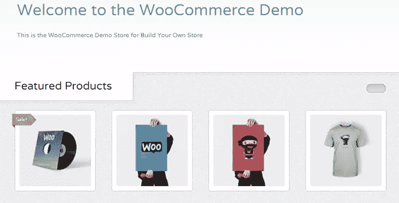
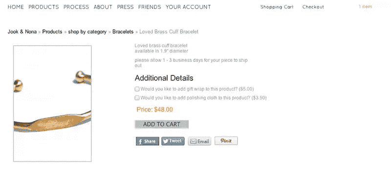
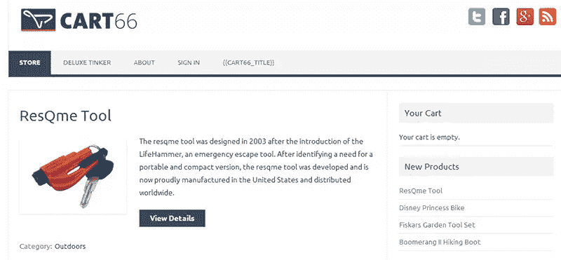
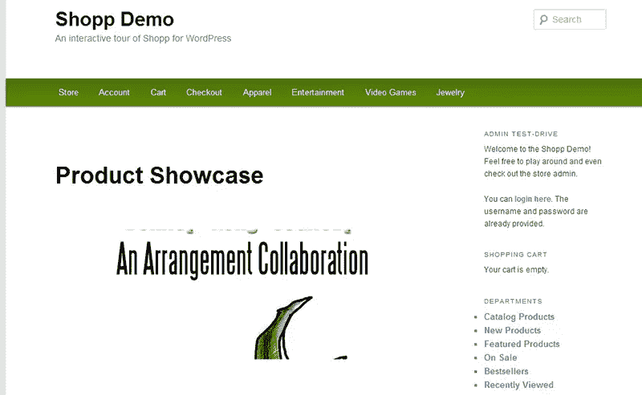
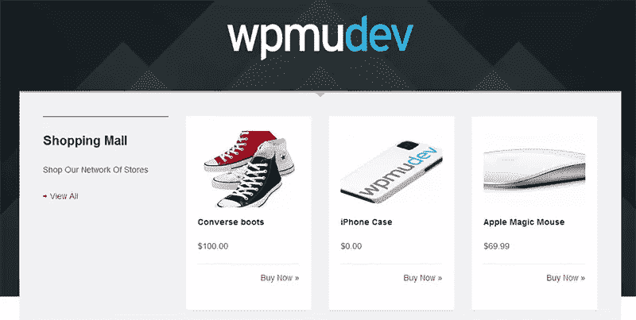

# 最好的 WordPress 购物车插件

> 原文：<https://www.sitepoint.com/5-of-the-best-wordpress-shopping-cart-plugins/>

WordPress 是一个极其通用的平台，拥有[多种多样的功能](https://www.sitepoint.com/15-things-you-may-not-know-wordpress-can-do/)。WordPress 最受欢迎的(也是越来越多的)用途之一是运营一个电子商务网站。多亏了一些非常出色的插件，我们可以在实现专业设计和功能的同时，以相对较低的成本建立一个网上商店。

在这篇文章中，我将向你展示五个最好的 WordPress 购物车插件，包括它们的前端设计和最重要的特性。每个插件都有自己的优点和缺点，所以你会发现每个插件的优点和缺点。

## 1. [WooCommerce](http://www.woothemes.com/woocommerce/)

woo 商务演示

WooCommerce 是 WordPress 最受欢迎的电子商务插件。毫无疑问，它已经占据了自己的位置，成为了 T2 Magento 的完美替代者，Magento 被认为是目前开源电子商务软件的领导者。

WooCommerce 最初是 Jigoshop 的一个分支，是由 WooThemes 维护的一个免费插件，woo themes 是一个非常受欢迎的 WordPress 主题商店，背后有强大的营销力量。受欢迎是 WooCommerce 成功的原因之一，但从长远来看，热是没有用的。更重要的是，WooThemes 在产品开发上投入了一些认真的努力，很大程度上依靠它来保持业务的运行。WooCommerce 还得到一个庞大而活跃的开发者社区的支持，包括它自己专门的开发者和店主会议。

它显示，WooCommerce 有许多很棒的特性，使它成为这个列表中一个很有价值的竞争者。它包括了一些重要的工具，可以让你的网上商店开箱即用(即使它的基本主题也很不错)。但是最终你会想要扩展默认的特性集，这就是 WooCommerce 的一个主要缺点:定价。

WooCommerce 非常依赖扩展。如果你想使用表率航运，你需要支付 199 美元的单一网站许可证。订阅也是如此。想添加一个或多个支付或运输网关吗？每个网关再加 79 美元。这些是一年期许可证。你可以很容易地运行到每年 100 美元的订阅，使它不再那么免费。

这是 WooThemes 支持的插件的价格。有一些独立的开发者，但是由于 WooThemes 使得通过他们销售非常有吸引力，你不会找到很多。

**woo commerce Pros**
——简单易用，你可以在一个小时内将你的商店开箱即用。
–由 WordPress 社区的领导者之一构建并积极维护。
——woo commerce 提供了一款[手机应用](http://www.woothemes.com/2014/07/keep-finger-pulse/)来管理你的店铺。

**woo commerce Cons**
——供应商锁定的危险，产品及其扩展由一家公司经营。
–有时基本功能的扩展非常昂贵。
——并不是每个主题都适用于 WooCommerce，所以先看看这个。

## 2. [WP 电子商务](http://getshopped.org/)

曾经最受欢迎的电子商务插件(现在被 WooCommerce 超越)，WP 电子商务(WPEC)提供了大量的功能，并由一大群开发者积极维护。

它比 WooCommerce 更受社区驱动，在某种程度上，当你决定购买高级插件或支持时，你甚至不清楚你在向谁付费。但如果你自己是一名开发者，WPEC 可能没有 WooCommerce 那么受限制。

WPEC 提供了大量的特性，但并不是所有的特性都得到了很好的实现。优惠券就是一个很好的例子:你可以使用它们，但只能在购物车级别上使用，并且设置有限(这使得跟踪更加困难，并允许滥用)。

有可能支付高级支持，但这是相当昂贵的 47 美元的支持票。他们还提供了一个黄金购物车插件(47 美元)。这一款附带了一些本应包含的基本选项(如网格视图)，但也开辟了许多新的支付网关(其中一些未知或非常具体)。它还附带一个支持令牌，并提供了巨大的价值。

**WP 电子商务优势**
–与多家综合航运公司合作的内置费率航运。
–许多免费或低价的附加产品。
–几乎可以完美地与任何主题或插件配合使用。

WP 电子商务缺点
——支付网关有限(基本上只有 PayPal)。
–功能丰富，但功能细节没那么多。
——许多小错误需要一段时间才能修复。

## 3. [Cart66](http://cart66.com/)

Cart66 有两种不同的风格:cart 66 Pro(WordPress 插件)和 Cart66 Cloud(托管版本，基于插件，但在许多方面进行了修改)。我会看看 WordPress 插件。

Cart66 的无限站点许可价格为 149 美元，是这个列表中最贵的插件。但是它同时提供订阅和会员服务，其他插件通常会收取额外费用。它还配有专业支持。他们花费了大量的时间和精力来使插件尽可能的安全，并真正开发出他们的特性。

Cart66 在支付和运输网关上击败了其他插件。它还配备了一个非常先进的优惠券系统，允许自定义通讯链接，例如。你甚至可以以各种方式使用“立即购买”按钮，比如在你的社交媒体账户上。

将广泛的功能与专业支持相结合是一个黄金组合。价格相当高，但特别是对于不熟悉技术方面的店主来说，Cart66 可能是一个非常好的选择。

cart 66 Pros
——几乎可以与任何 WordPress 主题和插件一起工作。
–包括专业支持和有用的支付/运输网关。
–丰富而详细的功能集。

对于一个 WordPress 插件来说，价格太贵了。
–cart 66 背后的公司越来越关注他们基于云的解决方案(但目前完全支持插件)。
–非常混乱的销售网站，混合了插件和云版本的功能，虽然它们并不总是一样的(但也许这只是我…)。

## 4.[购物](https://shopplugin.net/)

Shopp 采取了和 WPEC 一样的方法，将免费插件和付费专业支持结合起来。只是在这种情况下，插件背后有一个可识别的公司，这使你更确定你在和谁打交道。

Shopp 肯定有一个很好的产品销售页面，以一种方便的方式展示了它的大量功能。而且这些特点真的很值得展示。每个功能都经过了深思熟虑。我喜欢用优惠券作为例子，因为每个插件都可以很容易地进行比较。

Shopp 提供了大量的配置可能性。你不仅可以对一件商品或整个购物车打折，甚至可以提供“买 X 送 Y”或针对特定客户类型(如批发)的折扣。同样的道理，航运有许多方式来设置，基本上无论如何你会需要。你可以联系几个大的运输公司(有付费的附加服务)来计算实时价格。

有点令人失望的是它的综合支付提供商。默认情况下，它有几个主要的提供者，但是它的附加组件不允许添加更多有用的提供者。这限制了你的选择，考虑到插件为其他特性提供的高度灵活性，这很奇怪。

**Shopp Pros**
–非常广泛和详细的功能集。
—支持价格适中，每个站点每年 75 美元。
–附加产品的合理定价。

**Shopp Cons**
–支持的支付提供商数量有限。
–支持许可证附带更新，需要每年更新。
–主题数量有限。

## 5.[市场新闻](https://premium.wpmudev.org/project/e-commerce/)

MarketPress 是由 WPMU DEV 提供的，当谈到 WordPress 插件和主题时，它是一个发电站。19 美元的无限制站点许可非常便宜，但是对于支持和更新，你需要升级到昂贵得多的每月计划(这确实开放了 WPMU 开发插件的完整库)。

它的一个主要特点是能够经营一个商店网络。可以自己经营多个店铺，统一结账。你甚至可以让第三方供应商在你自己的网络上经营一家商店，你可以从他们的销售额中抽取一定的比例，就像一个“商场老板”一样。

MarketPress 有一些非常聪明的功能，比如产品变化的库存通知和定制个性化字段。您还可以跟踪优惠券代码或指定最大使用次数。

它可以与任何主题或插件一起工作，并且有相当数量的知名支付提供商。但在运输方面，它缺乏灵活性和价格，而且提供的运输通道数量非常有限。目前只支持 UPS 和 USPS，他们正在努力增加联邦快递。

MarketPress 绝对值得一试，标价 19 美元，还附带一个月的支持。这是一个比插件本身更大的偷窃。

经营你自己的商店网络，甚至像一个购物中心。
–低价，含一个月的支持。
–使产品与众不同的巧妙特征。

**market press Cons**
–数量有限的运输供应商。
–扩展支持和更新需要昂贵的每月许可证。
–无法通过附加功能增加功能。

## 替代购物车

如果你不相信 WordPress 是电子商务商店的基础，你可能要考虑一些替代方案。幸运的是，我以前写过这个:

*   [测试 3 个托管购物车](https://www.sitepoint.com/testing-3-hosted-shopping-carts/)
*   [自主购物车:Magento 和 WooCommerce 对比](https://www.sitepoint.com/self-hosted-shopping-carts-magento-and-woocommerce-compared/)
*   [更多托管购物车:BigCommerce 和 Volusion](https://www.sitepoint.com/more-hosted-shopping-carts-bigcommerce-and-volusion/)
*   [自主购物车:Prestashop vs. OpenCart](https://www.sitepoint.com/self-hosted-shopping-carts-prestashop-vs-opencart/)
*   [Magento 对 X-Cart (+截屏)](https://www.sitepoint.com/magento-vs-x-cart-screencast/) 

## 结论

在 WordPress 上经营一个电子商务商店可以有很多方式。每个插件都有很多共同的特性，但是每个都采用了不同的方法。你可以全都试试，甚至包括有 30 天退款政策的 Cart66。

请在评论中告诉我你更喜欢哪个 WordPress 电子商务插件。

## 分享这篇文章