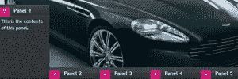
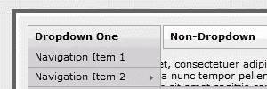
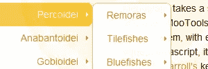

# 5 个专业 jQuery 菜单

> 原文：<https://www.sitepoint.com/5-professional-jquery-menus/>

jQuery 菜单是最流行的 jQuery 插件之一。它通常用于组织网站中的菜单和子菜单，以及在其中放置样式。如果你有一个大型复杂的网站，这个插件是为你准备的，它会让你的网站更加专业和用户友好。只要使用合适的配色方案或大小来适应你的网站。如果你能理解你正在编辑的东西，你也可以编辑它。

## [1。不同的顶部导航](http://net.tutsplus.com/tutorials/javascript-ajax/a-different-top-navigation/)

这是一个 jQuery 插件，提供多层水平下拉菜单系统。

## [2。花式滑动菜单](http://www.andrewsellick.com/64/fancy-sliding-tab-menu-v2)

这个 jQuery 菜单位于底部，提供了很好的导航系统。

## 3.Outlook 导航栏

这是一个很棒的 jQuery 插件，它使用了 AjaxControlToolkit 的 Accordion 控件。它更像一个可折叠的面板，因为它有多个窗格，并且一次显示一个。

## [4。多级下拉菜单](http://www.leigeber.com/2008/11/drop-down-menu/)

这个多级下拉菜单脚本的特点是动画，易于使用和多实例支持。

## [5。菜单式](http://greengeckodesign.com/menumatic)

这个 jQuery 插件接受无序的链接列表，并把它变成一个动态的下拉菜单。

## 分享这篇文章