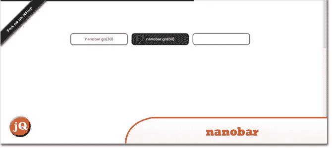
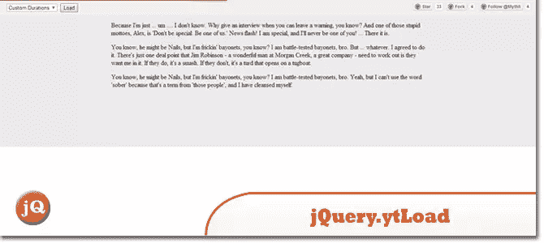
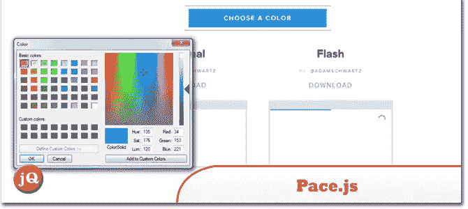
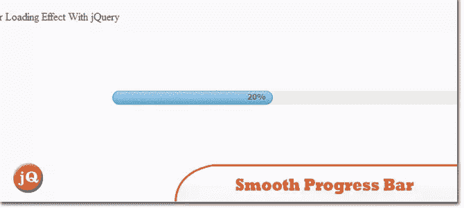

# 5 进度加载行(YouTube 风格)jQuery 插件

> 原文：<https://www.sitepoint.com/5-progress-loading-lines-youtube-style-jquery-plugins/>

今天，这里列出了 5 个进度加载行(YouTube 风格)jQuery 插件，这是在 YouTube 上看到的一个有趣的想法！我喜欢在 Angular SPA 应用程序上切换视图时使用这个功能。=)

## 1.纳米棒

非常非常轻量级的进度条(约 730 字节的 gzipped)。不需要 jQuery。

 
[源+演示](http://nanobar.micronube.com/)

## 2.n 进展

Ajax 应用程序的细长进度条。受谷歌、YouTube 和 Medium 的启发。

 [Demo1](http://ricostacruz.com/nprogress/) [Demo2](http://techably.com/demo/nprogress/)

## 3.jquery.ytLoad

一个受 youtube 启发的、简单的、轻量级的 jQuery 插件，用于可视化 ajax 进程。

 
[来源](https://github.com/Mythli/jquery.ytload) [演示](http://ytload.mythli.net/)

## 4.步

自动页面加载进度条。

 
[来源](http://github.hubspot.com/pace/docs/welcome/) 

## 5.用 jQuery 实现平滑进度条加载效果

一个简单的进度条，带有 jQuery、HTML5 和 CSS3 的平滑加载效果。需要一点代码。有了这个插件，你可以设置你的网页在加载完成时重定向到另一个页面。

 
[来源](http://www.jqueryscript.net/loading/Smooth-Progress-Bar-Loading-Effect-With-jQuery.html) [演示](http://www.jqueryscript.net/demo/Smooth-Progress-Bar-Loading-Effect-With-jQuery/)

## 分享这篇文章