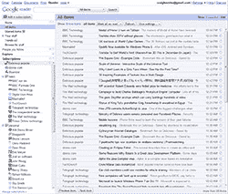
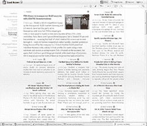
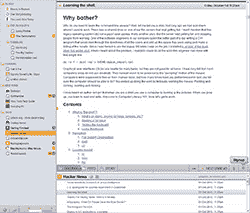
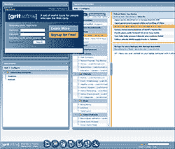

# Bloglines 的 5 个 RSS 阅读器替代品

> 原文：<https://www.sitepoint.com/5-rss-reader-news-aggregators/>

博客的末日即将来临。它的寿命已经延长到 2010 年 11 月 1 日，但它正处于最后的垂死挣扎，只有几个星期的时间来迁移到另一个服务。然而，尽管失去了许多大牌，而且与流行观点相反， [RSS 并没有死](https://www.sitepoint.com/death-of-rss/)。有几个免费的聚合器你可以考虑转移到。

## [谷歌阅读器](http://reader.google.com/)

谷歌阅读器是前博客用户最明显的选择。它是目前最常用的 RSS 聚合器，并且它的支持者是一家不太可能会消失或取消这项服务的公司(Reader 比 Wave 更成功)。

谷歌阅读器将进口标准的 OPML 文件，并有一个简单的界面。如果您想更改默认设置，有一些很好的配置设置。这项服务也比 Bloglines 更可靠，在移动设备上运行良好。

## [好角落](http://goodnoows.com/)

虽然 Good Noows 是一个测试产品，但它有大量的功能来满足最苛刻的用户。您可以使用现有的谷歌、脸书、Twitter 或 LinkedIn 帐户登录，然后查看各种风格的 RSS 流，如“Pulitzer Story”或“Glossy Mag”

我喜欢好的 Noows，感觉比 Google Reader 高级。不幸的是，还没有 OPML 导入支持。它即将到来，但在它完全实现之前，我只能向拥有少量 RSS 提要的用户推荐它。

## [新闻模糊](http://www.newsblur.com/)

NewsBlur 是一个有趣的 HTML 应用程序，提供了几个小部件供您使用。例如，它有一个智能滑块，可以分析你的阅读历史，从而显示或隐藏不太重要的故事。

读者鼓励你在 NewsBlur 中查看故事，而不是打开一个新页面。一开始我发现界面有点古怪和混乱，但一些用户会喜欢它。

## [格里特维尔](http://my.gritwire.com/)

Gritwire 是一个完全基于 Flash 的应用程序，提供 RSS 聚合和类似于社交网络的服务。提供了 OPML 导入以及播客媒体播放器、天气预报和其他几个小工具。

## 其他选项

如果你只有几个 RSS 订阅，你可以考虑个性化的仪表板系统，比如 [Netvibes](http://www.netvibes.com/) 、 [Protopage](http://www.protopage.com/) 或 [iGoogle](http://www.google.com/ig) 。Pageflakes 也提供了一个有用的类似博客的阅读器视图。

你有喜欢的 RSS 阅读器吗？你认为前博客写手的最佳选择是什么？

## 分享这篇文章