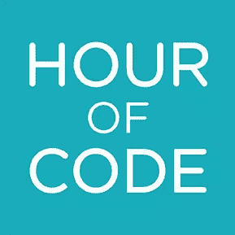

# 5 小时代码的 Ruby 资源

> 原文：<https://www.sitepoint.com/5-ruby-resources-for-the-hour-of-code/>

在过去的几年里，我一直是“代码时刻”的积极参与者。如果你不熟悉《一小时代码》,这里有一个来自其网站的简介:

> “代码小时”是一项全球性运动，覆盖 180 多个国家的数千万学生。任何地方的任何人都可以组织一小时的代码活动。一小时的教程有超过 45 种语言版本。不需要经验。4 到 104 岁。

简而言之，HoC 是 12 月的一周，像你我这样的书呆子有机会走进教室，领导一场与编程相关的活动。令人难以置信的满足。我珍惜我在教室里度过的时光，我期待着本周再次这样做。我强烈建议你找一所当地的学校，贡献出你的一些时间。通常，你甚至不必去学校，因为他们可以和班上的同学建立视频聊天或 Skype 通话。我以前去过闲逛的路线，虽然它没有在教室里那么有趣，但它仍然是令人愉快的，并受到老师和学生的极大赞赏。

一旦你决定把你的时间和精力花在一个特别的事件上，你可能需要一些想法。幸运的是，互联网上充斥着各种建议和活动，你可以用它们来让自己看起来像是花了很多时间在做计划。今天，我将关注 5 个与 Ruby 相关的项目，你可以用它们来和孩子们一起享受编程的乐趣。

## [KidsRuby.com](http://kidsruby.com)

Kids Ruby 是一个适用于所有平台的可安装程序，它提供了一个 Ruby 环境来测试 Ruby 代码并查看结果。该网站甚至有一个[类](https://github.com/hybridgroup/kidsruby-class-1)，你可以用它来教孩子们使用 Ruby 编程。

不幸的是，OSX 安装程序不能在 MacOS Sierra 上运行，所以我需要一个不同的平台。但是，如果你没有使用最新版本的 Mac OS，或者你使用的是 Windows、Debian 或 RaspberryPi，KidsRuby 是处理你的临时事件的一个简单方法。你可能应该准备一些他们可以编码的简单的 Ruby 片段，或者提出一些小的挑战，用简单的 Ruby 片段作为他们的答案。

## [鲁宾逊](http://rubykin.com/)

Rubykin 自称是“教孩子 Ruby 的第一本书”，它由 10 个章节组成，讲述了 Ruby 的基础知识。它有许多例子，你可以和 irb 或 [Repl.it](https://repl.it/languages/Ruby) 的孩子们一起浏览。事实上，你应该在这些例子的基础上，给孩子们一些简单的练习。也许你可以给他们挑战，让他们红宝石比赛(第一个完成的人获胜！).

你可能需要让孩子们共享设备，但学校/班级希望有一些可用的 Chromebooks 或 PC。

## 铁路桥——教孩子

RailsBridge 是一个很棒的组织，它的目标是“…[教]人们编码，因为我们相信制造技术的人应该准确地反映使用技术的人的多样性。”他们有一个“教孩子”的页面，链接到各种不同年龄层次的 Ruby 相关课程。其中一个课程使用鞋子来展示图形和创建 RGB 演示。

该页面上的一些链接是断开的、畸形的或旧的，但是有大量的想法供你使用或修改。例如，在教高中女生 Ruby 的故事中，有一些关于如何穿鞋子的例子和代码片段。RailsBridge 文档也有一些关于如何教授 Ruby(和其他语言)的链接。

## [你好红宝石](http://www.helloruby.com)

《你好，红宝石》是琳达·柳卡斯写的一本儿童读物。从网站:

> 你好 Ruby 是世界上最异想天开的学习计算机、技术和编程的方式。

在书中，Ruby 是一个与各种角色互动的女孩，每个角色都代表编程中的一个概念。这本书非常非常好，如果你帮助的班级比较年轻(比如说，K-3 年级)，那么这本书是完美的。此外，这本书的后面有许多你可以在课堂上做的活动，包括用建筑纸和贴纸制作自己的电脑。哦，这些活动也在[你好 Ruby 网站](http://www.helloruby.com/teach)上。

完成后，你可以把这本书(或几本书)捐给班级，作为你促成的这个不可思议的事件的一个提醒。去年我为一个班级做了这个，他们非常兴奋。

## [红宝石魔法](https://www.nostarch.com/rubywizardry)

另一本书是*Ruby wizardy:儿童编程入门*。在这种情况下，你可能需要提前做好准备，弄清楚在上课期间你想看哪一章(或哪几章)。例如，当你解释概念时，你可以让孩子们轮流写代码。然后，就像 Hello Ruby 一样，你可以向班级捐赠一本或多本书。

这本书可能更适合年龄较大的班级，如中学生。我鼓励你看一看免费摘录([“国王和他的弦”](https://www.nostarch.com/download/rubywiz_ch2.pdf))，感受一下这本书是如何写的。很有意思。

## 奖金资源

所以，我知道我说过我只给你 5 个 Ruby 资源，但是我喜欢你，所以我会添加更多。有大量关于儿童编程的教学和引导资源，其中一些最好的是 Ruby 特有的。以下是我最喜欢的几个:

*   Code.org——Code.org 赞助了“代码小时”等活动。Code.org 网站上有关于如何教各个层次的孩子的视频，以及可供使用的活动。这是一个令人难以置信的网站。
*   CS Unplugged.org–CS 不插电是另一个很棒的网站，有很多活动可以和孩子们一起表演。教授二进制、排序算法、图像表示等等。另外，你可以买一本书来支持他们的努力，我建议你在他们离开的时候给他们。
*   谷歌教育(Google for Education)–谷歌有大量的资源来教授编程。这个网站真的非常非常不可思议。
*   这里有一个来自自由代码营的关于和你的孩子一起做一小时代码的帖子。

顺便说一句，我去年组织了一次到我办公室的实地考察，有几节课[写了关于它的文章](http://skookum.com/blog/how-to-plan-a-field-trip-to-your-office)(我从那个帖子复制了上面的资源，但这是我的帖子，所以没关系)，所以不要觉得特设是你传播知识的唯一一周。

## 动手吧！

我希望这篇文章能激励你为当地的一群孩子贡献一些时间。我们很幸运能进入技术行业，所以我们应该把我们的运气向前传给下一代。谁知道呢，你今天花的一个小时可能最终会激发伟大的技术头脑来解决问题和创造伟大的东西。哦，这也很有趣。

## 分享这篇文章