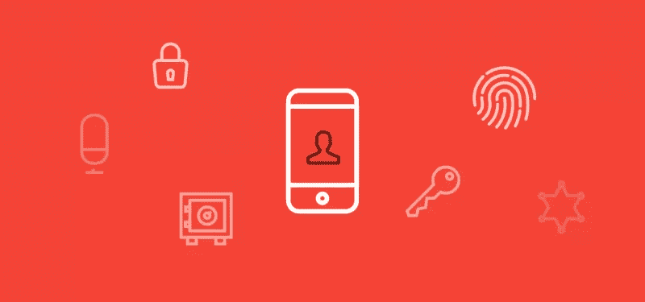
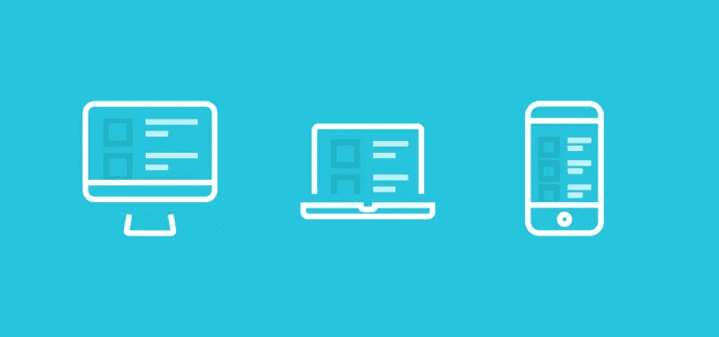

# 指导产品设计的 5 个简单 UX 原则

> 原文：<https://www.sitepoint.com/5-simple-ux-principles-guide-product-design/>

生活中很少有事情是不变的:死亡、税收和陌生人的询问。“握手一分钟之内。

作为一名 UX 设计师，这些年来我进行了大量的实践，试图找到我的答案。

这是我想到的:

> 我的工作就是进入用户的大脑。我需要从用户(实际上是很多用户)的思维空间来看待设计，并消除潜在的问题或困惑。

这个永无止境的过程需要 UX 在构建完成之前、之中和之后都在场。将用户放在心上永远是一个挑战——像到期日和底线这样的影响有时会模糊道路。

为了帮助你的[产品设计](https://www.sitepoint.com/premium/books/the-lean-product-playbook/)走在正确的道路上，我收集了一份 UX 五原则的清单，用来指导我的设计过程。理解如何以及为什么做出 UX 决策有助于向团队中的其他人解释事情，这甚至有助于将所述 UX 决策融入最终产品。

## 1.消化性

好的设计很容易消化:大脑不应该花费大量的精力去弄清楚它到底在看什么。运气好的话，人们会“明白”而不需要六段解释。

这不仅仅是清晰易读的文本。人们有时需要指导来做决定，所以一个包含 12 个内联项目的菜单可能会让人望而生畏。用一些层次结构(大小、颜色、图标)来组织可以帮助突出更常见的选择，这可以让人们更快地找到他们想要的东西。

另一个易于理解的设计的例子是新用户指南，通常以交错提示的形式出现，一个人可以一次处理一个。但是想象一下相反的情况——给一个全新的用户一大堆指令，脱离了产品的上下文。没有人喜欢令人困惑的惊喜。

考虑一下你让别人对你的产品做出的所有决定，以了解漏斗的底部。大脑在一天中的认知资源是有限的，所以不必要地使用它们是不礼貌的。

## 2.清楚

好的设计是诚实的。除了理解你的价值主张中的文字，你还需要用户理解实际的价值。对你的产品含糊其辞是不会赢得任何粉丝的。

与价值相关，定价是一个清晰至关重要的领域。如果用户不知道你要求他们支付的价格，他们是不会点击“立即购买”的。虽然切换到自动计费的可疑“免费试用”可能是常态，但我怀疑它们是否会赢得任何受欢迎度竞赛。

这听起来可能有点俗气，但是一个好的计划就是简单地遵循黄金法则。解释事情就像你希望他们解释给你听一样。尽可能把事情说清楚。你知道你期望从你选择使用的产品中得到什么，所以你不敢少造一些。

## 3.信任

好的设计容易让人信任。在要求某人完成一项行动之前，尽一切努力帮助他们理解为什么需要这项任务。诚实和清晰的解释在每一步都建立了信任，导致越来越容易的转化。

考虑一下优步(和 Lyft，取决于你挥杆的方式)。他们让搭车变得如此容易，以至于一个有 100 年历史的行业现在陷入混乱。这款应用程序可以保存你的支付信息，你可能会觉得与陌生人交换信息不太舒服，并有助于进行值得信赖的无痛交易。

消除疑虑会创造一种越来越无形的体验。随着决策所需的资源越来越少，使用该产品变得更加容易和愉快。

## 4.熟悉

突破性的设计很棒，但是转化性的设计更好。新的框架和华丽的插件在 Dribbble 上可能看起来不错，但是如果没有人点击“购买”按钮，你就有问题了。

平台指南的存在是有原因的。虽然让你的产品在不同平台上看起来完全一样似乎是主要目标，但是要注意每个操作系统的细节。使用熟悉的模式、图标和展示风格是让自己看起来很自然的好方法，即使你不是。

在实际设备上测试你的解决方案对确保每种环境下都有宾至如归的感觉大有帮助，这正是像 [InVision](https://www.invisionapp.com/) 这样的工具大放异彩的地方。当你不需要假装使用某个设备时，伪装成用户会更容易。

## 5.高兴

有人说，一个想法已经不够了——执行是赢得战争的关键。讽刺的是，团队执行得越多，用户需要做的就越少。你对一个复杂的问题越简单，用户就会对你的解决方案越满意。

最大的快乐是当有人忘记你的产品是一种“产品”——它是如此的有用，以至于它甚至不再作为一种产品来阅读，而仅仅是作为一个人生活中的一些有用的东西。

## 站在用户的角度

用清晰的意图构建考虑周到的产品表明你在乎，让选择更舒适，并带来更好的整体体验。这很重要，因为已经发现 68%的用户放弃是因为他们认为你不关心他们(我们知道这不是真的！).

只要你对自己诚实，就很容易判断自己产品的用户体验。站在别人的立场上走一英里，从一个疲惫不堪的人的大脑空间考虑你产品中的每个动作。你会点击下一个的*吗？*

## 分享这篇文章