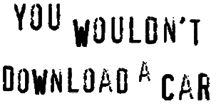
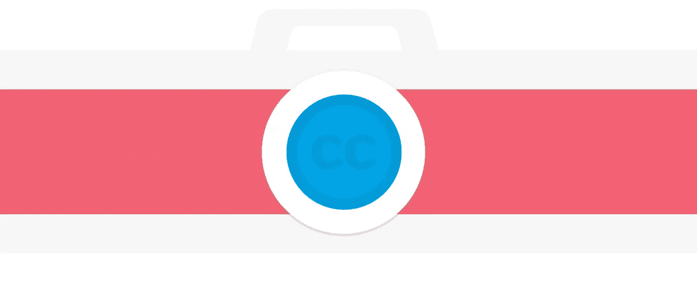
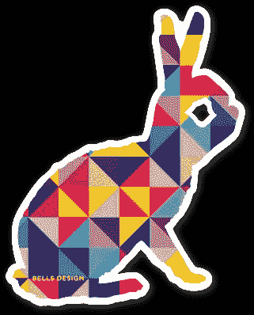
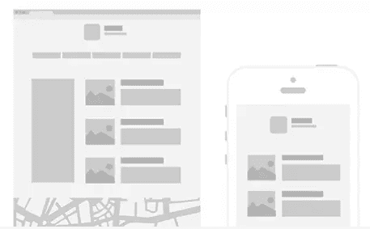
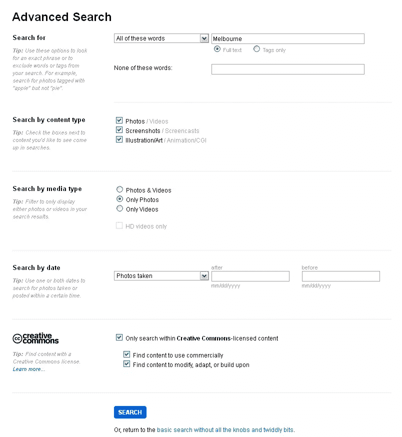
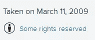
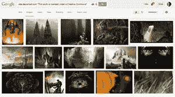

# 奇妙的知识共享设计资源的 5 个站点

> 原文：<https://www.sitepoint.com/5-sites-fantastic-creative-commons-design-resources/>

**“你不会下载汽车”**

你可能会从许多电影和其他数字媒体上的强制反盗版视频中认出这个问题。

讽刺的是。2014 年，我很可能*会*下载一辆车！

如果你有必要的硬件和资源，3D 打印使这非常容易实现——甚至是微不足道的。

然而，像这样的声明表明，大型商业公司往往不知道互联网的本质，以及它如何不断改变自己。全世界越来越多的人认为版权不再能促进创造力和创新。需要一些新的东西。

旁注:第二大讽刺是，反盗版广告中使用的音乐没有得到音乐创作者的许可。。

## 知识共享是如何诞生的

对于数字时代的设计师和居民来说，旧的学校版权通常是不利的。由于互联网和数字文化的传播，过时的版权，主要用于书籍和其他作品，对于像互联网这样一个动态的生态系统来说是不够的。

从技术上来说，每当我们想使用一些资产，我们需要征求版权所有者的许可，因为“保留所有权利”。然而，有时在资产中做一个小的改变就足够了，如果“保留所有权利”，这是不可能的。这个问题需要一个解决方案。这正是 2001 年“知识共享”诞生的原因。

作为一个非营利组织，知识共享通过免费的法律工具实现了创造力和知识的共享和使用。

他们易于使用的[版权许可](http://creativecommons.org/licenses/)提供了一种简单、标准化的方式，允许公众在自己选择的条件下分享和使用你的创意作品。CC 许可让您轻松地将您的版权条款从默认的“保留所有权利”更改为“[保留某些权利](http://wiki.creativecommons.org/FAQ#What_does_.22Some_Rights_Reserved.22_mean.3F)”

知识共享许可 ***不是*** 版权的替代方案。[它们与版权](http://wiki.creativecommons.org/FAQ#How_do_CC_licenses_operate.3F)一起工作，使你能够修改你的版权条款以最适合你的需要。

我不会在这里更深入地讨论法律术语，以及这对作为创作者的你有什么好处(确实可以；但是[这里有一个成功案例研究的列表](http://wiki.creativecommons.org/Case_Studies)，包括白宫使用 CC 许可。然而，今天我将重点介绍它如何为 CC 许可资产的用户带来好处，以及如何使用 Creative Commons 为您的下一个项目找到合适的资产，并避免为节省一些钱而购买股票图像。

下面就介绍其中的一些吧。

## 经纬照相术

Gratisography 一直是我最喜欢的免费摄影资源之一。我在研究知识共享许可时偶然发现了它。Gratisography 由来自 [Bells Design](http://bellsdesign.com/) 的 Ryan McGuire 创建，它利用了很少使用的知识共享许可:Creative Commons Zero。

为什么 Creative Commons Zero 很少使用？

嗯，主要是因为它不是真正的许可证，而是缺乏一个。知识共享零给予用户对材料的 100%自由，没有任何属于作者的权利。

一个相当激进的解决方案，但我们的消费者和设计师肯定能欣赏！然而，人们通常很有礼貌地给作者署名，这有时会比使用集成了署名权利的许可证更有回报和更广泛。

确实，Gratisography 的图像在各种个人和商业项目中帮助了我。虽然数量有限，但它提供了超高清摄影和图像，适用于许多领域。

特别是如果你喜欢在你的项目中使用附庸风雅的抽象图像，而不是公司，俗气的微笑套装，Gratisography 是最适合你的。这就像一个超高清照片的 Instagram feed。

## 微型摄影

如果你不以摄影为生，你用智能手机拍的照片可能会比专用相机多。Ryan McGuire 基于这一概念推出了 Gratisography 的姐妹网站 [Tinyography](http://www.tinyography.com/ "Tinyography") 。

Tinyography 使用与 Gratisography 相同的理念，即所有照片都在 Creative Commons Zero 下获得许可，但它们是用 iPhone 拍摄的，并且是方形尺寸。如果你喜欢 Instagram，你会喜欢 Tinyography。与 Gratisography 一样，这里通常每周都会添加新的图像，因此请不时再次查看更新。

似乎这还不够，贝尔斯设计公司免费赠送了一个很棒的兔子贴纸。你也可以申请一个！

## 阴影 1.0

通常你会为网站、应用程序和类似的东西制作线框模型，但为了节省时间，你最好不要在笔记本上乱涂乱画。Shades 1.0 试图通过发布原型制作时经常使用的虚拟元素的矢量图像来加快原型制作工作。

当你解释工作流程时，这些将会非常方便。你甚至可以把这些元素打印出来，在你的桌子上手动排列，以获得你创作的灵感。

目前该项目是在 1.0 版本，但作者正在接受请求和反馈，以便在下一个版本中添加新元素。

最棒的是什么？

Shades 1.0 在 CC-BY 下授权，也就是说你可以把它用在任何你想用的地方，只要你给原创者(Heidi Pungartnik/Design for Founders)
[你可以在这里找到 Shades 1.0。](http://www.designforfounders.com/shades/)

## 闪烁（光）

我们大多数人都知道， [Flickr](https://www.flickr.com/ "Flickr") 作为一个照片存储和分享社区有着悠久而受人尊敬的声誉。

许多人不知道的是， [Flickr](https://www.flickr.com/ "Flickr.com") 也提供了一个在知识共享许可下的数百万张照片的宝库。他们的明智之举！

您还可以通过特定的许可证来过滤搜索结果，以避免“保留所有权利”或知识共享许可对您的工作限制太多。只需进入 ***[高级搜索](https://www.flickr.com/search/advanced/ "Flickr's advanced search")*** 并根据你的喜好调整过滤器。

在下面的例子中，我们正在搜索“Melbourne”的照片，我们可以将其用于商业用途，但我们的工作仍然以此为基础；即:根据我们的喜好修改它。

从搜索结果中，我们可以选择一个图像，它将公正地对待我们以后的工作。

在我们的例子中，我选择了亚瑟·阿尔霍弗利设计的墨尔本的天际线。

亚西尔·阿尔霍菲利

为了确定这一点，请检查图片下方的许可证，点击它会被重定向到 https://creativecommons.org/的许可证页面

正如你可能看到的，我们可以出于任何目的，甚至是商业目的，自由分享和改编本作品，只要我们注明作者。

## DeviantArt

DeviantArt 是艺术家展示作品的最佳网站之一。他们中的许多人选择将他们的作品提供给其他人，并经常为此使用知识共享许可协议。

不幸的是，DeviantArt 目前没有提供专门的搜索来查找 CC 许可的作品。

相反，你需要更狡猾一点。进入 Google Images 搜索:'["本作品在 Creative Commons 网站下获得许可:deviantart.com](https://encrypted.google.com/search?q=%22This+work+is+licensed+under+a+Creative+Commons%22+site:deviantart.com&source=lnms&tbm=isch&sa=X&ei=IJbXU4vuH8ns8AWYvYCgBw&ved=0CAYQ_AUoAQ&biw=1276&bih=683#q=dragons+%22This+work+is+licensed+under+a+Creative+Commons%22+site:deviantart.com&tbm=isch "Google image search of Devianart") '，或者用更多的搜索词指定它。

当然，这是一个笨拙的解决方法，但是考虑到 DA 上有如此多精彩但不被重视的资源，这绝对值得一试。

还有一个致力于知识共享许可作品的小组，你可以定期查看:

[http://creative-commons.deviantart.com/](http://creative-commons.deviantart.com/)

## 那么，你是一个有创造力的普通人了吗？

随着版权和免费软件之间的界限变得越来越模糊，像知识共享这样的解决方案更受欢迎。的确，艺术家需要让自己的作品得到认可和报酬，但这不应该限制更广泛人群的发展、进步和创造性思维，在这里，版权造成的损害大于确保的权利。

Creative Commons 试图涵盖这两个问题的解决方案，坦率地说，到目前为止，它做得很好。

所以开始下载那辆车吧！

## 分享这篇文章