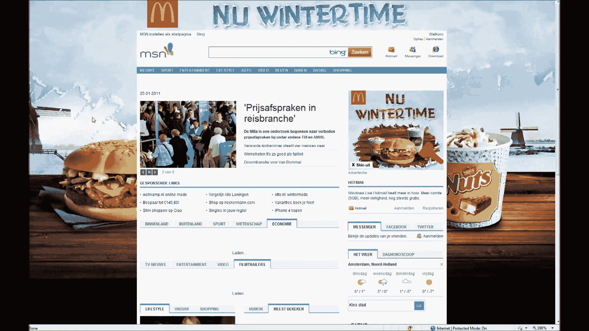
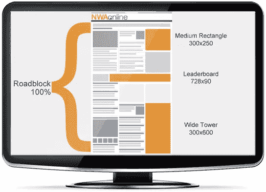
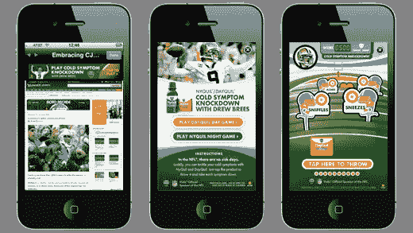
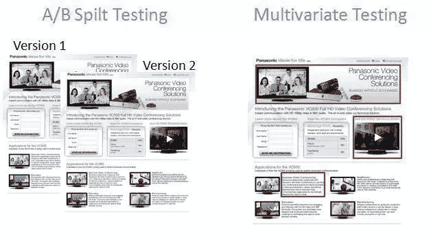
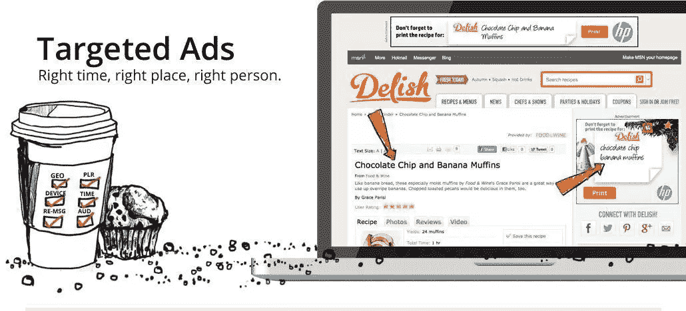
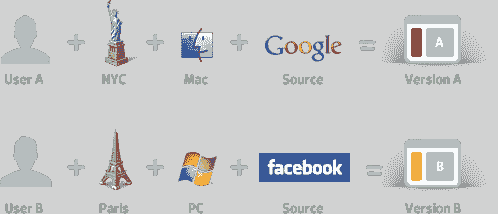
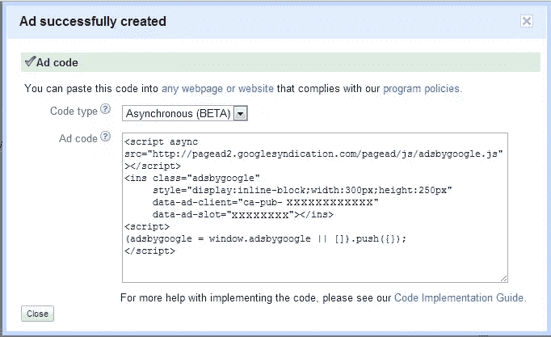
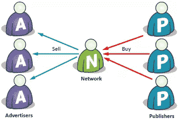

# 优化广告基础设施的 5 个策略

> 原文：<https://www.sitepoint.com/5-strategies-optimizing-advertising-infrastructure/>

*本文由 [AdButler](http://www.adbutler.com/) 赞助。感谢您对使 SitePoint 成为可能的赞助商的支持。*

在线广告正在发展，变得比以往更加复杂。今天的广告商正在寻找更有效的广告活动，包括详细的统计数据、跟踪和定位。

这个新的在线广告世界需要合适的工具。简单的“广告旋转器”时代已经一去不复返了；如今的广告活动要求使用功能齐全的广告服务器。如果你不用，你可能会把钱留在桌子上。

正如航空公司使用先进的预订软件来实现收入最大化一样，顶级出版商也使用第三方广告服务器，如 AdButler。这里有五个策略可以让你在优化广告基础设施方面有一个良好的开端。

## 策略 1–尝试先进的横幅概念

简单弹出窗口的日子已经一去不复返了。就像电视广告一样，由于过度使用和熟悉，它们没有被广大消费者注意到。

事实上，根据 Infolinks 在 2013 年进行的一项关于横幅失明的研究，60%的受访者不记得他们看过的最后一个展示广告，只有 14%的受访者记得被广告的公司名称。

考虑到投入这些广告的数百万美元，这相当令人沮丧——尤其是如果你考虑到这些统计数据在这项研究完成后的两年里可能只会变得更糟。

如果你想产生影响，你就必须鹤立鸡群。

今天先进的横幅广告概念推动了更高的参与度，因为它们提供了一些让消费者措手不及的新东西。开始尝试的一些想法包括:

### 主页接管:

主页接管就像它听起来的那样——一个广告商的旗帜接管一个品牌主页的安排。

 ( [来源](http://i.ytimg.com/vi/OhZpwhTAHbw/maxresdefault.jpg))

任何时候你点击背景图片，它会带你到广告商的链接。这些概念需要大量的预算和巨大的创造力。但是如果你认为你有能力做到这一点，那就值得一试。

### 路障:

想用你的信息轰炸人们，让他们除了听别无选择吗？嗯，那么[你可能想试试路障](http://www.clickz.com/clickz/column/1693918/creativity-roadblock-ads)。

 ( [来源](http://media.arkansasonline.com/static/nwaonliimg/mediakit/roadblock.png))

这是一个简单的做法:买下所有可用的广告空间并分享你的信息。你可能见过娱乐业在推广新电影时使用这种方法。

### 富媒体应用:

这些类型的广告为广告商提供了无限的可能性。在移动平台上，它们通常被视为吸引观众的一种身临其境的方式。

 ( [来源](https://www.medialets.com/wp-content/uploads/2014/01/Vicks-YahooFantasyFootball-1of2.png))

但是富媒体应用程序并不只是为移动设备保留的。它们可以应用于所有形式的数字媒体，以创造一个伟大的互动体验。

[AdButler](http://www.adbutler.com/#features) 对富媒体应用程序和其他高级工具(如视频广告服务模板)提供了出色的支持。

### 退出意向弹出窗口:

当有人要离开页面时，一个[退出意图弹出窗口](http://2xecommerce.com/effective-exit-intent-popups/)抓住他们最后一点注意力。

 ( [来源](http://codecondo.com/wp-content/uploads/2014/08/You-Can-Recommend-Other-Content-or-Products.png?406dc9))

他们通常也能很好地转化。退出意图弹出窗口提供商 OptiMonk 估计，在一个普通的电子商务网站上，这些信息可以推动:

*   注册率在 3-5%之间
*   包含奖励(如免费电子书、特别报告或优惠券)时，注册率为 10%或以上
*   当提供激励时，转化率为 9-10%

我们正处于一个非常活跃的营销时代。这取决于你的新概念和新格式，看看什么最适合你的出版商。

## 策略# 2–测试以揭示高性能广告单元

A/B 和多变量分割测试是出版商最好的朋友。嗯，他们是数字营销世界中每个人的朋友——但他们对那些运营广告基础设施的人特别感兴趣。

 ( [来源](http://www.internetmarketinginc.com/assets/MVT.jpg))

传统的 [A/B 测试围绕着解读](http://blog.hubspot.com/blog/tabid/6307/bid/30556/The-Critical-Difference-Between-A-B-and-Multivariate-Tests.aspx)两个特定选项中的最佳选项。大多数时候，只有页面的一个小细节被改变来衡量结果。

但多元测试包含同时测试各种成分，允许更快的结果——以及接受该协议的广告提供商更快的利润。

在广告中，你可以[使用这种测试方法](http://www.smashingmagazine.com/2011/04/multivariate-testing-101-a-scientific-method-of-optimizing-design/)来衡量执行过程中各种组件的表现。无论是测试不同的横幅类型，还是切换整个广告单元，这种策略都将帮助您优化和最大化收入。

## 策略# 3——基于网站互动的目标广告

一个成功的广告是从定位开始的。你让出版商的广告对用户的体验越有针对性，效果就越好。

就是这么简单。

 ( [来源](http://www.flashtalking.com/us/wp-content/uploads/2012/10/Targeted-Ads-Header2.jpg))

网络世界的一切都要考虑用户。随着社交媒体之类的东西越来越受欢迎，营销已经变得非常个人化。

让您的广告基础设施超越基本的地理和站点/区域定位。通过使用定位选项，如现场行为、现场互动和设备，提高整体用户体验。

 ( [来源](http://conversionxl.com/wp-content/uploads/2013/02/personalize.png))

你会惊奇地发现，这种目标定位水平可以让品牌向读者展示相关广告，这在当今这个时代非常重要。

## 策略# 4–利用异步广告提高页面性能

每个人都喜欢双赢的局面。这正是这些类型的广告为广告商和消费者提供的。

运行异步广告改善了站点加载时间并降低了服务器负载。这意味着事情运行得更顺畅、更快速，这是每个人都能欣赏的。

甚至 Google AdSense 也加入了进来。下面来看看新的[异步 AdSense 脚本](http://www.matrudev.com/post/synchronous-asynchronous-adsense/):

 ( [来源](http://www.matrudev.com/files/Asynchronous-Adsense-Ads.png))

当用户对广告感到满意时，你做了一件好事。尝试一下，看看你的网络广告以这种方式加载时是否表现得更好。

## 策略 5——给你的广告网络贴上白色标签

建立一个横跨相关垂直行业的广告网络为出版商创造了巨大的机会。一个白色标签品牌下的集体利基网络会给你巨大的综合影响力——这意味着更多的回报。

 ( [来源](http://altitudedigital.com/wp-content/uploads/2015/03/ad-network.png))

以[高速公路的好处](http://www.speedwaybenefits.com/)为例…

该公司由传奇的 NASCAR 推广人 Humpty Wheeler 创立，目标只有一个:创建一个有效的营销渠道，将全国约 1800 万草根赛车迷与渴望吸引他们注意力的赞助商和推广人联系起来。

迄今为止，该公司与 350 家广告商合作，在超过 7，000 场活动中亮相，估计有 28，000 家竞争对手。这是一个简单的概念，但只有借助白色标签的力量才能实现。

当你有更大的影响力时，你可以和广告商协商更高的报酬。因为他们的活动可以在你的网络中展示，他们会喜欢增加的曝光率，因为更大的空间意味着更多的人看到广告，这最终会转化为出版商和广告商收入的增加。

并非所有的广告基础设施提供商都提供白色标签，但如果你对这一功能感兴趣，你应该看看 [AdButler 的产品](http://www.adbutler.com/)。

## 总结

正如我所解释的，新技术可以帮助优化你的广告基础设施。我上面概述的五个策略可以带来巨大的好处。从有针对性的广告到先进的横幅广告概念，甚至到给你的广告网络贴上白色标签，这些策略都是被证明是成功的。

像 AdButler 这样的高质量广告服务解决方案可以支持所有这些策略，以及您在成长过程中可以依赖的坚如磐石的性能和扩展能力。

优化广告基础设施是在大数据时代保持领先的必要组成部分。你会使用这些策略来帮助你开始这个过程吗？在下面的评论中分享你的想法和计划吧！

## 分享这篇文章