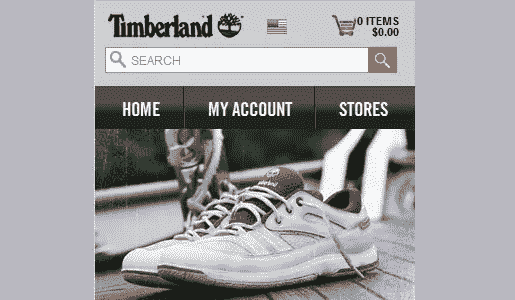
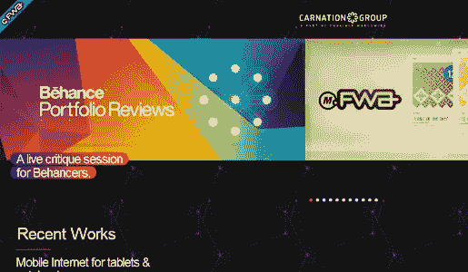

# 5 个令人惊叹且实用的移动网站设计

> 原文：<https://www.sitepoint.com/5-stunning-and-usable-mobile-website-designs/>

我不打算撒谎；很难找到高质量的手机网站设计。问题是，在台式电脑上搜索要容易得多，但你必须使用一个应用程序来改变你的用户代理或改变你的屏幕大小，以查看网站如何响应。所以这个综述肯定是一个爱的劳动。

现代移动网站分为两大类:

1.  那些检测用户代理，并转发到一个单独的移动网站，通常是在 m.site.com 或类似的地方。
2.  那些使用[@ media screen max/min-width logic](https://www.w3.org/TR/css3-mediaqueries/)检测屏幕大小，根据屏幕大小设计页面样式的设计，通常被称为“响应式”网页设计。

出于多种原因，我倾向于第二种选择，但是这个移动网站设计的例子列表并不关注任何一种设计架构。我只是寻找非常有用的好设计。

你可能会问，“可用”到底是什么？这个没那么专业，更主观，所以你可能完全不同意我的一些选择。但是，我寻找能让我在网站上快速找到内容的设计，有一个干净的设计，并能快速加载。我知道这些品质也是相当主观的，所以请在下面的评论中让我知道你对这些设计的看法。尽情享受吧！

* * *

### 爱情与奢华

爱情与奢华是我最喜欢的发现之一。我承认我喜欢一切——颜色、字体设计，尤其是响应式设计。请注意，当您缩小桌面浏览器窗口时，设计如何适应您的浏览器大小。这是响应式设计在发挥作用。

还要注意当你缩小水平屏幕尺寸时，菜单是如何移动的，整个布局是如何变化的？突出的设计元素，即页面右侧的排版，实际上在小屏幕上完全消失了。相反，菜单成为移动用户首先看到的东西。

这是一个可用的移动网站设计的完美实现。我相信我们会在下面的评论中做出一些小的改变和建议，但总的来说这是一个很好的例子。

* * *

### 轨道发展公司

Orbitaldevs.com 是另一个响应式设计的惊人例子，而不是一个单独的移动网站设计。如果你在大屏幕上浏览这个网站，网站会有一些有趣的移动和浮动效果，但是小屏幕会隐藏这些，把菜单放在前面和中间。

我不喜欢的是，该网站没有任何“转到顶部”按钮。你必须一路滚动回到页面顶部才能看到菜单，这在移动设备上很麻烦。这应该是设计单页网站时的常见做法。

除此之外，这个网站是惊人的，在检测和适应屏幕尺寸方面做得很好。

* * *

### 丝芙兰

丝芙兰的移动网站(可在 m.sephora.com 查看)是一个单独的移动网站设计的例子，它有自己的子域和一切。虽然[我对创建一个独立的移动网站](https://www.sitepoint.com/forget-mobile-sites-time-for-a-responsive-web/)的方法不太满意，但丝芙兰做了一件了不起的工作，赢回了我的心。手机网站的布局简洁，按钮让导航变得轻而易举。就下载量而言，移动网站也比桌面网站小得多。

该品牌在桌面和移动住宿上都是一致的。对于一些使用分而治之方法的网站来说，这是一个大问题——品牌并不总是保持一致。但在这种情况下，Sephora 移动和桌面网站是同步的，并且运行良好。

让丝芙兰化险为夷的是，桌面网站实际上有一些无法在移动设备上运行的功能。因此，在丝芙兰的案例中，创建一个独立的移动网站是有意义的。我认为仅仅为了解决移动设备的基本布局问题而创建一个完全独立的移动版网站并不是一个好主意。

* * *

### 天伯伦

天伯伦的移动网站(可在 mshop.timberland.com 查看)是另一个合适的独立移动体验的好例子:购物。Timberland 在使网站易于导航方面做得很好，他们仍然设法在非常有限的屏幕尺寸内将评论、产品图片和价格放入两列网格中。该网站加载速度很快，找到我感兴趣的东西轻而易举。

请注意，搜索栏和购物车功能位于网站顶部。这对于电子商务网站非常重要，因为客户通常会研究多种产品。因此，这种技术使他们很容易找到并一次购买几件商品。

该品牌也与桌面网站紧密相关。主站点图形更加密集，所以做一个轻量级的移动网站设计是有意义的。

* * *

### 康乃馨组

康乃馨集团的移动网站([m.carnationgroup.com](http://m.carnationgroup.com/))可以作为*不*做什么的例子。我在列表中包括了这个，以提供一个犯了几个错误的站点的例子。我只希望它能持续足够长的时间，让我的读者有机会看到这个网站的运行——或者更确切地说，是在*的*运行中。

公平地说，我喜欢这个网站的许多设计理念。颜色和布局非常吸引人。桌面和移动设计确实配合得很好。但是，对我来说这就是赞美的终点。

第一次加载后，网站没有一致的响应。因此，如果你用你的移动设备在垂直(高)位置加载网站，并在网站加载时旋转它，它不会对你做出反应。在重新加载屏幕之前，您可能会一直使用初始布局。当我[测试这个设计](https://www.sitepoint.com/how-to-validate-test-your-designs-for-the-mobile-web/)时，它在一些移动浏览器上运行良好。在其他情况下，就不是这样了。

主页顶部的图形滑块看起来不错，反应也很好，但是他们不应该试图把所有的图形都塞进一个移动网站。页面首先加载它们，在加载多个大的离屏横幅图像时，给你一个计时器。右上角的菜单只在特定的布局中有效。我无法让它持续工作，这让我陷入了困境。

你可以看出我对康乃馨集团的手机网站设计不太感冒。还有更糟糕的实现，所以我不想太苛刻。引起我注意的是，他们费尽周折创建了一个几乎相同的移动网站，而他们本可以将同样的精力投入到创建一个真正不同的移动体验上。本质上，他们接受了创建一个单独的移动网站的所有缺点，而没有利用这些优点。

但是，他们不是一个提供复杂产品的公司，也不是一个购物车系统。那么，为什么要过分强调某种外观和感觉呢？谁知道呢，但我希望这至少能让人们更多地思考他们的移动设计和架构。

* * *

你是否偶然发现了一个设计巧妙、布局灵敏、占地面积小的移动网站？手机地图上应该擦掉的手机炸弹呢？让我看看你发现了什么，并告诉我为什么它是赢家或输家！如果你喜欢手机设计，你应该看看我们的合作网站， [BuildMobile](https://www.sitepoint.com) 。

## 分享这篇文章