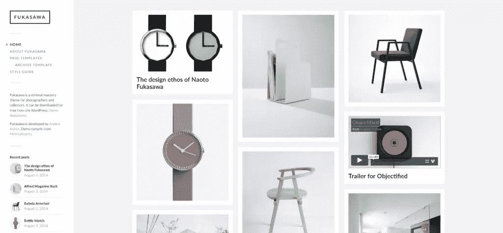
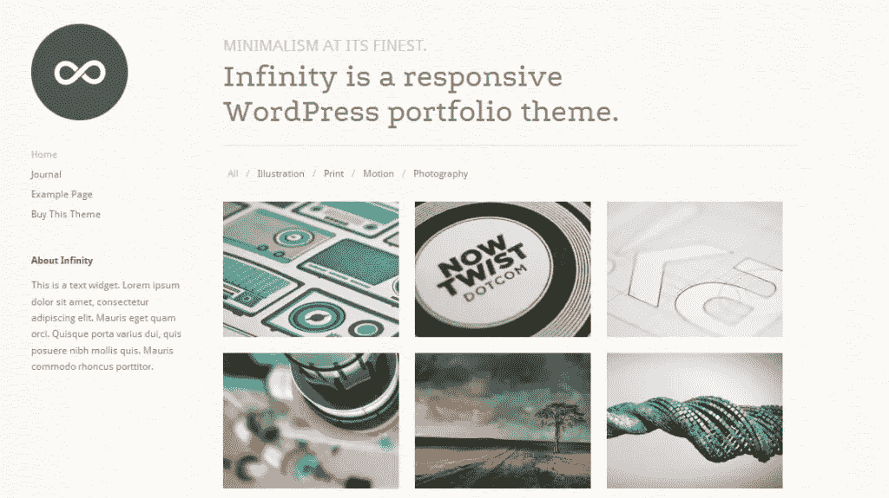
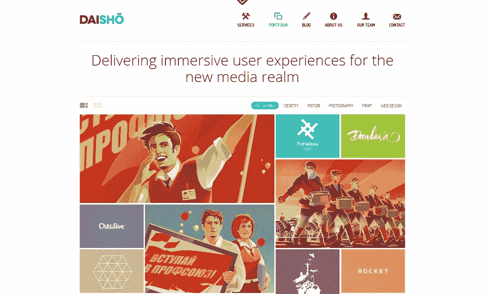
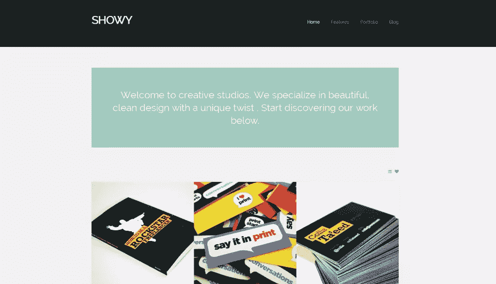
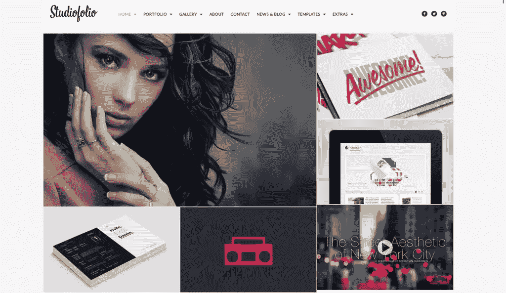

# 设计师的 5 个令人惊叹的 WordPress 组合主题

> 原文：<https://www.sitepoint.com/5-stunning-wordpress-portfolio-themes-for-designers/>

投资组合是艰难的工作。如果你遇到任何设计师，他们很可能会在某个时候提到他们的作品。看看 Behance 或者 Dribbble 就知道了；这些社区定期组织投资组合评审或聚会，与他们的同类交流，因此他们的投资组合总是最新的。

抛开痴迷不谈，拥有一个投资组合是当今数字时代的需要。在如今很少见到实体作品集的地方，如果没有作品集或已建立的网络形象，你会发现很难找到工作或演出，尤其是作为一名创意人员。

虽然作为 Behance 或 Dribbble 的设计师出现在社交网络上非常有帮助，但你可能希望解决一个你可以控制的独立托管的投资组合。作为一个开源 CMS，WordPress 非常适合这个任务。

我不会进入如何安装 WordPress 的细节，相反，我会推荐一些我今年看到的最好的 WordPress 组合主题。其中一些附有一个真实的用例，所以你将能够看到这在主题提供者的理想主义预览之外会是什么样子。

## 深泽

如果你喜欢 Pinterest，深泽可能会引起你的兴趣。).它拥有一个漂亮的最小化布局，在一个 Pinterest 风格的网格中显示你的帖子、图片和视频。

虽然不是专门的设计组合主题，但深泽为展示和博客目的提供了一个非常平稳的过渡，使它感觉像是为一个目的服务，而不是两个目的；因此适合大多数设计者的需要。

Fukasawa 也有很好的 Jetpack 支持([如果你还不熟悉 Jetpack 插件，请查看 Jacco 的 Jetpack 指南](https://www.sitepoint.com/a-guide-to-jetpack/))。

该主题包括对图像、视频和画廊格式的支持，并在帖子上方以整洁的幻灯片形式展示画廊，将它们变成一种愉快的阅读体验。

此外，Jetpack Infinite Scroll 允许您在不重新加载页面的情况下加载新帖子。您还可以使用 Jetpack Tiles 画廊在漂亮的网格中显示您的图像，因为 Fukasawa 对这两者都有内置支持。

这个主题允许你自定义颜色、logo 和侧边栏，而不需要接触任何代码(他们必须知道设计者有多害怕代码)，这对于那些想要快速建立和运行一个投资组合的人来说是一个加分项。

不过你还没听到最精彩的部分:深泽完全自由了。这是相对罕见的反应和视网膜就绪的主题。如果你不确定你的预算，一定要试试福泽。

[这是来自阿尔巴尼亚地拉那的设计师 Truman 设计的 Fukusawa 的真实案例。](http://youcancallmetruman.com/)

[下载](http://www.andersnoren.se/teman/fukasawa-wordpress-theme/)
[演示](http://www.andersnoren.se/themes/fukasawa/)

## 无穷

Infinity 拥有经典而极简的外观，这在各种运动设计师的作品中是常见的。它看起来干净简单，但也有一些有趣的人文风格，比如纹理背景或日志(博客)布局。

该作品集允许你在一个作品中添加一个特色图片和任何数量的其他图片，允许你以一种宽泛的方式展示任何项目(因为通常很难用一个图片来展示一个设计项目)。

无限肯定(这是双关语吗？)包含了大量的特性，比如响应能力、短代码、本地化支持、Google Web 字体集成、幻灯片等等。

然而，我不是博客布局的忠实粉丝，你可能会发现它不适合开箱即用，尤其是如果你倾向于专注于写作，或者喜欢记录你的设计之旅。

作为一个高级主题，Infinity 的标价为 59 美元。

[购买](http://themetrust.com/themes/infinity/)
[试玩](http://themetrust.com/demos/infinity/)

## 大和

Daisho 可能是最有趣的投资组合主题之一。它提供了各种功能，从地铁风格的工作画廊，到有趣的博客布局或服务部分。我必须承认，虽然布局有点混乱，因为它不遵守经典的 UX 规则；这可能是一件好事，也可能是一件坏事，取决于你想要实现什么。例如，当你进入页面时，导航栏上有一个后退按钮。我不记得上一次在实际网站上看到后退按钮是什么时候了(你真的需要它吗？我是说，我们在互联网上！).但是如果你喜欢这种惊喜，这可能是你最好的选择。

无论如何，Daisho 提供的体验实际上是相当惊人的。这是视网膜准备和响应与平滑和清晰的动画，你很少看到做得这么好。考虑到这一点，如果你对动画或运动图形感兴趣，这绝对是一个合适的主题。它很好地补充了这种工作，同时还为你提供了很多发挥的空间。话虽如此，如果你不确定是否真的需要最大限度地使用它，或者宁愿用一个更简单的替代方案来解决问题，那么 Daisho 也可能是一个大材小用。

Daisho 的价格相当合理，为 53 美元。

[购买](http://themeforest.net/item/daisho-flexible-wordpress-portfolio-theme/2585124)
[试玩](http://themes.devatic.com/daisho/)

## 显眼的

唷！这些都是非常奇特的主题，如果你的需求非常低，它们可能很难消化。艳丽显示了这里很好的搭配。

该主题拥有令人耳目一新，但不过度的动画和一个，两个或三个栏目的组合布局。每个项目可以容纳几个图像或其他嵌入，如视频。

它们在侧边栏上有很好的描述，可以添加所有需要的信息。博客还提供了一种直接展示你最新想法的可靠方式。

不过，炫耀设法在其他地方炫耀(双关语)——短代码。当我看到这个主题在短代码方面提供了什么时，我感到很惊讶。它提供了这么多，实际上我不确定一个人怎么可能在一个专注于投资组合的网站上使用它们。

如果你愿意付费，并想拥有比 Fukasawa 更多的功能，但又不想淹没在 WordPress 功能的海洋中，你绝对应该考虑炫耀。该主题将花费你 39 美元，与其他主题相比并不算多。

这是克罗地亚设计师 Roko aka rocac 的一个有趣的使用案例，他在他的作品中使用了炫丽的主题。

[购买](http://themeforest.net/item/showy-bold-flat-portfolio/4718241)

## 摄影工作室

最后一个看起来更像 WordPress-y 的主题。Studiofolio 是一个多用途的作品集和博客主题，它允许你以一种非常灵活的方式展示你的作品，提供包括视频和其他嵌入的选项。

我在 Studiofolio 中注意到的一个很棒的功能是，如果你不想使用全屏模式，可以指定网站的确切宽度。灵活的布局也允许你的作品和项目有不同的大小和格式，强调那些你想关注的项目。它甚至允许你改变块之间的空间；所以你可以基本上有一个地铁风格的安排，或者更多的网格方法，在街区之间留有空间。

主题是反应灵敏，视网膜就绪，并根据您的喜好提供三个不同的菜单位置。后者可以改变你的网站的整体感觉，所以这是一个很好的定制方式。Studiofolio 还包括 Lightbox 和 Slider Revolution 插件，这是购买完整主题的一个很好的理由。还有很多其他值得研究的东西，比如不同页面的自定义背景、各种博客布局、图库收藏等等。Studiofolio 售价 48 美元，价格合理。

运动和平面设计师 Kleidi Eski 已经在使用 Studiofolio 了。你可以在这里查看他的作品集。

[购买](http://themeforest.net/item/studiofolio-a-versatile-portfolio-and-blog-theme/3760086)
[试玩](http://themeforest.net/item/studiofolio-a-versatile-portfolio-and-blog-theme/full_screen_preview/3760086)

## 结论

有太多的主题要做出公正的选择，但这些特别的主题给我留下了深刻的印象，我相信你不会对它们中的任何一个感到失望。

如果你已经有了一个托管在 WordPress 上的作品集，如果你想更新一下的话，你可以看看这些主题。如果你还没有作品集…你还在等什么？

## 分享这篇文章