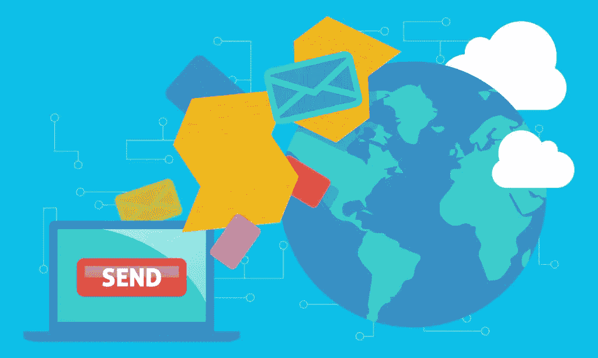
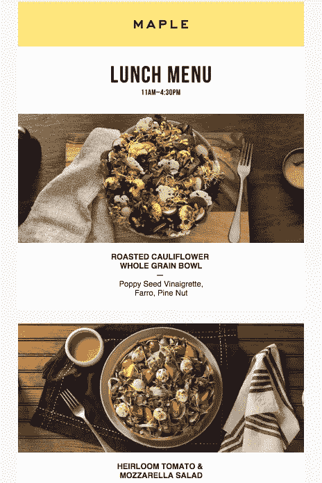
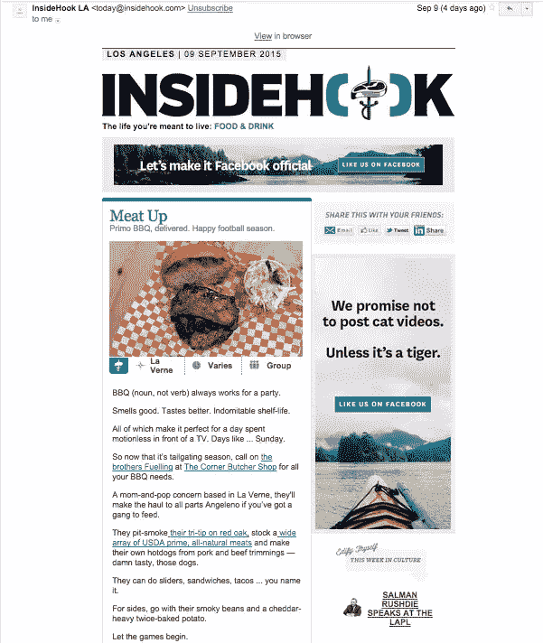
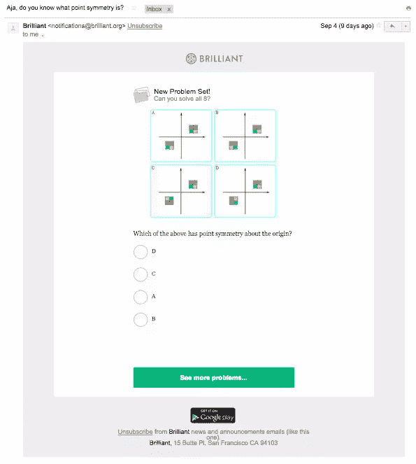
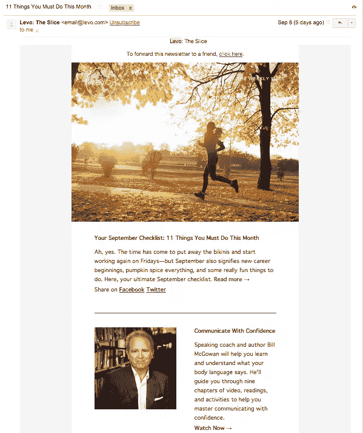
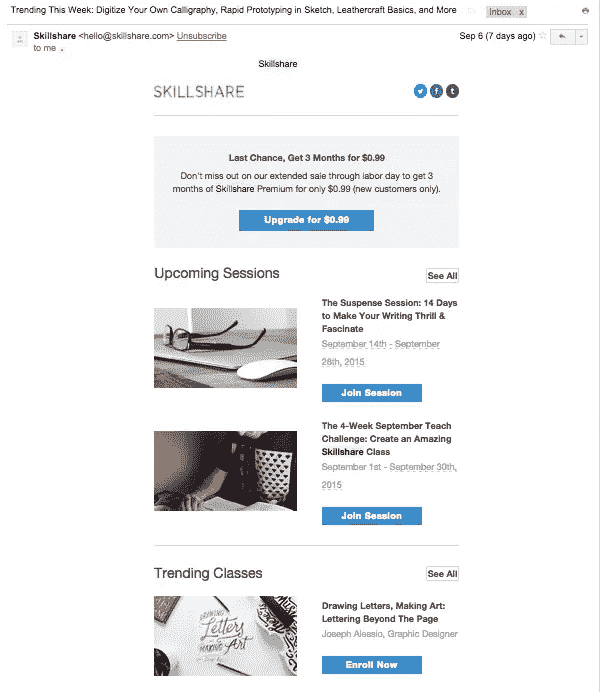

# 5 个你可以借鉴的成功电子邮件简讯

> 原文：<https://www.sitepoint.com/5-successful-email-newsletters-you-can-learn-from/>

由于有了像 [Mailchimp](http://mailchimp.com/) 、[基准电子邮件](http://www.benchmarkemail.com/)和[持续联系](http://www.constantcontact.com/)这样的工具，创办一份时事通讯相当容易。但是创办一份人们真正想读的时事通讯呢？那就难多了。

首先，我们将向您展示五个执行良好的电子邮件简讯示例。然后，我们将深入探讨哪种模式最适合您的特定目标和产品。

## 例子 1:枫树

[Maple](http://maple.com) 是一家美食外卖服务机构。午餐和晚餐的菜单都很小——每份只有三到四道菜——并且每天都在变化。

不是期望人们主动去 Maple 网站，查看选项，下订单，Maple 的时事通讯为他们做了所有的工作。

每天上午 11:15，Maple 都会给顾客发一封电子邮件，标题是:“今天的午餐菜单:[日期]在 Maple。”同样的邮件在下午 5:15 发出——除了它被称为“今天的晚餐菜单:[日期]在枫叶”，现在列出了晚餐选项。

### takealways:

*   **保持一致。**Maple 简讯的发送时间、标题和设计永远不会改变，这意味着客户完全知道会发生什么。
*   让它变得新奇。尽管细节一成不变，但有一样东西确实变了:食物。即使他们不打算点任何东西，人们也会好奇的想知道提供了什么。
*   强调设计。从高质量的照片到易读的文字，阅读这份简讯是一种愉快的体验。

## 示例 2:inside book

InsideHook 是一个“为有冒险精神和有成就的人准备的城市指南”——那么为什么我，一个住在小镇的 20 多岁的大学生，要订阅它的电子邮件呢？简单:这是一份非常棒的时事通讯。

每个每日版本都在幽默(查看 9 月 9 日邮件的标题，“我们有一个重要的尾随公告”)和有用(如何以极快的速度在机场导航)之间取得了完美的平衡)

有趣的是，InsideHook 并不只是链接到自己的文章。时事通讯突出了网络上有趣的、及时的内容。

### takealways:

*   娱乐/教育的分离是取悦你的读者的保证方式(这将提高你的打开率和转发率)。
*   你可以通过提供优秀的内容来吸引目标受众之外的人。
*   如果你想减少你的时事通讯的促销感觉，引入外部资源。

## 例子 3:Brilliant.org

把[Brilliant]([【http://brilliant.org】](http://brilliant.org%5D))想象成数学、科学和工程的维基百科。它的网站值得一试，但它的每日简讯确实非常精彩。

每天晚上 12:30 左右，我都会收到一封精彩的邮件，里面有一个令人困惑的问题。它们是那种你心不在焉地阅读的问题——然后直到你知道答案才能忘记。

要看到解决方案，你必须点击进入辉煌的网站。从那以后，很容易陷入解决问题的狂欢中。

### 外卖:

*   给你的电子邮件订阅者一个点进你网站的理由。
*   让你的时事通讯具有互动性。这个功能将你的读者从被动的参与者转变为主动的参与者。
*   无论是脑筋急转弯还是引人入胜的主题，都要激发用户的好奇心。

## 例 4:爱情联盟

Levo League 发送了大量的新闻简报，包括额外津贴(抽奖和竞赛)、公告、简报(趋势报道的“每日剂量”)、切片(每周版本)、时尚娱乐和必读内容。

所有这些电子邮件背后的基本原理是什么？Levo 清楚地知道它的受众——职业女性——有着不同的兴趣。通过为这些兴趣创建利基通讯，从时尚和新闻到流行文化和免费赠品，该公司可以为其用户提供个性化的内容。

### takealways:

*   如果你的受众有很大的多样性，考虑将其细分，这样你就可以给每个子集发送一份定制的时事通讯。
*   同样，如果你想报道的话题太随意，不适合放在一份时事通讯里，那就取消隔离。
*   利用你的时事通讯，让自己成为你所在领域的权威或值得信赖的声音。

## 示例 5:技能共享

Skillshare 是一个在线学习社区，提供无限制的课程，如[美食摄影:在餐馆拍摄](https://www.skillshare.com/classes/photography/Food-Photography-Shooting-at-Restaurants/107192571?via=homepage)和[HTML 介绍:建立一个作品集网站](https://www.skillshare.com/classes/technology/Introduction-to-HTML-Build-a-Portfolio-Website/1152572263?via=homepage)，每月收费。

每隔几天，该公司就会发送一封电子邮件，宣布即将举行的直播会议和当前的趋势课程。这很聪明:它通过不断地向人们介绍新课程来鼓励他们使用这项服务，同时也给了顾客一个机会去了解其他人有兴趣学习什么。

### takealways:

*   使用你的时事通讯来建立一种社区意识，无论是通过宣布事件、网络研讨会、Twitter 聊天等等。、通过突出显示用户活动或两者。
*   用“趋势”或“当前热点”特征创造一种紧迫感。
*   如果你用你的时事通讯来谈论你的产品，确保这些信息对读者确实有价值。

## 挑选你的模型

现在我们已经介绍了五个范例以及它们成功的原因，是时候选择最适合您自己的新闻稿的模式了。

一个简单的方法来确定最佳的通讯模仿？选择一个离你所在的空间最近的。以下是按公司类别分类的简讯:

*   **枫叶:**产品/配送服务
*   **inside book:**媒体/生活方式
*   **精彩:**教育/娱乐
*   **左旋联盟:**社区/出版

然而，你也应该考虑一下你的新闻稿想要达到的目标。

以下是一些目标示例:

*   提醒您的客户新产品或产品更新
*   与你的客户发展长期关系
*   打造你品牌的声音
*   激励你的客户访问你的网站
*   推动销售
*   鼓励你的顾客使用你的产品

所以，假设你最关注的是第一个目标:每当你推出新东西和/或推动销售时，提醒你的用户。Maple 模式——定期发送“这是我们得到的”电子邮件——是您的最佳选择(尽管您可能希望将频率从一天两次减少到一周一次或一个月一次，这取决于您的产品)。

另一方面，如果你试图与你的用户发展长期关系，建立你的品牌声音，并激励你的用户访问你的网站，你最好选择 InsideHook 或 Levo League 格式。

或者，如果你想鼓励你的客户使用你的产品，像 Brilliant 这样的时事通讯将是一个明智的选择。

如果你不能在两种模式中做出选择呢？使用营销人员最好的朋友，A/B 测试，创建两种简讯格式，看看哪一种能在两周或三周内产生更多的参与度。

你喜欢哪些时事通讯？有你发现的真正有效的模型吗？在推特上让我知道[！](http://twitter.com/ajavuu)

## 分享这篇文章