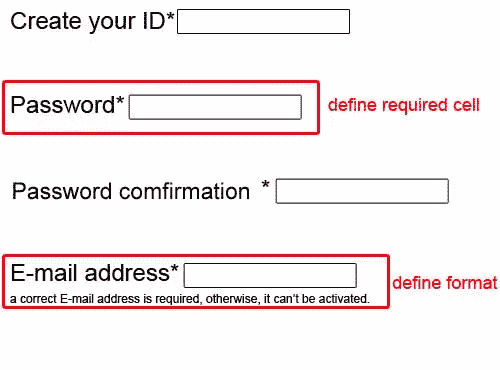

# 我喜欢 HTML5 的 5 点

> 原文：<https://www.sitepoint.com/5-things-i-love-about-html5-2/>

HTML 是网页的主要标记语言。我们可以通过 HTML 来传达网页布局、内容、效果等信息。作为其系列的最新版本，HTML5 正在彻底改变网络。虽然 HTML5 还没有被定为标准，但是它的新特性已经打动了我们的心。

在这篇文章中，我想向你展示我对 HTML5 感到兴奋的五件事，它们肯定也会给你带来全新的网络体验。

## 1.新布局标签


我们可以看到 HTML4 的布局标签在语义上是相同的——`div id=`——所以我们无法区分各部分的内容。然而，HTML5 规范已经添加了相当多的有用的标记来构建您的标记。它将网页的各个部分定义为布局区域，而不需要使用`div`标签。也就是说，你的标题被`<header>`标签包围，你的导航被`<nav>`标签包围。

HTML5 中的这些布局标签是相互独立的。它们更干净、更整洁、更有条理，这使得搜索引擎和统计软件能够识别每个部分。这样定义的内容允许系统和 mashup 网站轻松解析、链接和引用您的文章。

## 2.更好的表单系统



HTML5 带来了巨大的改进，对创建表单的开发人员和填写表单的用户都有好处。例如，表单验证最常见的一个方面是强制必填字段，即在输入某些信息之前阻止表单被提交。这现在可以简单地通过将`required`属性添加到`input`、`select`或`textarea`元素来实现:

```
<input type="text" … required />
```

此外，正如您在上面的图片中所看到的，您可以指定条目的种类，比如您期望从表单字段中得到的电子邮件地址格式，然后浏览器可以检查在特定字段中输入的数据是否与预期的结构匹配。

这样，HTML5 的新`form`类型和元素将有助于证明在线输入的信息是完全准确的，而不需要运行额外的 JavaScript 或 PHP 来检查验证。它将加快加载时间，改善用户体验，并使 web 表单更容易编写，在整个 Web 上更加一致。

## 3.音频和视频 API


HTML5 通过`<audio>`和`<video>`元素引入了内置的媒体支持，并创造了一种在没有任何插件的浏览器中显示视频的新方式。它提供了一组功能 API 来控制媒体显示。例如，`<video>`标签有许多有用的属性，包括自动播放控件，一个指向视频加载前显示的图像文件的`poster`属性，以及一个播放/暂停控件的布尔属性。那些控制媒体显示的元素是可编辑的。

因此，HTML5 显然为我们带来了更好的视频和音频体验，允许我们播放视频或音频，并通过鼠标和键盘事件设置复杂的用户交互。

## 4.画布 API


在网页中画图一直是个问题。以前，我们不得不向 Flash、Silverlight 等插件寻求帮助。不过，在这个[闪到 HTML5](http://www.flash-to-html5.net/?utm_source=html5cssconverters&utm_medium=article&utm_campaign=1216) 的时代，问题解决了。HTML5 `canvas`标签使用 JavaScript 在网页上绘制图形。

`canvas`元素有几种绘制路径、框、圆、字符和添加图像的方法。它由一个用 HTML 代码定义的可绘制区域组成，具有`height`和`width`属性。然后，JavaScript 代码可以通过类似于其他常见 2D API 的全套绘图功能来访问该区域。

因此，HTML5 `canvas`允许动态生成图形、在网页上绘图和交互，比如放大/缩小。`canvas`的一些预期用途包括构建图表、动画、游戏和图像合成。上面的截图是一个 HTML5 `canvas`游戏。

## 5.地理定位 API


要检测过去客户端设备的位置，通常需要检查客户端 IP 地址。但是基于 IP 来检测用户的位置可能是无效的。所以现在，HTML5 提供了一个地理信息的地理定位 API，当用户通过 GPS 访问一个网站时，它可以识别用户的位置。由于现在许多现代手机都配备了 GPS 功能，从这些设备中获取位置信息变得更加容易。地理定位 API 为地理定位接口提供了函数`getCurrentPosition()`，该函数将经纬度返回给函数调用方(网站)。函数签名是:

```
void getCurrentPosition(in PositionCallback successCallback);
```

在这种情况下，知道用户从哪里访问特定的网站，并根据位置定制网站内容，将对用户的行为产生很大的影响。例如，假设你正在网上搜索一些你打算购买的产品的评论。如果评论网站和搜索引擎可以获得你的位置信息，并在后台做一些处理，他们可以显示与该产品相关的广告。那一定会诱导你点击那些广告，购买那些产品。

## 结论

除了我上面提到的五个方面，HTML5 还有很多其他很棒的新特性。我希望越来越多的人会发现它们有用，并在未来充分利用 HTML5。

## 分享这篇文章