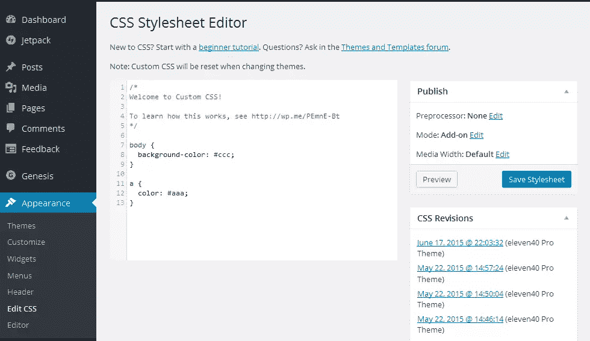
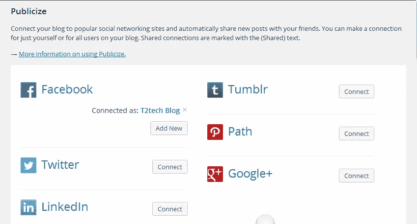
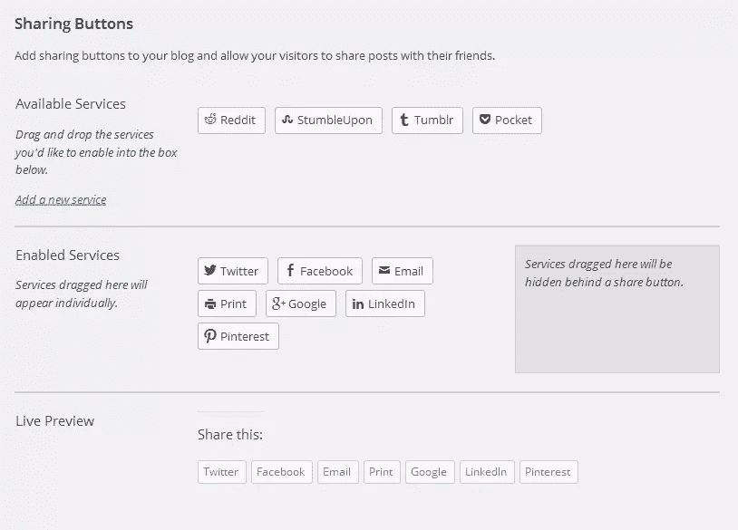

# 关于 WordPress 的 Jetpack，你可能不知道的 5 件事

> 原文：<https://www.sitepoint.com/5-things-you-may-not-know-about-jetpack-for-wordpress/>

Jetpack 是一个受欢迎的 WordPress 插件，由 WordPress 背后的人 Automattic 创建。这个插件为自托管的 WordPress 站点带来了许多 WordPress.com 上最强大的功能，从而极大地促进了 WordPress 博客和网站的改进。

在这篇文章中，我将分享你可能不知道的 Jetpack 插件的五大特性，包括如何在你的 WordPress 站点上启用、配置和使用它们。

## 自定义 CSS

编辑 WordPress 主题的核心 CSS 文件很少是修改或定制 WordPress 主题的最佳方法。可能会出现损坏主题的错误，如果主题被更新，自定义可能会丢失。

有了 Jetpack 定制 CSS 特性，编辑、修改和定制就可以完成，而不用动一根手指就能接触到主题的核心 CSS 文件。如果犯了错误，很容易改正。修改可以更快地完成，将 CSS 恢复到默认也不成问题！

### 自定义 CSS 功能的工作原理

默认情况下，激活 Jetpack 时，自定义 CSS 模块会自动激活，并且可以在管理中的*仪表板→外观→编辑 CSS* 下找到。



在这里，您可以使用标准的 CSS 语法来指定选择器和属性，以创建您的自定义样式。例如，如果您希望更改所有页面的正文背景颜色，或者所有链接的颜色，您可以在样式编辑器中输入下面的 CSS 代码，然后单击**保存样式表**。

```
body {
         background-color: #ccc;}
a {
         color: #aaa;}
```

这些修订位于桌面视图中 CSS 编辑器的旁边。每个修订都标有修订日期。打开修订版时，红色高亮显示指定已删除的内容，绿色高亮显示指定已添加的内容。


要恢复自定义 CSS 的先前版本，请单击**恢复该日期的修订版**，自定义 CSS 将恢复原状。以防万一你需要手动激活模块:*仪表盘→ Jetpack →自定义 CSS* 并激活。

## 宣传

你觉得社交媒体分享是个挑战还是太费时间了？使用 Jetpack，您可以在六个流行的平台上即时共享您的更新。

连接到您要广播的各种社交网络后，Publicize 模块会自动在您选择的网络上分享您的帖子。

### 如何配置宣传功能

激活功能*Dashboard→Jetpack→Settings→public*并激活后，您可以通过导航到共享设置页面*Dashboard→Settings→Sharing*来配置该功能，并将您的博客连接到您喜欢的社交网络。



## 相关职位

WordPress 有许多相关的帖子插件，其中许多运行良好，但是如果你想要一个可以执行精确计算的插件来确定一个帖子是否相关，而不会使你的数据库陷入困境或增加服务器的额外负载，或者你对降低你博客上的[跳出率](https://support.google.com/analytics/answer/1009409?hl=en)感兴趣，那么你应该考虑激活 Jetpack 相关帖子模块。

“相关职位”模块在得出职位相关的结论之前，会进行所有必要的计算和分析。所有的过程都在 WordPress.com 服务器上进行，所以你的服务器没有额外的负载。

### 激活相关员额模块

您可以通过访问管理员并选择*Dashboard→Jetpack→Settings→Related Posts*并激活来激活该模块。激活后，模块从那里开始，并在每个发布的帖子下面显示相关的帖子。

## 共享

在发布好的内容后，给读者一个机会，让他们分享你的内容，让你有更多的曝光率，这是一个好主意。

共享模块使这变得简单。只需点击一下，就可以在不同的社交网络上分享内容。

### 共享功能的工作原理

共享功能的设置页面可在*仪表盘→设置→共享*中找到。在写作的时候，有十一个分享按钮你可以拖放到你想要的位置。



您可以选择按钮的显示方式:纯文本形式或图标形式。按钮也可以显示在内容之前或之后，这取决于您的偏好。

## 光子

根据 Jetpack 插件功能的官方文档:*“Photon 是一个图片加速和编辑服务，用于托管在 WordPress 或与 Jetpack 连接的 WordPress 网站上的网站。这意味着您的主机负载更少，读者的图像速度更快。”*

这一特性非常有益。我见过一些网站，在这些网站上，你甚至可以在图片加载完毕之前阅读整篇博文。这就是 Jetpack 的光子特性派上用场的地方。

### 光子功能的工作原理

该功能通过 WordPress.com CDN 加载您帖子的图片。它减轻了你的服务器的额外负荷，并且通过 WordPress.com 服务器来完成。

你可以通过访问你的 WordPress admin，*Dashboard→Jetpack→Settings→Photon*来激活这个功能，然后激活。你也应该看看 Jacco Blankenspoor 的[这篇文章，了解更多关于 cdn 的信息，以及为什么你应该考虑为你的 WordPress 站点建立一个 cdn。](https://www.sitepoint.com/5-reasons-why-you-should-be-using-a-cdn-with-wordpress/)

## 结论

我只给了你一点 Jetpack 可以为你的网站做什么的味道，在我写这篇文章的时候，有超过 30 个像上面突出显示的插件一样的伟大功能，只有 VideoPress 和 VaultPress 模块是高级(付费)功能。

一旦你安装了它，我相信你会同意我的观点，Jetpack 是一个功能丰富的插件，可以节省你很多时间。你可以点击访问[官方 Jetpack 插件页面。](http://jetpack.me/)

## 分享这篇文章