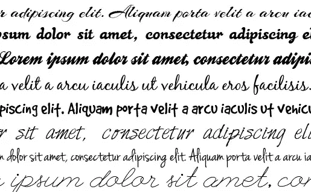
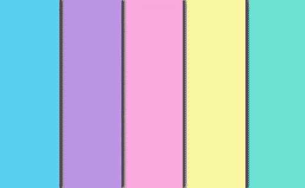
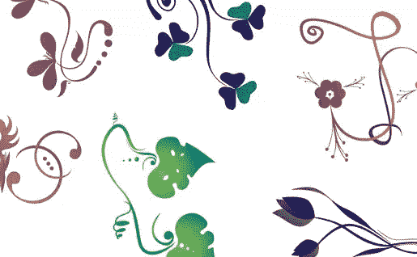
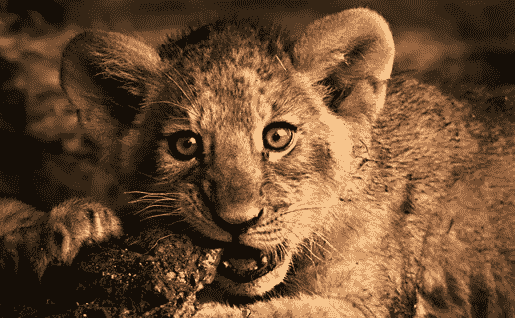
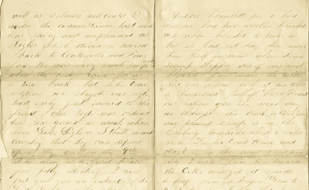

# 女性设计的 5 个技巧

> 原文：<https://www.sitepoint.com/5-tips-for-feminine-designs/>

成功的商业设计的关键之一是理解你的观众。如果你发现自己从事的设计目标受众主要是女性，你可能需要一些如何让它更“女性化”的想法在商业设计中，你的概念应该吸引观众的眼球，加强信息的传递。对于女性观众来说，女性化的设计更有吸引力，更有效，也更适合这个目的。

那么，是什么让设计变得女性化呢？真的能设计出自然吸引女性眼球的东西吗？运用正确的基本原则，任何人——甚至那些更有男子气概的人——都可以成功地为女性观众设计。

请记住，不同文化和不同年龄组的偏好是不同的。例如，我们倾向于将亮粉色和紫色与非常年轻的女性联系在一起，而深红色和紫色通常是为成年女性选择的。与任何设计一样，确保你清楚地了解你的受众，并在整个设计过程中牢记这些特定的受众。

* * *

### 使用脚本或手写排版

脚本或手写字体可以为任何设计增添女性气质。当然，小心使用这些字体。不是每个设计元素都应该用脚本来装饰。相反，把重点放在标题上，让正文用易读的字体——通常是简单的衬线或无衬线字体。此外，请记住，您选择的字体可能无法立即在 web 上使用。

这里有几个可供下载的字体供您使用。我在上图中使用了这些:

*   [亚利桑那州](http://www.fontsquirrel.com/fonts/arizonia)
*   [黑玫瑰](http://www.fontsquirrel.com/fonts/Black-Rose)
*   [大概](http://www.fontsquirrel.com/fonts/Ballpark)
*   [二十一点](http://www.fontsquirrel.com/fonts/BlackJack)
*   好狗狗
*   [原原手](http://www.fontsquirrel.com/fonts/HarabaraHand)
*   [珍娜起诉](http://www.fontsquirrel.com/fonts/jenna-sue)
*   [联赛脚本](http://www.theleagueofmoveabletype.com/league-script-number-one)

对于那些想要一些网络字体的人，我倾向于坚持使用[谷歌网络字体](http://www.google.com/webfonts):

*   [胭脂剧本](http://www.google.com/webfonts/specimen/Rouge+Script)
*   圣德拉菲尔德夫人
*   [棒棒糖](http://www.google.com/webfonts/specimen/Bonbon)
*   [亚历克斯刷](http://www.google.com/webfonts/specimen/Alex+Brush)
*   新一天的到来

* * *

### 选择多样、明亮的颜色

在引言中，我提到了女性设计的色彩概念。这些概念是基于对色彩吸引力的大量研究。虽然这些研究的结果各不相同，但它们有几个共同的结论:首先，棕色和灰色等中性色调不适合女性设计。第二，两性都喜欢各种深浅的蓝色。第三，绿色食品往往更受女性青睐。关于颜色分解的精彩讨论，请看 Entrepreneur.com 的这篇文章，约翰·威廉姆斯在文章中讨论了不同的颜色对一个品牌意味着什么。威廉姆斯的色彩联想应该会对你的女性设计项目产生影响。

一些关于颜色的简单建议:限制你的调色板，坚持明亮的颜色，保持高对比度(为了可读性)，使用柔和的色调，因为它们通常与更女性化的概念相关联。粉彩往往是一个很好的起点；它们内置在 Photoshop 的色板中(“窗口”->“色板”，然后在弹出菜单中选择“彩色涂层”或“无涂层”)。上面的配色方案来自粉彩无涂层样本集。

* * *

### 包括花卉视觉元素

花卉图案与大自然有着深刻的联系，这是所有文化中一个著名的女性观念。一个简单的方法就是将柔和的碎花和卷发元素融入到你的设计中。花卉 Photoshop 和 Illustrator 笔刷可以轻松快速地整合这些元素。

上面的设计是用粉色小胡子的花矢量集制作的:[花矢量](http://www.pinkmoustache.net/free-vectors-floral-design-elements/)。

* * *

### 库存摄影

我说我们女孩子喜欢小动物是不是太老套了？肯定不止我一个人有可靠的“温暖模糊”反应。如果你能把任何类型的婴儿融入到你为妈妈或奶奶类女性设计的产品中，你几乎肯定应该这么做。

然而，对于商界的单身女性来说，婴儿的吸引力可能会减弱。其他成功职业女性的照片更有可能吸引这个群体。对于职业女性来说，无论是在工作场所还是在工作环境之外，找一些照片，展示女性在工作场所负责，或者有一个(或两个或三个)帅哥奉承她们。

无论你的照片包含什么主题，试着在主题看向相机的地方找到图形。这尤其为女性创造了一种引人入胜的体验。女性观众更容易与照片中的主体产生近乎情感的联系，而这种联系往往会转移到主持广告的品牌身上。

* * *

### 使用个人写作风格

你设计上的文案可能是联系女性观众最重要的元素。你的图形可能会吸引注意力，但如果你的语气冷淡或不连贯，你的听众会很快与你的设计脱节。

友好、随意的语气很重要。有两种方法可以快速改变你文章的语气，那就是使用缩写，避免使用大而复杂的单词或短语。我喜欢用插入语来插入我的想法(因为这给了你一个想说什么就说什么的借口)。这里有一个例子:

更正式的说法是:“男性通常会被与女性相关的复杂细微差别搞糊涂。”

不那么正式:“男生就是不了解女生(我更喜欢保持这种方式)。”

* * *

### 最重要的是…

我们女生不喜欢被关在盒子里。我们是复杂的生物，非常独特(或者至少我们喜欢这样认为自己)，所以不要用一个我们可以说是由一个不理解我们的人创造的设计来侮辱我们。如上所述，永远要研究你的受众的人口统计数据。而且，特别是如果你是一个男人，让几个女人评论一下设计并给你她们的意见。如果你做了调查，并在把调查结果发给你的客户或分发之前得到一些反馈，你就更有可能满足你的女性观众的兴趣。

你是如何为女性观众设计的？你对这个概念有什么直接的视觉暗示？

## 分享这篇文章