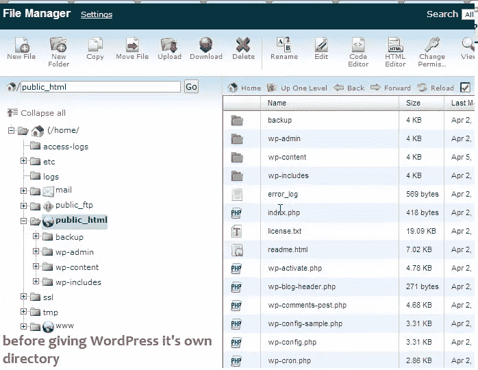
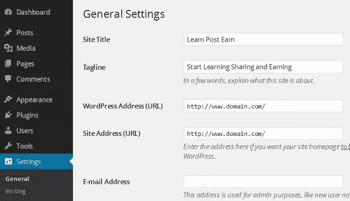
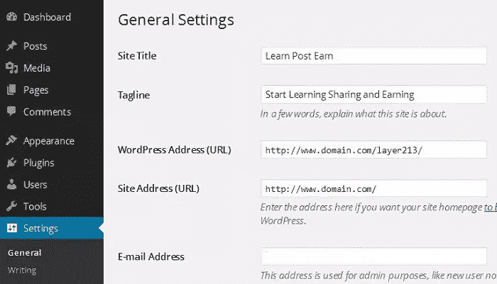
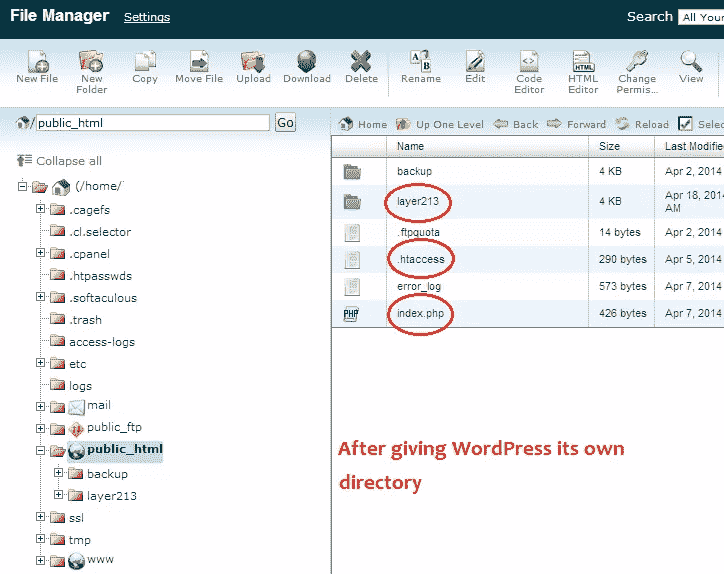

# 给 WordPress 超级用户的 5 个建议

> 原文：<https://www.sitepoint.com/5-tips-for-wordpress-power-users/>

WordPress 不仅让用户能够创建功能强大的网站，还允许用户进行定制，以增加额外的安全性，简化部署和协助管理。

安装 WordPress 非常简单容易，即使是对网络有基础知识的初学者也能做到。在这篇文章中，我们超越了基础，讨论了 WordPress 超级用户的 5 个建议:

1.  wp-config 可以驻留在根目录之外
2.  WordPress 可以通过命令行使用 WP-CLI 安装
3.  您可以为登录和访问仪表板启用 SSL
4.  您可以轻松启用双因素身份验证
5.  WordPress 可以安装在一个子目录中(并且仍然从 web 根目录运行它)

## 1.wp-config 可以驻留在根目录之外

wp-config 是主要的 WordPress 配置文件。它包含您的数据库名称、数据库用户和密码、唯一的认证密钥、表前缀和其他重要信息。

为了增加额外的安全层，你可以将`wp-config.php`移到 WordPress 安装目录之外。这意味着对于一个安装在你的虚拟主机空间根目录下的网站(例如,`public_html`目录),你可以将`wp-config.php`保存在根目录下。

你也可以在`public_html`之外创建一个新的目录，或者你可以将`wp-config.php`保存在一个现有的目录中，WordPress 就可以工作了。

## 2.WordPress 可以通过命令行使用 WP-CLI 安装

WP-CLI 代表 WordPress 命令行界面。WP-CLI 是一套用于管理 WordPress 安装的命令行工具，它非常强大。你可以很容易地执行一些普通的任务，比如更新 WordPress、生成备份、更新插件和设置 WordPress 多站点等等。

WP-CLI 项目网站有关于如何安装和使用 WordPress 命令行界面的所有细节。如果您使用 DreamHost，WP-CLI 会安装在他们的所有服务器上。更多信息，你可以访问 [DreamHost Wiki](http://wiki.dreamhost.com/WordPress_wp-cli) 。

## 3.您可以为登录和访问仪表板启用 SSL

通常，我们大多数人登录我们的 WordPress 站点时没有启用 SSL，但是 WordPress 允许你强制 SSL 登录和访问管理仪表板。

要实现这一点，您只需将以下内容添加到您的`wp-config.php`:

```
define('FORCE_SSL_ADMIN', true);
define('FORCE_SSL_LOGIN', true);
/ That's all, stop editing! Happy blogging. / 
```

您还需要为您的域设置 SSL 证书。SSL 证书每年将花费你大约 10 到 50 美元以上。WordPress[Administration Over SSL](http://codex.wordpress.org/Administration_Over_SSL)Codex 页面为那些想了解更多的人提供了所有的细节。

## 4.您可以轻松启用双因素身份验证

虽然这不是 WordPress 的原生特性，需要一个插件，但我们认为它与本文中涉及的一些其他技巧相关，值得一提。

双因素(或两步)身份验证是需要两条信息才能登录的过程，而不仅仅是密码。通常它是一个硬件令牌，比如一个 yubi key T1，或者一个服务，比如 T2 谷歌认证器 T3 或者 T4 Duo T5。

一些不同的安全插件也提供双因素认证。

## 5.WordPress 可以安装在子目录中

你知道 WordPress 也允许你定制你的安装目录吗？通常情况下，你会把 WordPress 安装在根目录下(例如`public_html`)，但是 WordPress 也允许你把它安装在子目录下`http://domain.com/wphere`，你的网站地址(URL)将保持不变`http://domain.com/`。

这是 WordPress 安装在根目录下的截图。



您的登录 URL 应该如下所示:

`http://www.domain.com/wp-admin/`

如果你将 WordPress 安装在它自己的目录中，假设你已经将你的目录命名为 *layer213* 你的登录 URL 将会是这样的:

`http://www.domain.com/layer213/wp-admin/`

你可以给 WordPress 文件所在的目录起一个你喜欢的名字。在我的例子中，你可以看到我把它命名为*层 213* 。

这样做的一个原因是将那些使你的网络根目录混乱的文件和目录转移到其他地方。您的网站仍然会显示为安装在 web 根目录中，您的 URL 仍然会正常工作。

因此，在我们的例子中，你的 WordPress 目录结构应该是这样的:

`http://www.domain.com/layer213/wp-admin/`

您的网站地址将保留在:

`http://www.domain.com/`

这意味着用户仍然会访问:

`http://www.domain.com/`

要查看您的站点仪表板，您可以访问:

`http://www.domain.com/layer213/wp-admin/`

这可能看起来很奇怪，但是这是一个完全支持的配置，在 [WordPress Codex](http://codex.wordpress.org/Giving_WordPress_Its_Own_Directory) 中有更详细的介绍。

### 如何在仪表板中更改 WordPress)

*请注意:只有当您可以通过 FTP/SFTP 访问您的服务器，并且能够轻松复制和移动文件时，您才应该尝试这样做。*

让我们来看一下将 WordPress 安装在它自己的目录中所需的步骤，或者如果你已经将它安装在一个子目录中，你如何改变这些设置。

登录你的 WordPress 仪表盘，进入**设置**和**常规**。下面是移动 WordPress 文件之前 WordPress Dashboard 的截图。



现在用你的目录名改变**WordPress(URL)**，无论你想给你的目录起什么名字。在我的例子中，我给了它*层 213* 。**网站地址(网址)**将保持不变。下面是更改**WordPress(URL)**后的截图。



现在点击**保存更改**。不要担心，如果你看到任何错误或你的网站没有任何风格。这是正常的，我们还没有将文件移动到新的位置。

### 移动 WordPress 文件

现在登录您的虚拟主机控制面板(cPanel 或 Plesk 等)或通过 FTP/SFTP 连接。转到文件管理器，创建一个新目录。将其命名为 *layer213* (把它改成你喜欢的任何名字)，这个名字必须和你在 WordPress 仪表盘中输入的名字相同。

选择所有的 WordPress 文件，除了你创建的新目录。在我的例子中，它是 *layer213* 并将所有文件移动到这个新目录。

复制(**不许动！**)index.php 和。htaccess 文件从新的 WordPress 目录到你的站点的根目录(例如 public_html)。

将`index.php`下载到您的本地计算机，并在文本编辑器中打开它。找到下面一行:

`require( dirname( __FILE__ ) . '/wp-blog-header.php' );`

使用 WordPress 核心文件的目录名，将其更改为以下内容:

`require( dirname( __FILE__ ) . '/layer213/wp-blog-header.php' );`

保存更改并上传到您的 web 服务器的根目录(如 pubic _ html)。

### 在哪里。htaccess？

当你打开 cPanel 并点击文件管理器时，选中“显示隐藏文件”复选框。隐藏文件如。htaccess 将在您的文件管理器中可见。

*如果你在 Windows IIS 服务器上运行 WordPress 并启用了永久链接，你将使用`web.config`而不是`.htaccess`。*

### 登录您的仪表板

现在输入`http://www.domain.com/layer213/wp-admin/`登录你的 WordPress 仪表盘，如果你已经设置了永久链接结构，更新它。如果出于任何原因，WordPress 未能更新永久链接结构，它将显示新的重写规则。将这些新规则手动复制并粘贴到位于根目录的`.htaccess`文件中。

### 如果您已经安装了子目录

如果你已经在一个子目录中安装了 WordPress，你将不得不复制`index.php`和`.htaccess`文件到你的根目录。

在移动这些文件之前，登录你的 WordPress 仪表盘，进入**设置**，然后进入**常规**标签。

将**网站地址(URL)** 改为你的根目录。例如，如果 URL 是`http://domain.com/layer213`，那么将其更改为`http://domain.com`并且**保存更改**。

如果您看到任何错误，请不要担心，这是意料之中的。

更改网站地址(URL)后，现在将**(不要移动)** `index.php`和`.htaccess`从`layer213`(在我上面的例子中)复制到你的网站的根目录(例如`public_html`)。

现在在任何文本编辑器中打开您的`index.php`,并更改以下行:

`require( dirname( __FILE__ ) . '/wp-blog-header.php' );`

到下面的代码:

`require( dirname( __FILE__ ) . '/layer213/wp-blog-header.php' );`

将`layer213`更改为您的目录名。保存更改，然后将文件上传到根目录。您的登录地址将保持不变。

给 WordPress 它自己的目录后可以看到下面的截图。



## 建议

请记住，当执行上述一些步骤时，您的网站将无法正常运行。如果你有很多访问者，你可能想启用维护模式。你可以安装一个免费的[维护模式](https://wordpress.org/plugins/wp-maintenance-mode/)插件，点击几下就可以启用维护模式。

## 分享这篇文章