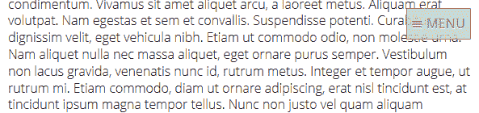

# 垂直媒体查询的 5 种用途

> 原文：<https://www.sitepoint.com/5-uses-vertical-media-queries/>

媒体查询是响应式网页设计背后的核心技术，然而，尽管有太多的选择，我们很少有人敢冒险超越`min-width`(可能还有`max-width`)，即

```
/* mobile-first layout */
.column {
	width: 100%;
}

/* tablet layout */
@media (min-width: 50em) {
	.column {
		float: left;
		width: 50%;
	}
}

/* desktop layout */
@media (min-width: 75em) {
	.column {
		width: 33.33%;
	}
}
```

一般情况下，需要几个其他介质查询属性:

*   `width`、`height`和`device`声明有点过于苛刻
*   `resolution`可用于高密度视网膜屏幕，但新的 HTML5 `picture`元素和`srcset`属性更适合图像内容
*   `color`和`monochrome`属性可能只在针对电子阅读器时有用
*   `aural`、`braille`、`handheld`、`projection`、`tv`、`scan`、`grid`等。有具体的设备使用案例
*   `aspect-ratio`和`orientation`可能仅在屏幕超出标准 4.3 和 16.9 范围时需要

[在 MDN 上查看媒体查询参考。](https://developer.mozilla.org/en-US/docs/Web/Guide/CSS/Media_queries)

然而，我们是否应该对`min-height`和`max-height`属性表现出更多的爱呢？如果我们只考虑`min-width`和/或`max-width`，我们可能会让那些使用较小设备的人的生活更加困难。垂直媒体查询在几种情况下会很有用…

## 1.管理固定元素

你的汉堡图标在屏幕上方有自己固定的导航栏吗？也许只有 50 像素，但这可能是较小设备或横向设备屏幕的 10%。用户将需要更多的滚动，并发现使用起来更加困难。因此，只有当高度变得可行时，才考虑固定横杆，例如

```
/* static nav bar */
nav {
	width: 100%;
	height: 50px;
	color: #fff;
	background-color: #333;
}

/* fixed nav bar */
@media (min-height: 800px) {
	body {
		padding-top: 75px;
	}

	nav {
		position: fixed;
		top: 0;
		left: 0;
	}
}
```

不可否认，这意味着用户必须滚回页面顶部才能访问导航。对于较长的页面，可以考虑在较小的屏幕上使用不太显眼的固定元素，例如



## 2.管理“折叠”

是的，[折死了](/quiet-death-the-fold/)。文件夹与开发人员和设计人员无关；没有标准的屏幕尺寸、分辨率、浏览器边框或窗口高度。不幸的是，它不一定与个人用户无关。

考虑一个包含高度为 600 像素的旋转木马的网页标题。任何使用相似浏览器尺寸访问该页面的人可能都没有意识到下面有内容——看起来好像该页面已经整齐地结束了。他们可能会错过重要的行动号召或进一步的信息。

很难保证折叠不会影响到每个人，但有选择。在本例中，500 像素以下的屏幕将显示一个全高 600 像素的传送带。裁剪后的元素应该让更多的内容显而易见。在 500 像素和 800 像素之间，轮播缩小到 400 像素，这样用户可以看到下面的更多内容。在 800 像素时，传送带返回到 600 像素，但是仍然可以看到额外的内容。

```
.carousel {
	width: 100%;
	height: 600px;
}

@media (min-height: 500px) {
	.carousel { height: 400px; }
}

@media (min-height: 800px) {
	.carousel { height: 600px; }
}
```

这种技术不太可能在所有情况下都有效，但至少，你可以使用垂直媒体查询来确保行动号召按钮总是出现在屏幕上，而不必滚动。

## 3.调整字体大小和粗细

较小的字体可以用在较小的屏幕上。这不会降低可读性，因为设备通常比显示器握得更近。

即使你选择不改变正文，那些 24px 的大标题也几乎可以缩小。这将减少所需的滚动，并且当用户以横向持有他们的设备时特别有用。

## 4.调整行高和边距

同样，在较小的屏幕上，文本间距可以更小。例如:

```
h1 {
	font-size: 1.25rem;
	font-weight: normal;
	line-height: 1.2;
	margin: 1em 0 0 0;
}

p {
	font-size: 0.75rem;
	line-height: 1.2;
	margin: 0 0 1em 0;
}

@media (min-height: 50em) {

	h1 {
		font-size: 2rem;
		font-weight: bold;
		margin: 1.5em 0 0.5em 0;
	}

	p {
		font-size: 1rem;
		line-height: 1.5;
	}

}
```

## 5.调整内容可见性

在较小高度的屏幕上，你可以考虑让内容“可选”。也许你可以[为某些部分或问题/答案块实现一个手风琴](/css3-vertical-accordion-using-target-selector/)。在更大的高度，所有的内容都变得可见，而不必先点击标题。

也就是说，要警惕完全隐藏内容。如果一个小工具或功能对使用较小设备的人没有用，为什么有必要在较大的屏幕上显示它？

虽然`min-height`和`max-height`永远不会像`min-width`和`max-width`一样被广泛使用，但它们提供了许多设计机会，我们才刚刚开始利用这些机会。

## 分享这篇文章