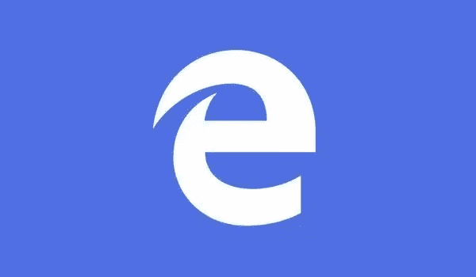

# 让你的网站在现代网络(和边缘)上摇滚起来的 5 种方法

> 原文：<https://www.sitepoint.com/5-ways-make-site-rock-modern-web/>

本文是微软网站开发系列的一部分。感谢您对使 SitePoint 成为可能的合作伙伴的支持。



[Edge](http://blogs.windows.com/bloggingwindows/2015/07/21/do-unexpected-things-with-microsoft-edge/?WT.mc_id=13420-DEV-sitepoint-article44) 是微软的新网络浏览器，配备了新的渲染引擎—[Edge html](http://blogs.windows.com/msedgedev/2015/02/26/a-break-from-the-past-the-birth-of-microsofts-new-web-rendering-engine/?WT.mc_id=13420-DEV-sitepoint-article44)——以及 Windows 10 的底层操作系统。由于从 Windows 7、8 和 8.1 的升级对大多数人来说都是免费的，你可以预计在未来几个月会有大量边缘用户涌入网站。Edge 是一个[对过去](http://blogs.windows.com/msedgedev/2015/02/26/a-break-from-the-past-the-birth-of-microsofts-new-web-rendering-engine/?WT.mc_id=13420-DEV-sitepoint-article44)的背离，实际上是完成了对过去版本的 ie 浏览器的改写，我相信许多网络开发者会对此表示欢迎。考虑到这一点，我想分享五种方法，你可以用它们来为现代网络互操作性和并行的微软 Edge 测试做准备:

## 更新您的 JavaScript 库

当新的浏览器版本发布时，像 jQuery 这样的公共库经常被更新以解决 bug。通过简单地更新您的 JS 框架，您可以避免许多与 Edge 的兼容性错误。在我们的内部研究中，我们发现前 20，000 个网站中有 57%使用的 JavaScript 框架的问题已经在同一库的新版本中得到修复。您可以使用[站点扫描器](http://dev.modern.ie/tools/staticscan/?utm_source=SitePoint&utm_medium=article44&utm_campaign=SitePoint)来确定您的站点上是否使用了过期的 JavaScript 框架。

## 避免 CSS 前缀

CSS 前缀在被 W3C 完全认可之前，被浏览器厂商用来实现新的、正在出现的 CSS 特性。如果供应商实现了 CSS 前缀，它将类似于下面的示例(这是一个特定于 IE 的“连字符”功能的实现，用于对多行文本进行连字符连接):

```
-ms-hyphens: auto;
```

对于站点来说，缺少特定于供应商的前缀，或者实现了特定于供应商的前缀，而这些前缀在公共 CSS 属性中并不需要，这种情况非常普遍。这可能会导致网页在 Microsoft Edge 或其他现代浏览器中呈现不正确。

由于相关的管理问题，浏览器厂商现在很少使用前缀。包括微软 Edge 在内的一些浏览器很少使用前缀。

尽可能避免使用特定于供应商的前缀。然而，如果你一定要使用厂商前缀，使用 [Grunt PostCSS](https://github.com/nDmitry/grunt-postcss) 来自动管理 CSS 中的前缀。

## 避免浏览器检测

一些网页使用浏览器检测技术来确定网页应该如何在许多不同版本的浏览器上呈现。我们建议使用特征检测；首先确定浏览器或设备是否支持特定功能，然后根据此信息选择最佳体验进行呈现的做法。

功能检测是浏览器检测的一个很好的替代方案，通常通过流行的 JavaScript 库使用，如 [Modernizr](http://modernizr.com/) ，或者通过功能检测代码。特征检测通常与聚合填充一起使用，以在不支持现代特征的旧浏览器中实现这些特征。

有关如何使用 Modernizr、Polyfills 和其他兼容性技术的更多详细信息，请参见 [Martin Kearn 关于“调整、现代化和优化您的网站”的文章](http://blogs.msdn.com/b/martinkearn/archive/2015/01/29/tune-modernise-and-optimise-your-website.aspx/?WT.mc_id=13420-DEV-sitepoint-article44)。

## 变得无插件

Edge 不支持插件，所以现在是考虑如何远离 Flash 和 Silverlight 等专有插件的好时机。Edge 确实支持 Flash，但 Flash 不是使用插件架构，而是与浏览器一起提供，并由 Edge 团队与 Adobe 合作进行集中更新和修补。对于一些网站来说，摆脱插件是非常直接的。然而，许多网站会发现这很困难，尤其是那些提供媒体内容的网站。Edge 团队在 [Edge 博客](http://blogs.windows.com/msedgedev/2015/07/02/moving-to-html5-premium-media/?WT.mc_id=13420-DEV-sitepoint-article44)上提供了关于如何将优质内容转移到 HTML 的指导。

## 确保边缘渲染模式

如果指令缺失或未指定基于标准的文档类型，Edge 可能会错误地显示您的页面。[扫描器](http://dev.modern.ie/tools/staticscan/?utm_source=SitePoint&utm_medium=article44&utm_campaign=SitePoint)运行一个简单的测试来确定你的站点设置是否正确，所以输入你的站点 URL，如果通过就很快知道。如果你想看看实际测试是什么样的，你可以在 GitHub 上查看扫描仪[的代码。](https://github.com/MicrosoftEdge/static-code-scan/blob/master/lib/checks/check-doctype.js)

### 资源

*   [宣布 Windows 10 中 F12 开发者工具的最新改进](http://blogs.windows.com/msedgedev/2015/07/21/announcing-the-latest-improvements-for-the-f12-developer-tools-in-windows-10/?WT.mc_id=13420-DEV-sitepoint-article44)
*   [关于我们新浏览器 Microsoft Edge 的技术会议](http://www.microsoft.com/en-gb/developers/articles/week02may15/technical-sessions-on-our-new-browser-microsoft-edge/?WT.mc_id=13420-DEV-sitepoint-article44)
*   [来自 Build 2015 的 Web 开发讲座](http://www.microsoft.com/en-gb/developers/articles/week01may15/web-development-talks-from-build-2015/?WT.mc_id=13420-DEV-sitepoint-article44)

## JavaScript 的更多实践

这篇文章是微软技术倡导者的 web 开发系列的一部分，内容涉及实用的 JavaScript 学习、开源项目和互操作性最佳实践，包括[微软 Edge](http://blogs.windows.com/msedgedev/2015/05/06/a-break-from-the-past-part-2-saying-goodbye-to-activex-vbscript-attachevent/?WT.mc_id=13420-DEV-sitepoint-article44) 浏览器和新的 [EdgeHTML 渲染引擎](http://blogs.windows.com/msedgedev/2015/02/26/a-break-from-the-past-the-birth-of-microsofts-new-web-rendering-engine/?WT.mc_id=13420-DEV-sitepoint-article44)。

我们鼓励您使用 [dev.modern.IE](http://dev.modern.ie/tools/?utm_source=SitePoint&utm_medium=article44&utm_campaign=SitePoint) 上的免费工具跨浏览器和设备进行测试，包括 Windows 10 的默认浏览器 Microsoft Edge:

*   [扫描你的网站，寻找过时的库、布局问题和可访问性](http://dev.modern.ie/tools/staticscan/?utm_source=SitePoint&utm_medium=article44&utm_campaign=SitePoint)
*   [在 Mac、Linux 和 Windows 上使用虚拟机](http://dev.modern.ie/tools/vms/windows/?utm_source=SitePoint&utm_medium=article44&utm_campaign=SitePoint)
*   [在您自己的设备上远程测试 Microsoft Edge](https://remote.modern.ie/?utm_source=SitePoint&utm_medium=article44&utm_campaign=SitePoint)
*   GitHub 上的编码实验室:跨浏览器测试和最佳实践

来自我们的工程师和布道者的关于 Microsoft Edge 和 Web 平台的深入技术学习:

*   【2015 年微软 Edge 网络峰会(对新浏览器、新支持的网络平台标准以及来自 JavaScript 社区的演讲嘉宾有何期待)
*   哇，我可以在 Mac 电脑上测试 Edge & IE 浏览器& Linux！(来自雷伊·班戈)
*   [在不破坏网络的情况下推进 JavaScript】(来自 Christian Heilmann)](http://channel9.msdn.com/Events/WebPlatformSummit/2015/Advancing-JavaScript-without-breaking-the-web/?WT.mc_id=13420-DEV-sitepoint-article44)
*   使网络正常工作的边缘渲染引擎(Jacob Rossi)
*   [用 WebGL 释放 3D 渲染](https://channel9.msdn.com/Events/WebPlatformSummit/2015/Unleash-3D-rendering-with-WebGL-and-Microsoft-Edge/?WT.mc_id=13420-DEV-sitepoint-article44)(来自大卫·卡图赫，包括[伏龙。JS](http://vorlonjs.com) 和 [babylonJS](http://babylonjs.com) 项目)
*   [托管网络应用和网络平台创新](https://channel9.msdn.com/Events/WebPlatformSummit/2015/Hosted-web-apps-and-web-platform-innovations/?WT.mc_id=13420-DEV-sitepoint-article44)(来自律师奶爸和基里尔·赛克谢诺夫，包括[流形。JS](http://manifold.js.com) 项目)

更多面向网络平台的免费跨平台工具和资源:

*   [适用于 Linux、MacOS 和 Windows 的 Visual Studio 代码](https://code.visualstudio.com/?WT.mc_id=13420-DEV-sitepoint-article44)
*   [用节点编码。JS](https://www.microsoftvirtualacademy.com/en-US/training-courses/building-apps-with-node-js-jump-start-8422/?WT.mc_id=13420-DEV-sitepoint-article44) 和[在 Azure 上免费试用](https://azure.microsoft.com/en-us/pricing/free-trial/?WT.mc_id=13420-DEV-sitepoint-article44)

## 分享这篇文章